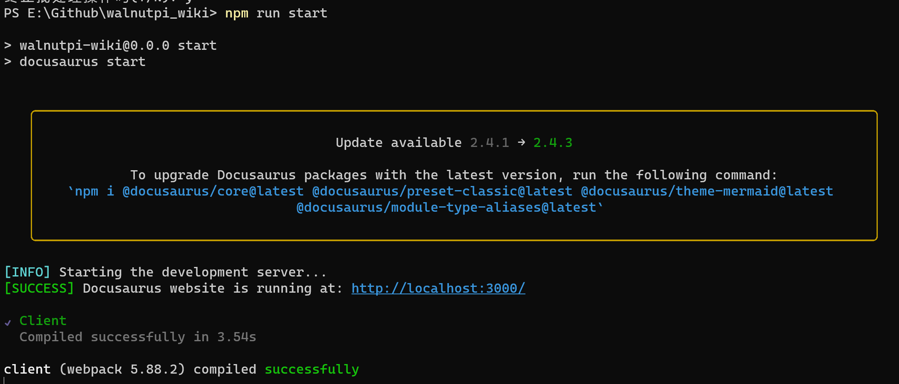
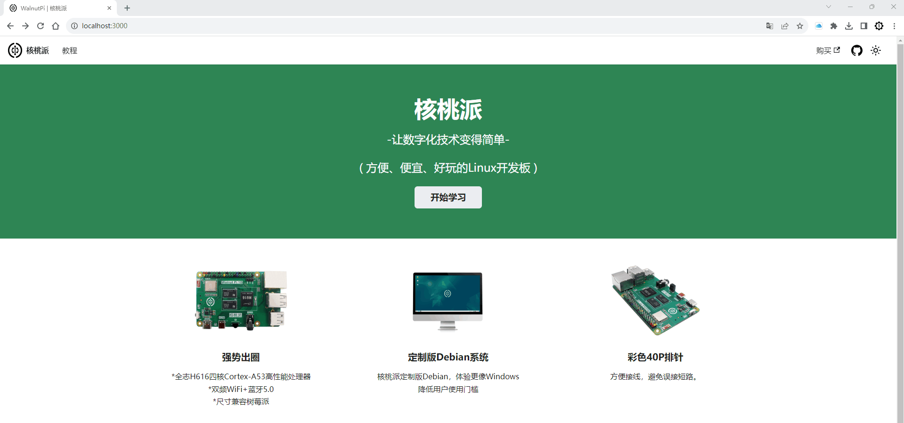

**[简体中文](./README.md) | English**<br>

# Walnut Pi Tutorial Documentation

## Official Website

[https://www.walnutpi.com](https://www.walnutpi.com)

## Contribution Notes

This project is built with [Docusaurus](https://docusaurus.io/). You can submit tutorial contributions following our documentation format.

The main contents of the document are placed in the `walnutpi_wiki/docs` directory, and the default language is Chinese;

The translated documents in different languages ​​are located in the `walnutpi_wiki/i18n` directory. 

(Interested users can fork the project, translate it, and submit Pull Requests!)

## Instructions

### Install Node.js

* [Node.js](https://nodejs.org/en/download/) version 16.14 or higher:
* When installing Node.js, it is recommended that you select all dependency-related checkboxes.

### Download the project

* You can use the repository address after you fork it.

```
git clone https://github.com/walnutpi/walnutpi_wiki.git
```

### Installing dependent libraries for the first time
```
cd walnutpi_wiki
npm install
```

### Run
```
npm run start
```

The `npm run start` command builds your website locally and serves it through the development server for you to view at http://localhost:3000/.





Other language versions can be viewed through the following command:

For example, the English version:
```
npm run start -- --locale en
```

For detailed tutorials, please see the official documentation:[https://tutorial.docusaurus.io/docs/intro/](https://tutorial.docusaurus.io/docs/intro/)