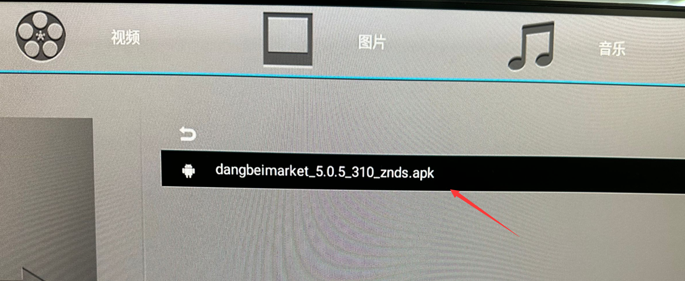
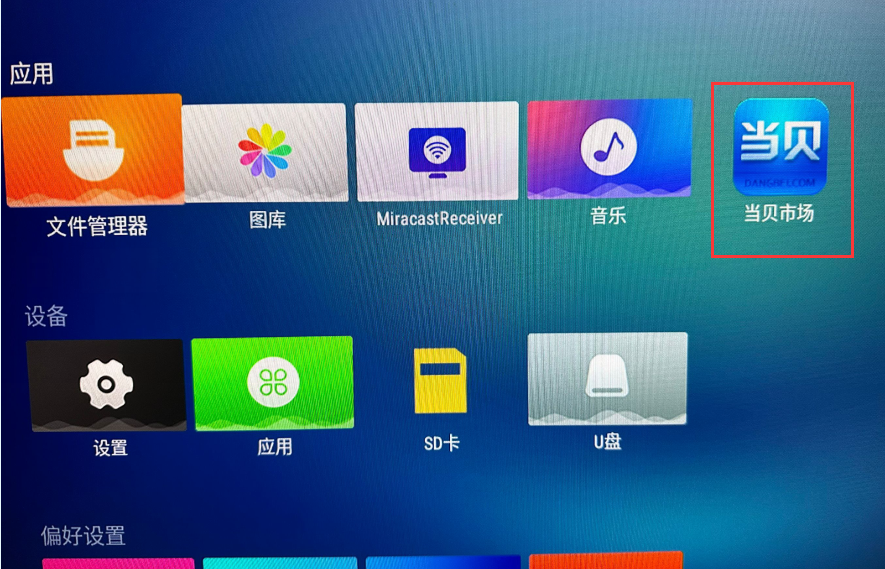

# 打造TV盒子

由于核桃派Android系统是Android TV版本，因此我们可以通过安装应用来打造自己的TV盒子。这里使用当贝盒子市场APP来实现。在当贝市场下可以安装银河奇异果，酷猫，央视TV等各类影音APP。

当贝安装包位于镜像目录下的**常用安卓应用软件**文件夹内：

可以使用U盘拷贝该应用，然后在核桃派开发板Android系统里面安装。教程: [U盘传输文件](./android_os.md#u盘文件传输)

点击应用：

如果弹出下面提示的话全部勾选允许即可:

然后点击安装：

安装完成后在桌面出现了**当贝市场**的应用图标：

确保核桃派已经连接到互联网。参考教程: [联网](./android_os.md#联网)

然后打开当贝市场：

声音支持HDMI音频和3.5mm Audio音频输出。