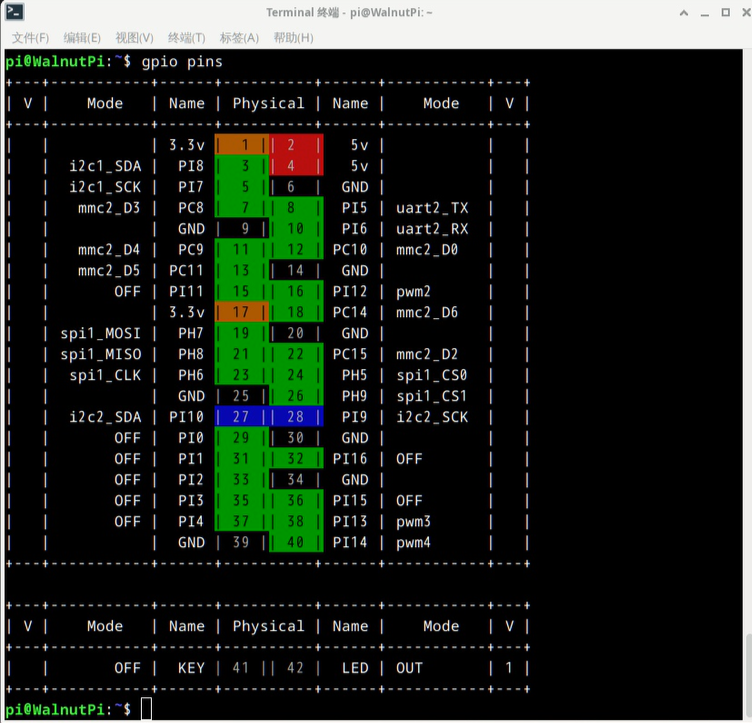
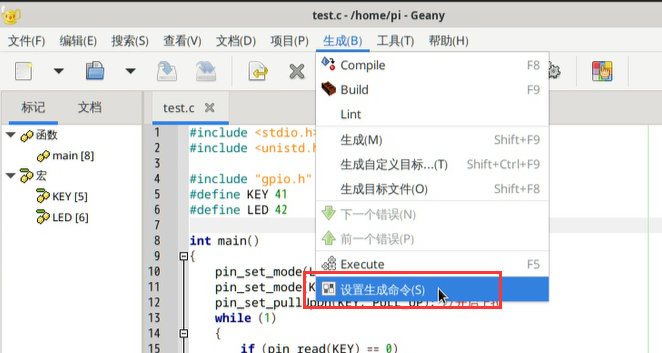
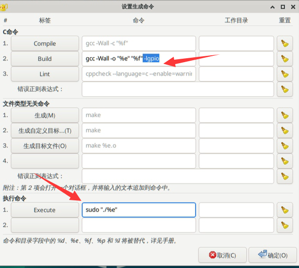

# IO控制

## 关于引脚编号
运行以下命令，可查看各引脚状态。后续编程都是使用这张表里的 **Physical** 编号来指代引脚
```
gpio pins
```


详细操作方式请点击查看：[**GPIO指令操作**](../gpio/gpio_command.md) 章节内容，这里不再重复。


## 示例代码
这是一个示例代码：按下核桃派开发板上的按键则LED亮起，松开则熄灭LED

```
#include <stdio.h>
#include <unistd.h>
#include "gpio.h" //控制gpio的库

#define KEY 41
#define LED 42
// 使用gpio pins命令查看得到这两个引脚编号

int main()
{
    pin_set_mode(LED, OUTPUT); 
    pin_set_mode(KEY, INPUT); 
    pin_set_pullUpDn(KEY, PULL_UP); //开启内部上拉
    while (1)
    {
        if (pin_read(KEY) == 0)
            pin_write(LED, 1);
        else
            pin_write(LED, 0);
    }
    return 0;
}
```

## 命令行编译运行代码
编译代码，由于gpio库是以动态库存在，所以编译要加上`-lgpio`。下面指令表示将当前目录下的test.c文件编译成可执行文件test。

```bash
gcc -Wall -o test test.c -lgpio
```

运行刚刚编译出来的程序，注意需要管理员权限才能控制gpio：

```bash
sudo ./test
```


## Geany IDE 编译

Geany IDE的使用，可以查看这一篇教程 [**在开发板上编译C语言代码**](./c_run.md)

如果使用核桃派桌面系统自带的Geany IDE ，需要进行一下设置。

打开**生成--设置生成命令** ：






在**Build**命令最后的地方加入 `-lgpio` ，这样在点击软件内的构建按钮时，就会让gpio库也参与编译过程：
```bash
gcc -Wall -o "%e" "%f" -lgpio
```
在**Execute**命令前面加入 `sudo ` , 这样在点击软件内的运行按钮时，就会以管理员身份运行
```bash
sudo "./%e"
```

点击 **确定** 键保存