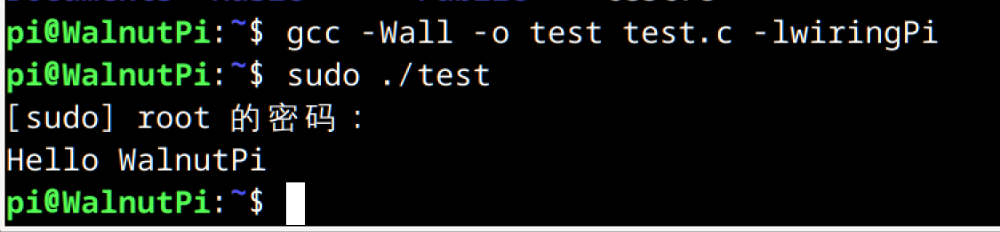
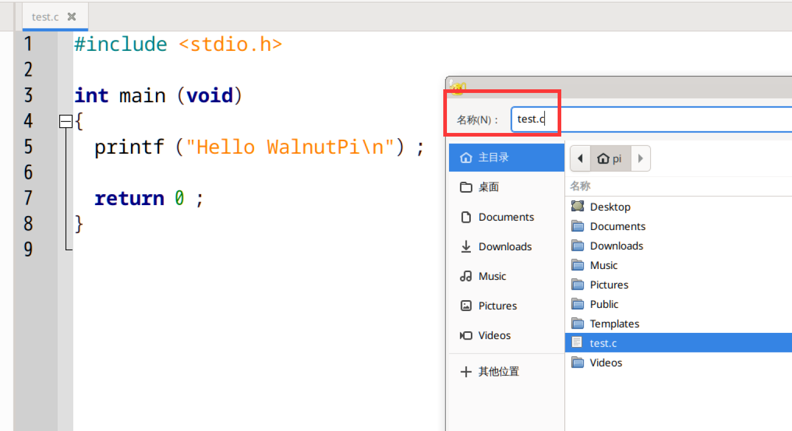
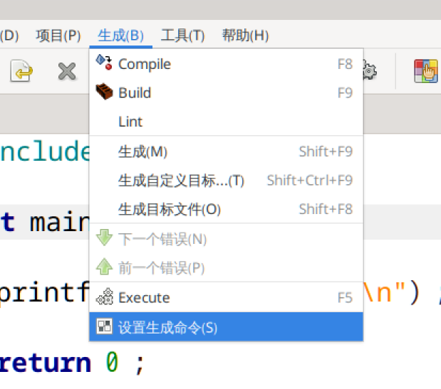
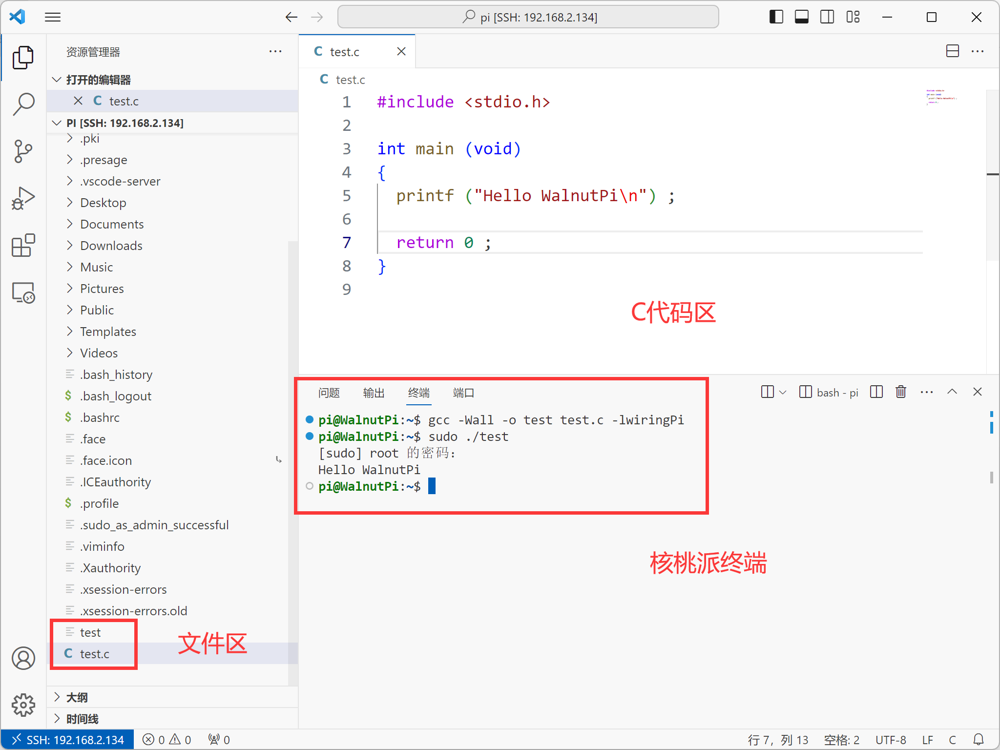

# IO控制（基于WiringPi）

## WiringPi简介


WiringPi是一个用C语言编写的早期用于（树莓派RaspberryPi）的软件包，可用于树莓派GPIO引脚控制、串口通信、SPI通信及I2C通信等功能，非常适合熟悉C/C++的人员在树莓派上进行软件开发。 

WiringPi的作者是Gordon Henderson，其官方网址为 http://www.wiringpi.com ，网站上面有一些项目使用方法和教程。

我们在核桃派上移植了WiringPi并开源托管到Github: https://github.com/walnutpi/WiringPi ,出厂镜像已经预装了该软件库，并对核桃派开发板主控做了适配。

:::tip 提示

WiringPi 原作者在2019年更新了树莓派4B的适配后就停止更新了。大家可以到网上搜索 “树莓派 WiringPi” 关键词能找到比较多的教程代码，但由于核桃派和树莓派是不一样的主控，所以如果你在使用过程中遇到问题或者有比较好的代码案例可以到我们交流群或者发邮件给我们反馈。

:::

## GPIO指令

WiringPi对核桃派的物理引脚进行了封装，定义了一套自己的引脚编号，为了保证代码兼容性，目前核桃派的wPi引脚定义和树莓派一致。

详细操作方式请点击查看：[**GPIO指令操作**](../gpio/gpio_command.md) 章节内容，这里不再重复。

## 编译和运行C代码

我们来体验一下WirngPi的编译和运行方法，先在核桃派当前目录新建一个test.c文件，输入下面内容（该代码实现在终端打印“Hello WalnutPi信息”）：
```c
#include <stdio.h>

int main (void)
{
  printf ("Hello WalnutPi\n") ;

  return 0 ;
}
```

编译代码，由于WiringPi是以动态库存在，所以编译要加上`-lwiringPi`。下面指令表示将当前目录下的test.c文件编译成可执行文件test。

```bash
gcc -Wall -o test test.c -lwiringPi
```

运行刚刚编译出来的程序：

```bash
sudo ./test
```

可以看到执行后终端打印出：Hello WalnutPi信息：



## Geany IDE (核桃派本地)

核桃派桌面系统出厂预装了Geany IDE ，位于**开始--开发**栏，使用Geany可以实现C编程和编译运行。

打开Geany:


新建一个文件，输入下面的测试代码，保存为.c文件。

```c
#include <stdio.h>

int main (void)
{
  printf ("Hello WalnutPi\n") ;

  return 0 ;
}
```



然后配置带WiringPi的C代码编译和生成命令。打开**生成--设置生成命令** ：



在**Build**命令最后的地方加入 **-lwiringPi** （注意区分大小写）。这个命令用于生成可执行文件，加入后完整命令为：
```bash
gcc -Wall -o "%e" "%f" -lwiringPi
```
在**Execute**命令前面加入 **echo "root" | sudo -S** （注意区分大小写）。这个命令用于运行前面生成的可执行文件（程序），加入后完整命令为：
```bash
echo "root" | sudo -S "./%e"
```


配置完成后点击**Build**按钮，下方可以看到编译结果信息。编译成功的话当前目录下会生成一个可执行文件。


再点**执行**按钮，可以看到弹出一个新终端，打印了“Hello WalnutPi”信息，说明代码被成功编译和执行。


## VSCode IDE（ssh远程）

除了使用核桃派自带Geany IDE外，这里说一下使用VSCode IDE 远程操作方法。关于VScode IDE远程方法请参考： [VSCode IDE（ssh远程）](../python/python_run#vscode-远程连接基于windows) 章节内容，这里不再重复。

VScode IDE需要在终端下使用命令来编译，好处是C编程比较直观，而且可以远程操作：

编写代码：
```bash
gcc -Wall -o test test.c -lwiringPi
```

执行程序：

```bash
sudo ./test
```



## IO控制

### 点亮第1个LED

```c
/*
实验名称：点亮第1个LED
实验平台：核桃派
说明：点亮核桃派开发板上的LED
*/

#include <stdio.h>
#include <wiringPi.h>

// 核桃派的板载LED引脚wPi编码为33
#define	LED	33

int main (void)
{
  printf ("WalnutPi LED\n") ;

  wiringPiSetup () ;

  pinMode (LED, OUTPUT) ;

  digitalWrite (LED, HIGH) ;	//点亮，LOW熄灭。

  return 0 ;
}

```

### 按键

```c
/*
实验名称：按键
实验平台：核桃派
说明：按键按下点亮LED，松开熄灭LED
*/

#include <stdio.h>
#include <wiringPi.h>


// 核桃派的板载LED引脚wPi编码为33，按键KEY为32
#define LED 33
#define KEY 32

int main (void)
{
  printf ("WalnutPi Pi KEY\n") ;

  wiringPiSetup () ;

  pinMode (LED, OUTPUT) ;

  pinMode (KEY, INPUT) ;
  pullUpDnControl (KEY, PUD_UP) ; //开启上拉电阻

  while (1)
  {
    if(digitalRead (KEY) == LOW) // 按键按下
    {
      digitalWrite (LED, HIGH) ;	// 点亮LED
    }

    else
    {
      digitalWrite (LED, LOW) ;	// 熄灭LED
    }
  }

  return 0 ;
}
```

更多例程可以浏览官网 http://www.wiringpi.com 或到网上搜索树莓派wiringpi代码。如有代码想贡献请QQ群或者邮件联系我们，感谢支持！
