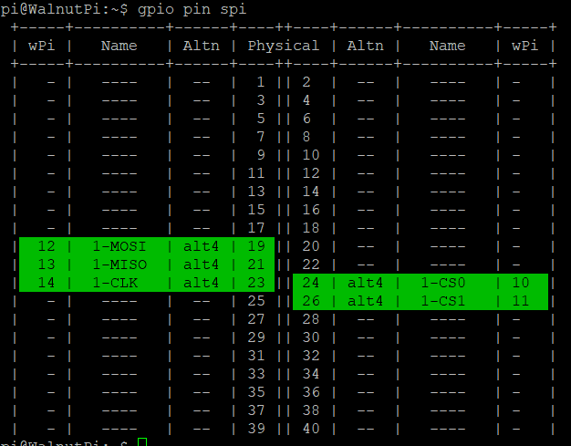
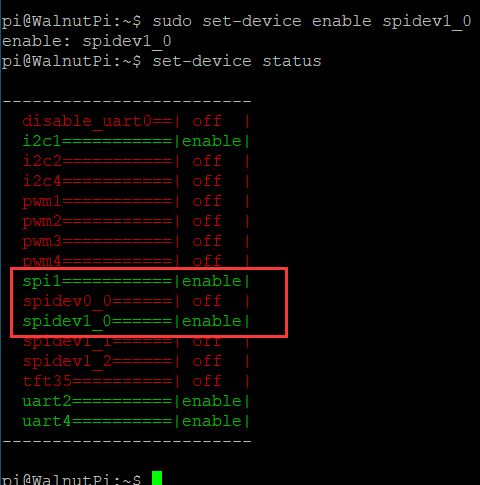
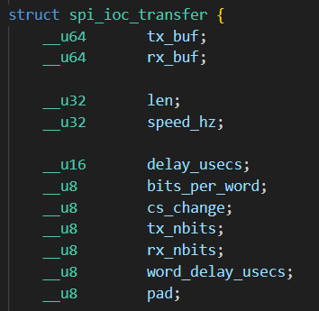
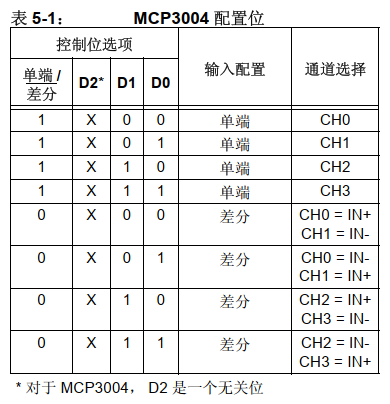
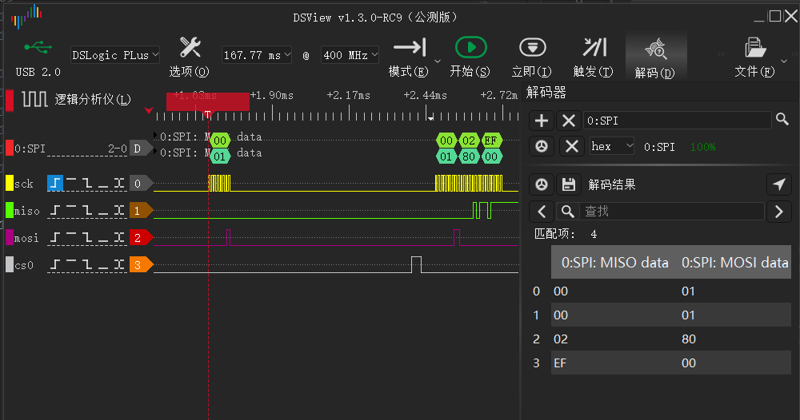

# SPI

## 配置引脚

### 找到板子上的spi引脚
为了方便查找，我们加入了一个显示功能引脚位置的功能，运行以下命令，查看板子的40pin引脚上有几个可用spi
```
gpio pin spi
```


可以看到这块40pin排针里只有spi1，还有归属于spi1的两根cs引脚。一个spi接口可以同时连着多个模块，然后每个模块都连上不同的cs引脚，通过cs引脚来控制要与哪个模块通信。

### 启用spi-dev
我们使用`set-device`指令来使能/关闭指定设备的底层驱动，使能后，引脚就会由gpio模式切换为对应的引脚复用功能。（配置后要重启才能生效）


如果我们要操作spi1，首先需要使能spi1，然后使能一个spidev1_x。例如使能`spidev1_0`，他对应的是spi1-cs0。重启后就会出现一个`/dev/spidev1.0`文件，操作这个文件进行spi通信时，就会自动使能spi1的cs0引脚（拉低），并使其他所有cs引脚失效（拉高）。

注意，启用spidev1_0的时候，会使其他使用spi1-cs0的设备驱动全部会失效，比如3.5寸lcd屏。


我这里启用spidev1_0，注意要重启后才能生效
```
sudo set-device enable spidev1_0
```


重启后发现出现了`/dev/spidev1.0`这个文件，因为后续我们需要通过操作这个文件来控制spi1_cs0的通讯


## spi读写程序
我们要操作`/dev/spidev1.0`这个文件。通过`open`打开，用`ioctl`进行配置以及触发spi读写，`close`关闭文件。

### 1. 打开文件
linux下一切皆是文件，先使用`open`函数打开我们要操作的设备对应文件，获取文件描述符。

open函数需要这些头文件
```c
#include <sys/types.h>
#include <sys/stat.h>
#include <fcntl.h>
#include <unistd.h>
```

open设备节点
```c
    int fd = open("/dev/spidev1.0", O_RDWR);
    if (fd < 0)
    {
        perror("Fail to Open\n");
        return -1;
    }

```
### 2. 配置spi模式
spi模式，根据CPOL和CPHA不同，spi分为4种模式。不同芯片可能要求你以指定模式工作

ioctl函数需要这些头文件
```
#include <sys/ioctl.h>
```

配置为mode0，即CPOL=0,CPHA=0
```c
static uint32_t SPI_MODE = SPI_MODE_0;
    if (ioctl(fd, SPI_IOC_WR_MODE32, &SPI_MODE) == -1)
        printf("err: can't set spi mode");
```

### 3. spi transfer
spi的两根引脚同时工作，MISO和MOSI是同步工作的。使用`spi_ioc_transfer`结构体来描述一次spi传输。spi可以拿来模拟不少协议，或者应该说是很多自称spi接口的芯片都有着怪怪的时序。

- `tx_buf`,要从MOSI中发送出去的buf
- `rx_buf`,保存MISO内容的buf
- `len`, buf的大小
- `speed_hz`， spi传输速率
- `cs_change`,是否在传输完成后，保持cs线为选中
- `bits_per_word`，传输时单个word的大小
- `delay_usecs`, 发送完后来一段延时
- `tx_nbits`, 以几线制spi发送。4线的qspi也使用这套接口进行发送。所以留个接口供选择 


首先需要以下头文件
```c
#include <linux/spi/spidev.h>
```

示例如下
```c
static uint8_t BITS_PER_WORD = 8;
static uint32_t SPEED = 80 * 1000;
    transfer.tx_buf = (unsigned long)tx_buf;
    transfer.rx_buf = (unsigned long)rx_buf;
    transfer.len = len;
    transfer.delay_usecs = 500;     //发送完成后的延时
    transfer.speed_hz = SPEED;
    transfer.bits_per_word = BITS_PER_WORD;
    transfer.tx_nbits = 1;  //单线制
    transfer.rx_nbits = 1;  //单线制
    transfer.cs_change = 0; //传输后把cs线松开
```

然后通过ioctl函数，用`SPI_IOC_MESSAGE(x)`（x=传入的transfer的数量）就可触发一次spi transfer。每次发送一个clk，都会同时将tx_buf的内容从MOSI输出，读取MISO的内容存到rx_buf
```
    int res = ioctl(fd, SPI_IOC_MESSAGE(1), &transfer);
    if (res < 0)
        printf("err: spi_transfer failed");
```
### 4. 关闭文件
每次`open`后记得调用`close`来手动关闭，不然文件描述符会保留直到程序关闭。而系统限制单个程序最大只能同时打开1024个文件，如果程序不停的open却不close，没一会就要报错退出了。
```
close(fd);
```

## 示例程序
这里使用ADC芯片mcp3004，4路输入转SPI输出。 首先阅读芯片手册搞清楚读取的步骤，如下↓




现在我想读取ch0的值，那么我需要发送3个字节的数据，第一个字节是0x01作为启动信号，第二个字节是配置字0x80，第三个字节无功能仅仅是为了触发接收。编写代码如下
```c
#include <stdio.h>
#include <stdint.h>

#include <sys/types.h>
#include <sys/stat.h>
#include <fcntl.h>
#include <unistd.h>

#include <sys/ioctl.h>

#include <linux/spi/spidev.h>

#define DEV_SPI "/dev/spidev1.0"

static uint32_t SPI_MODE = SPI_MODE_0;
static uint8_t BITS_PER_WORD = 8;
static uint32_t SPEED = 100 * 1000;

// mosi跟miso同时工作，从tx_buf中取出数据发送的同时，也会读取数据存入rx_buf
int spi_transfer(int fd, uint8_t *tx_buf, uint8_t *rx_buf, int len)
{
    struct spi_ioc_transfer transfer;

    transfer.tx_buf = (unsigned long)tx_buf;
    transfer.rx_buf = (unsigned long)rx_buf;
    transfer.len = len;
    transfer.delay_usecs = 500; // 发送完成后的延时
    transfer.speed_hz = SPEED;
    transfer.bits_per_word = BITS_PER_WORD;
    transfer.tx_nbits = 1;  // 单线制
    transfer.rx_nbits = 1;  // 单线制
    transfer.cs_change = 0; // 传输后把cs线松开

    int res = ioctl(fd, SPI_IOC_MESSAGE(1), &transfer); //触发transfer
    if (res < 0)
        printf("err: spi_transfer failed");
    return res;
}
int main()
{
    int fd0 = open(DEV_SPI, O_RDWR);
    if (fd0 < 0)
    {
        perror("Fail to Open\n");
        return -1;
    }

    // 配置spi模式
    if (ioctl(fd0, SPI_IOC_WR_MODE32, &SPI_MODE) == -1)
        printf("err: can't set spi mode");

    uint8_t tx_buf[3] = {0x01, 0x80, 0x00};
    uint8_t rx_buf[3];

    // mcp3004要求以cs0的下降沿作为spi通信开始的标志
    //因为当前spi1下只有一个cs0设备，所以初始时cs0一直是低电平
    //先发送一个数据，触发cs0拉高
    spi_transfer(fd0, tx_buf, rx_buf, 1); 

    uint16_t value;
    while (1)
    {
        spi_transfer(fd0, tx_buf, rx_buf, 3);
        value = (rx_buf[1] << 8) + rx_buf[2];
        printf("value=%d\r\n ", value);
        sleep(1);
    }

    return 0;
}

```
在开发板上编译很简单，我将代码写在文件`spi.c`内，想将其编译成名为`exe`的可执行文件，只需要执行下面这一句
```
gcc spi.c -o exe
```

测试结果如下，扭动连接在mcp3004通道0上的电位器，数值随之改变


代码刚运行时的初始时序如下

