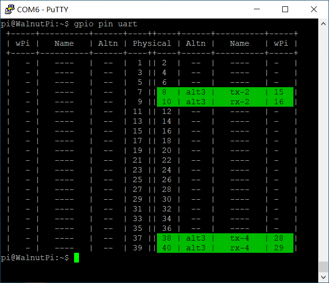
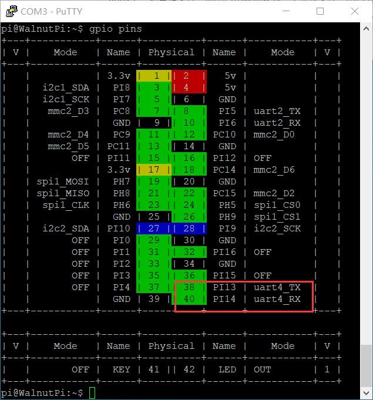

# UART(串口)

## 配置引脚

### 找到板子上的串口引脚
为了方便查找，我们加入了一个显示功能引脚位置的功能，运行以下命令，查看板子的40pin引脚上有几个可用串口
```
gpio pin uart
```



### 启用串口
我们使用`set-device`指令来使能/关闭指定设备的底层驱动，使能后，引脚就会由gpio模式切换为对应的引脚复用功能。（配置后要重启才能生效）

首先查看各设备的状态
```
set-device status
```


运行指令启用串口4，注意要重启后才能生效
```
sudo set-device enable uart4
```


重启后查看引脚状态,可以看到38和40都处于alt3了


## 串口读写程序
linux下一切皆是文件。而串口也被抽象为一个特殊文件，串口4就是`/dev/ttyS4`这个文件。通过`open`打开它，用`ioctl`进行配置，`write`&`read`进行读写，`close`关闭文件。

### 1. 打开文件
linux下一切皆是文件，先使用`open`函数打开我们要操作的设备对应文件，获取文件描述符。

open函数需要这些头文件
```
#include <sys/types.h>
#include <sys/stat.h>
#include <fcntl.h>
#include <unistd.h>
```

open设备节点
```c
    int fd = open("/dev/ttyS4", O_RDWR);
    if (fd < 0)
    {
        perror("Fail to Open\n");
        return -1;
    }

```

### 2. 配置串口参数
linux下一般使用`ioctl`来配置设备具体参数，不同设备可配置的参数不同。下面这个代码是最最最常用的8n1配置，115200波特率。


需要这些头文件
```c
#include <sys/ioctl.h>
#include <termios.h>
```

- 数据位可选的有`CS8`、`CS7`、`CS6`等
- 校验位，如果`PARENB`对应的位被置1，则使能校验位。同时如果`PARODD`对应的位被置1，则为奇校验，否则为偶校验。
- 停止位，如果`CSTOPB`对应的位被置1，则为2位停止位，否则是1位停止位
```c
    struct termios opt;
    ioctl(fd,TCGETS, &opt); // 获取串口参数opt

    cfsetospeed(&opt, B115200); // 输出波特率为115200
    cfsetispeed(&opt, B115200); // 输入波特率为115200
    
    opt.c_cflag &= ~CSIZE; //将设置数据位的bit清0
    opt.c_cflag |= CS8; // 数据位为8

    opt.c_cflag &= ~PARENB; // 无校验

    opt.c_cflag &= ~CSTOPB; // 1个停止位

    ioctl(fd,TCSETS, &opt); //应用刚刚写好的配置

```

### 3. 发送
只要往这个文件写数据，底层就会将其用串口发送出去。

write函数需要这个头文件
```c
#include <unistd.h>
```

发送数据
```c
    char buf[1024] = "hello\n";
    write(fd, buf, strlen(buf));
```

### 4. 接收
底层驱动会自动把串口接收到的数据存进缓冲区，我们只需要使用read函数读取这个文件，就是在读取串口缓冲区的内容。

read函数会尝试读取指定数量的字符，返回值是实际读取到的字符数量。

如果缓冲区是空的，read函数就会阻塞在这里。直到串口接收到一段以`\n`回车结尾的数据，才会刷新缓冲区并把数据交给read。


read函数和write函数一样依赖这个头文件
```
#include <unistd.h>
```

以下是一段读取的示例代码

```c
    tcflush(fd, TCIOFLUSH); // 清空串口接收缓冲区
    while (1)
    {
        int res = read(fd, buf, 3); // 读取3个字符
        if (res > 0)
        {
            buf[res] = '\0';
            printf("读到[%d]个  data: %s\n", res, buf);
        }
    }

```

### 5. 关闭文件
每次`open`后记得调用`close`来手动关闭，不然文件描述符会保留直到程序关闭。而系统限制单个程序最大只能同时打开1024个文件，如果程序不停的open却不close，没一会就要报错退出了。
```c
close(fd);
```
## 测试
完整的示例代码如下，在运行时会用串口发送字符串"hello"，然后串口会循环将接收到的数据打印出来
```c
#include <stdio.h>
#include <stdint.h>
#include <string.h>

#include <sys/types.h>
#include <sys/stat.h>
#include <fcntl.h>
#include <unistd.h>

#include <sys/ioctl.h>
#include <termios.h>


#define DEV_UART "/dev/ttyS4"

int main()
{
    int fd = open(DEV_UART, O_RDWR);
    if (fd < 0)
    {
        perror("Fail to Open\n");
        return -1;
    }

    struct termios opt;
    ioctl(fd, TCGETS, &opt); // 获取串口参数opt

    cfsetospeed(&opt, B115200); // 输出波特率为115200
    cfsetispeed(&opt, B115200); // 输入波特率为115200

    opt.c_cflag &= ~CSIZE; // 将设置数据位的bit清0
    opt.c_cflag |= CS8;    // 数据位为8

    opt.c_cflag &= ~PARENB; // 无校验

    opt.c_cflag &= ~CSTOPB; // 1个停止位

    ioctl(fd, TCSETS, &opt); // 应用刚刚写好的配置

    fcntl(fd, F_SETFL, O_NONBLOCK);

    char buf[1024] = "hello\n";
    write(fd, buf, strlen(buf));

    tcflush(fd, TCIOFLUSH); // 清空串口接收缓冲区
    while (1)
    {
        int res = read(fd, buf, 3); // 读取3个字符
        if (res > 0)
        {
            buf[res] = '\0';
            printf("读到[%d]个  data: %s\n", res, buf);
        }
    }

    close(fd);

    return 0;
}
```

在开发板上编译很简单，我将代码写在文件`uart.c`内，想将其编译成名为`exe`的可执行文件，只需要执行下面这一句
```
gcc uart.c -o exe
```

执行结果如下:


