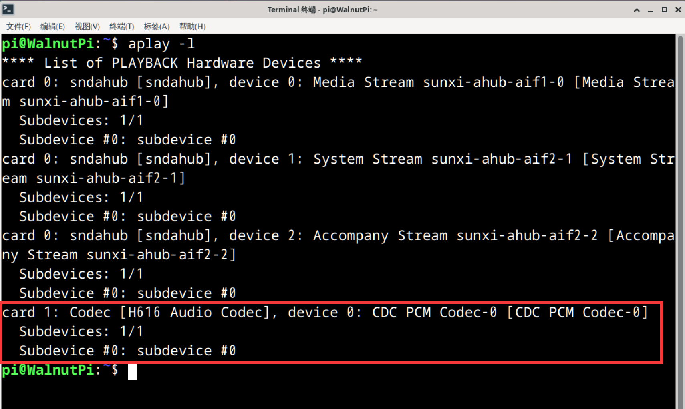

# 音频（耳机口）

核桃派板载的3.5mm音频输出口，该接口有一定的输出功率，可以使用耳机或者带功放的扬声器都可以播放声音。

## 查看音频设备

可以使用下面指令来查看音频信息：

```bash
aplay -l
```



## 音频播放测试

播放系统自带wav音频文件测试, 下面指令的**hw:1,0**中的1为上面指令查看到的设备编号1：

```bash
aplay -D hw:1,0 /usr/share/sounds/alsa/Noise.wav
```


音频口接上耳机或者扬声器，可以听到播放出声音。

## 桌面系统音乐播放

可以直接使用带桌面系统预装的VLC媒体播放器播放音频。

先将音频文件通过U盘或者ssh其它方式拷贝到核桃派，然后点击鼠标右键，**使用VLC媒体播放**即可：


