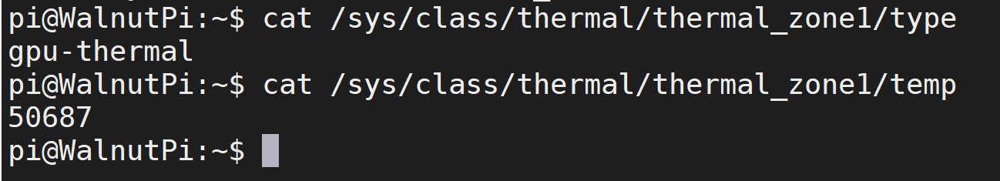

# 主控温度信息

核桃派1B的H616主控内置4个温度传感器，分别是：
- `sensor0`: CPU温度
- `sensor1`: GPU温度
- `sensor2`: VE(Video Encoding)温度
- `sensor3`: DDR温度

:::tip 提示
下面命令获取的温度数据值需要除以1000。
:::

## CPU温度信息

查看传感器类型指令：

```bash
cat /sys/class/thermal/thermal_zone0/type
```

查看温度信息指令：
```bash
cat /sys/class/thermal/thermal_zone0/temp
```


## GPU温度信息

查看传感器类型指令：

```bash
cat /sys/class/thermal/thermal_zone1/type
```

查看温度信息指令：
```bash
cat /sys/class/thermal/thermal_zone1/temp
```



## VE(Video Encoidng)温度信息

查看传感器类型指令：

```bash
cat /sys/class/thermal/thermal_zone2/type
```

查看温度信息指令：
```bash
cat /sys/class/thermal/thermal_zone2/temp
```


## DDR温度信息

查看传感器类型指令：

```bash
cat /sys/class/thermal/thermal_zone3/type
```

查看温度信息指令：
```bash
cat /sys/class/thermal/thermal_zone3/temp
```

