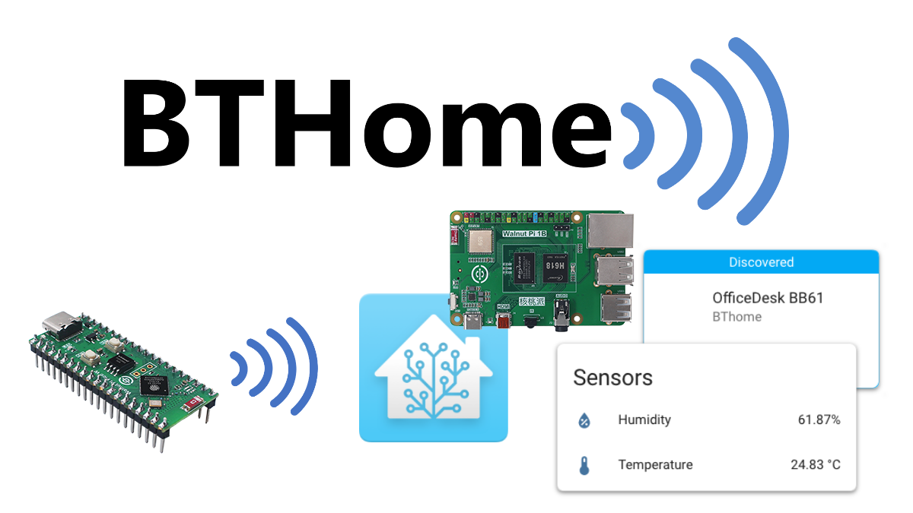
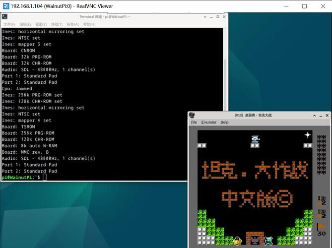
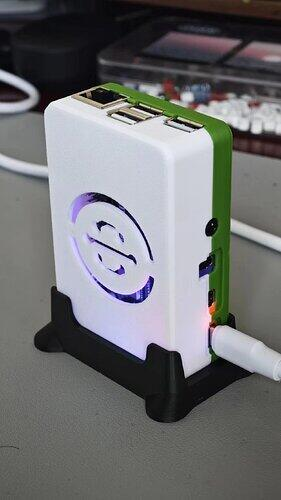

# 社区用户开源项目分享

感谢以下用户为核桃派开源生态贡献项目，如果你也有基于核桃派相关开源项目可以QQ群或者邮件联系我们，我们将不定期为贡献项目用户赠送核桃派相关产品。

## 2023年电赛E题（OpenCV）

- `用户`：DBin_K

[「电赛E题」可能是全网最穷方案 | 109元国产派主控 OpenCV方案 开源](https://www.bilibili.com/video/BV1RE421A7ba/?spm_id_from=333.337.search-card.all.click&vd_source=afb22e861cc5832170b148bd53698405)

## HomeAssistant BTHome蓝牙温度计

- `用户`：Dbl

[MicroPython 实现BTHome v2蓝牙温湿度计](https://forum.walnutpi.com/t/topic/234)

## NES游戏机

- `用户`：Dbl

[【怀念经典】5个步骤，让你的核桃派玩回当年火爆全球NES游戏](https://forum.walnutpi.com/t/topic/74)

## 视觉巡线小车

- `用户`：冰蓝maker

[【diy】用视觉识别做循线小车，便宜又简单](https://www.bilibili.com/video/BV1TK411i7Bb/?spm_id_from=333.999.0.0&vd_source=afb22e861cc5832170b148bd53698405)

## 热成像仪

- `用户`：冰蓝maker

[【diy】来做个热成像，传感器也就100多块钱](https://www.bilibili.com/video/BV1tC41147bx/?spm_id_from=333.999.0.0&vd_source=afb22e861cc5832170b148bd53698405)

## 外网穿透

- `用户`：sc-bin

[【推销软件】 zerotier，在外访问家里内网，免费且速度快到能跑满你家宽带](https://forum.walnutpi.com/t/topic/63)

## 部署MQTT服务器

- `用户`：sc-bin

[【软件安装】核桃派安装mqtt服务器mosquitto](https://forum.walnutpi.com/t/topic/40)

## pyQT5 GPT语音助手

- `用户`：jd3096

[核桃派pyqt5 GPT语音助手演示 附视频及源码](https://forum.walnutpi.com/t/topic/59)

## 核桃派1B外壳

- `用户`：jd3096

[我给核桃派1B做了个炫酷外壳，需要小伙伴的来看看吧，附模型文件](https://forum.walnutpi.com/t/topic/167)

