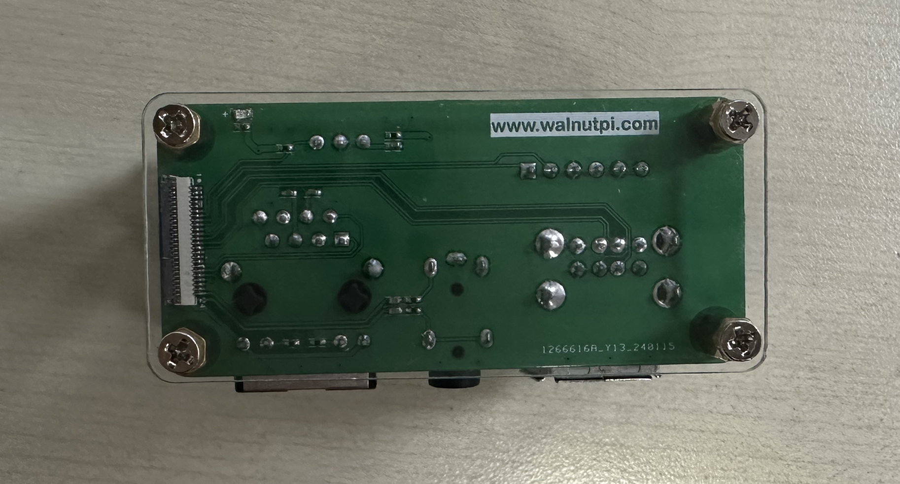
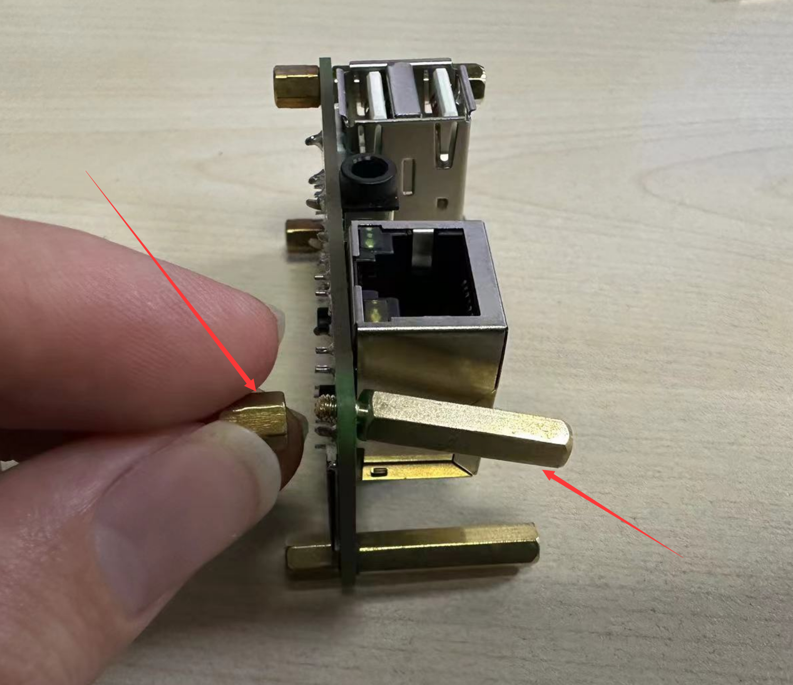
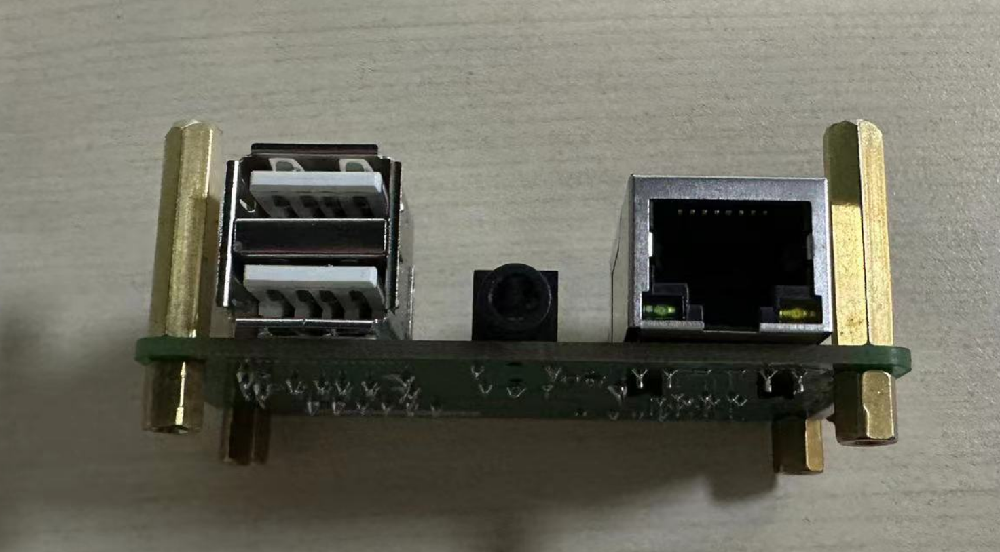
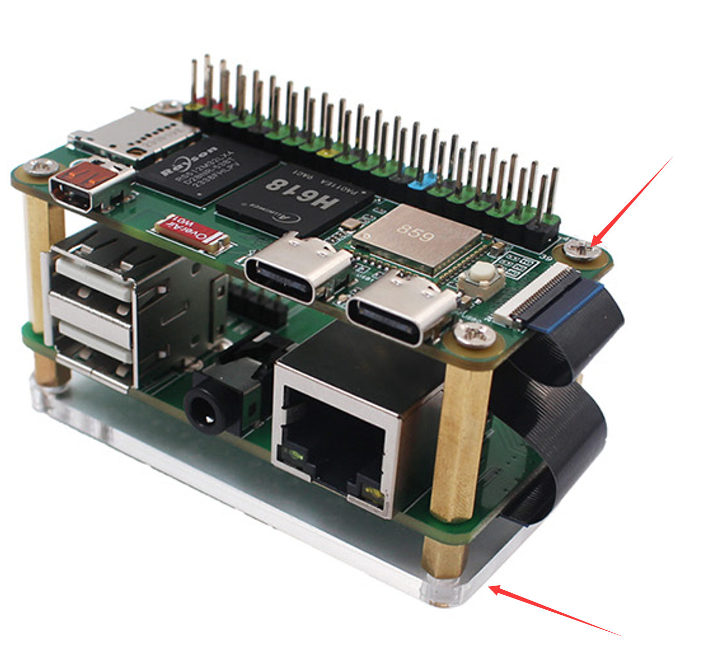
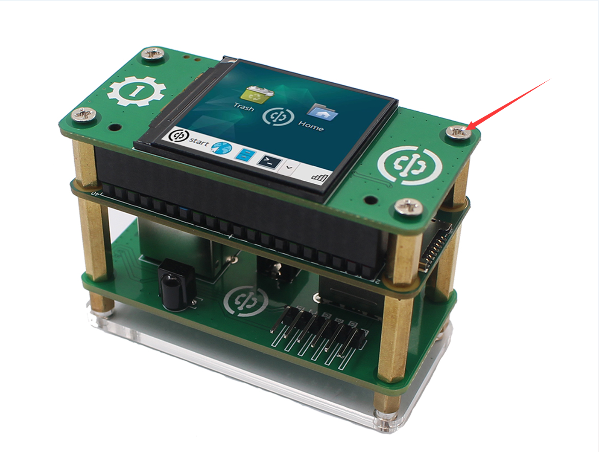
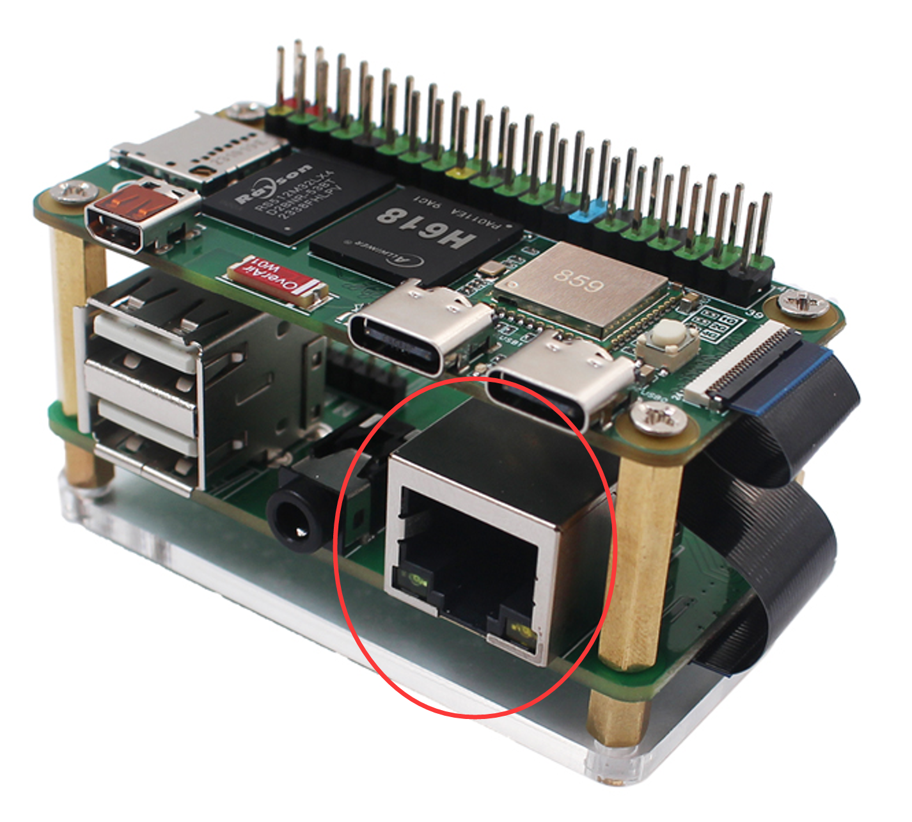

# 核桃派ZeroW配件组装

- **视频教程**

<iframe src="//player.bilibili.com/player.html?isOutside=true&aid=1053217345&bvid=BV19H4y1K7wd&cid=1507941927&p=1" scrolling="no" border="0" frameborder="no" framespacing="0" allowfullscreen="true" width="100%" height="500"></iframe>

  
  

在上一节了解过核桃派的硬件后，我们对核桃派有了一定的认识。但单独一个核桃派板子是无法工作的，它要求有一些必须的外设，如电源、键盘鼠标、显示器等。这节我们就来做详细的介绍核桃派ZeroW配件组装。

核桃派ZeroW搭配扩展板和1.54寸LCD，有多种使用场景。

## 40P彩色排针

核桃派ZeroW出厂默认不焊接40P排针，用户自己焊接时候需要注意这个排针是有方向的，不能搞错。焊接方向如下：

## 散热片

散热片能帮助核桃派CPU散热，特别在高温的环境下实现稳定工作，安装也是很简单，撕开导热贴，粘在主控上即可。由于散热片具有导电性，注意安装过程中不要与电路板其它元件（电容、电阻）接触到，避免发生短路。（ZeroW体积小，建议加装散热片辅助散热）

## 亚克力

亚克力的底板的作用是避免PCB底部跟其它金属物体接触短路，避免刮花桌面，同时底部产生了空间也提升了散热效果。

核桃派ZeroW亚克力底板安装方法非常简单，撕掉亚克力保护膜，中间嵌套铜柱，上下两端分别用M2.5螺丝拧紧即可。

## ZeroW扩展板

核桃派ZeroW扩展板，通过24P-0.5mm排线与核桃派ZeroW主板连接，引出了USB2.0 x 2 、百兆以太网 、音频、红外接收、调试串口、5V和3.3V电源输出功能。

使用长度20mm的单通螺柱跟长度6mm的双通螺柱按下图方式连接：

使用排线连接ZeroW和扩展板，注意排线金手指接触面朝下插入：

然后上下方均使用M2.5螺丝固定ZeroW和亚克力底板即可。

## 1.54寸LCD

1.54寸LCD直接按下图方向插入接口。为了方便拔插可以不接铜柱。

如果需要固定的用户可以使用配套的12mm长度单通铜柱固定：

插入1.54寸LCD，顶部再用M2.5螺丝固定即可：

## MicroSD卡

MicroSD卡需要预先拷贝操作系统的，那会在下一节系统和软件展开讲解，这里只介绍安装方法。推荐使用16G以上的MicroSD卡。

将MicroSD卡按下图所示轻轻插入到底。核桃派ZeroW的MicroSD卡槽属于拔插式，不带自弹功能。

如果你需要去除 SD 卡，往外拔出即可。
:::danger 注意

请勿在通电情况下拔插 SD 卡。

:::

## USB拓展坞

核桃派ZeroW 2路type-c均支持USB拓展坞拓展：方便接入USB摄像头、USB键盘鼠标等设备：

:::tip 提示
USB 拓展坞只测试支持拓展USB功能。像一些type-c转HDMI功能由于驱动问题无法使用。
:::

## 键盘和鼠标

核桃派支持有线键鼠和无线键鼠。

**有线键鼠**

**无线键鼠**

将键盘和鼠标连接到扩展板USB口。有线和无线 USB 键鼠安装方法一样。正常情况下USB的拔插不需要太用力，否则可能是插反了。检查USB方向是否正确。

## 显示器

一般的电脑显示屏或电视机都带有HDMI接口。

使用microHDMI转HDMI数据线可以直接将核桃派视频信号显示出来。

将microHDMI线较小的一端连接到核桃派（靠近陶瓷天线那个小端口），另一端连接到显示器，如果你的显示器有多个输入端口，可能还需要进
行一个输入端口切换的操作，具体视你显示器情况而定。

## 网线

要把核桃派和网络连接起来， 可以通过以太网或者 WiFi 无线连接。通常用WiFi，核桃派的 WiFi 支持 5G 信号连接，这里主要说一下网线的连接方法。把它
插进以太网口，塑料夹子朝下，直到你听到咔哒声。 网线的另一端通常以相同的方式连接到路由器、 网络集线器或交换机上的任意空闲端口。如果您需要移除网线，只需将塑料夹向内挤压到插头处，然后轻轻将电缆滑出即可。（以太网口在扩展板，属于百兆网口）

## 音频

核桃派扩展板上有标准的3.5mm音频输出接口，可以通过连接耳机或扬声器设备实现音频播放。

## 电源连接

核桃派ZeroW对电源的要求是：5V 1A以上的Type-C接口电源。

连接电源通常是最后的操作，接通电源后意味着我们准备开始使用。将电源的Type-C端连接到核桃派。如果线材上有开关，记得将开关打开。

核桃派ZeroW 2个TYPE-C均可以作为供电口，通常使用右边那个：

至此，核桃派ZeroW外设配件组装完成。
