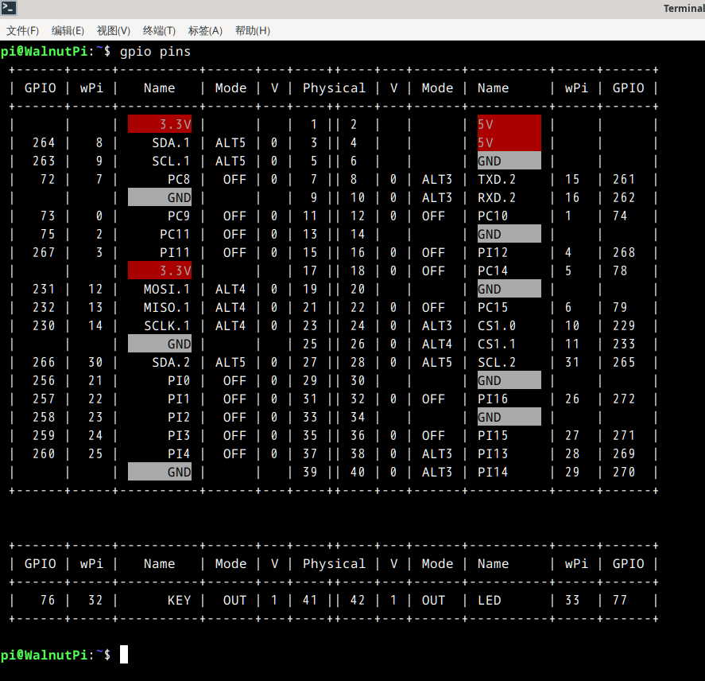
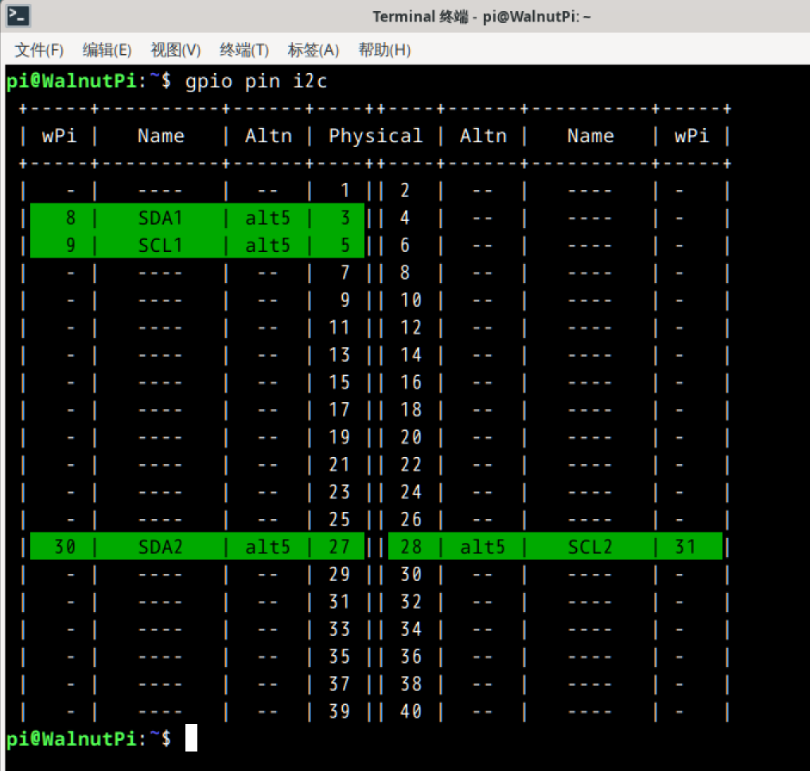
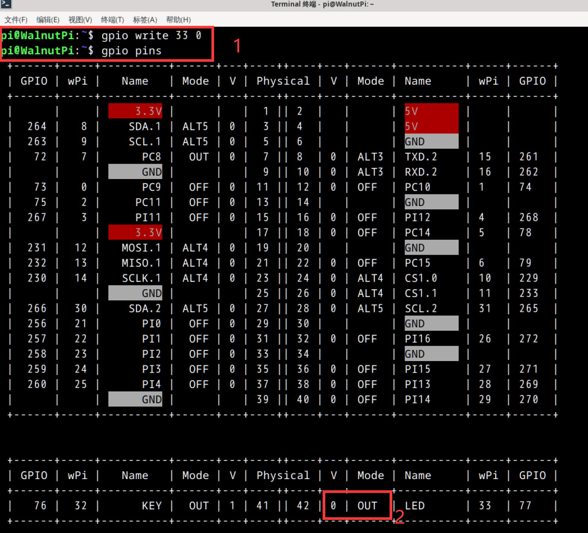
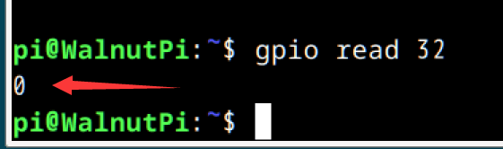

# GPIO指令操作

本节借助系统移植好的WiringPi相关指令对GPIO进行操作，帮助用户快速熟悉核桃派GIPO。

WiringPi对核桃派的物理引脚进行了封装，定义了一套自己的引脚编号，为了保证代码兼容性，目前核桃派的WiringPi引脚定义和树莓派一致。[WiringPi介绍](../c/io_wiringpi#wiringpi简介)

## 查看所有引脚状态

使用下面指令可以看到核桃派所有引脚定义：
```bash
gpio readall
```
或
```bash
gpio pins
```


上图每一列含义如下：
- `Physical`: 板上排针的编号
- `V`: 当前引脚的电平状态，1为高电平，0为低电平
- `mode`: 引脚当前的状态：
    - `IN`: 输入
    - `OUT`: 输出
    - `ALT`: ALT+数字表示引脚处于复用功能几
    - `OFF`: 初始状态未设置
- `name`: 引脚名称
- `wPi`: WiringPi引脚编号，后面指令控制或编程会用到
- `GPIO`: 主控的内部gpio编号

可以看到除了标准40Pin GPIO外，我们还给核桃派板载按键和LED加入了wiringpi引脚定义，方便用户使用。

## 查看i2c/uart等引脚的位置

这是核桃派特有功能，为了方便用户查询。

```bash
gpio pin [function]
```

- `[function]` : 功能类型可以选择以下几个选项:

    - `i2c`
    - `uart`
    - `spi`
    - `pwm`

例如我想知道i2c引脚是哪些，可以输入下面命令：

```bash
gpio pin i2c
```


## 设置引脚功能

```bash
gpio mode [WpiNum] [mode]
```
- `[WpiNum]`：控制引脚的wpi编号。

- `[mode]` : 有以下功能可以选择：

    - `in` : 输入模式,浮空
    - `up` : 输入模式,开启内部上拉
    - `down` : 输入模式,开启内部下拉
    - `out` : 输出模式
    - `off` : 回归初始未使用状态
    - `alt2`...`alt5` : 设置引脚为第n个复用功能

例如我要将PC8引脚设为输出，可以使用下面指令。
```bash
gpio mode 7 out
```
配置完成后再使用**gpio pins**指令查看引脚状态，可以看到PC8的模式改成了OUT输出。


## 控制引脚输出电平

```bash
gpio write [WpiNum] [status]
```

- `[WpiNum]` 是你要控制引脚的wpi编号。
- `[status]` ：引脚输出状态。
    - `0` : 低电平（0V）
    - `1` : 高电平（3.3V）

我们可以使用板载蓝色LED来测试一下，由于启动系统后LED默认点亮，我们这里可以使用指令将它熄灭试试。

从前面查表可以看到LED的wPi编号为**33**，先设置LED引脚模式为输出：
```bash
gpio mode 33 out
```

再设置输出状态为0（低电平0V）：

```bash
gpio write 33 0
```



可以看到核桃派上的蓝灯熄灭了。


## 读取引脚输入电平

```bash
gpio read [WpiNum]
```

- `[WpiNum]` ：要读取引脚的wpi编号。

我们可以使用板载按键来测试一下，读取按键的输入电平，核桃派板载按键没按下时输入1（高电平3.3V），按下是输出0（低电平0V）。

从前面查表可以看到按键KEY的wPi编号为**32**，先设置KEY引脚模式为输入：
```bash
gpio mode 32 in
```

先读取一下按键目前的电压状态：

```bash
gpio read 32
```

可以看到KEY的引脚状态为IN（输入），没有按下按键时输入电平为1（高电平3.3V）。


接下来**按着按键不要松手**：


再执行读取电平指令，可以看到输入电平变为0（低电平0V）。
```bash
gpio read 32
```



## 翻转引脚输出电平

这个功能实现将一个输出模式的引脚电平变换，比如当前输出高电平，执行该指令后输出低电平，再次执行再翻转输出高电平。

```bash
gpio toggle [WpiNum]
```
- `[WpiNum]` ：输出引脚的wpi编号。

例如将板载LED输出状态翻转：
```bash
gpio toggle 33
```

## 硬件PWM（占空比方式）

```bash
gpio pwm [wpipin] [range] [freq] 
```

- `[wpipin]` ：带硬件pwm功能的引脚的wpi编号。见下图：

    - `3` ：PWM1。
    - `4` ：PWM2。
    - `28` ：PWM3。
    - `29` ：PWM4。


- `[range]` ：PWM占空比。范围：0-1000 ；(为了实现更高精度的控制)
- `[freq]` ：频率。范围：400 - 20000 (由于主频分配问题这个方式频率最低只能400Hz)

例如想让pwm1所在的3号引脚上输出一个1KHz，占空比50%（千分之500）的方波，可以输入下面指令：
```bash
gpio pwm 3 500 1000
```

## 硬件PWM（时间值方式）

```bash
gpio pwmt [wpipin] [high_time] [period_time] 
```

- `[wpipin]` ：带硬件pwm功能的引脚的wpi编号。见下图：

    - `3` ：PWM1。
    - `4` ：PWM2。
    - `28` ：PWM3。
    - `29` ：PWM4。


- `[high_time]` 单个周期内高电平部分的时长，以us为单位，不能大于`[period_time]`

- `[period_time]` 周期的长度，以us为单位，1到500000，部分只能选择1到2500（walnutpi-1b的pwm4）

例如如我想输出一个周期20ms，高电平时长为1.5ms的方波来控制舵机, 舵机连接在pwm1所在的3号引脚上,则在命令行输入如下指令：

```bash
gpio pwmt 3 1500 20000
```
