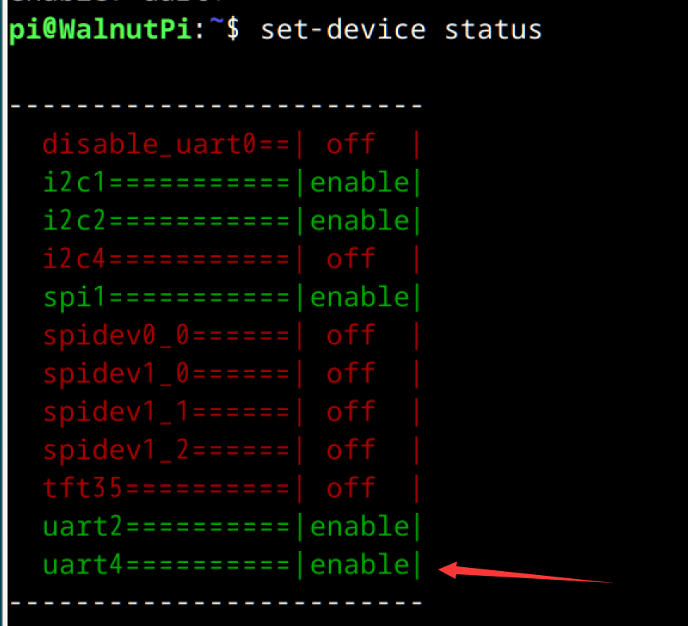
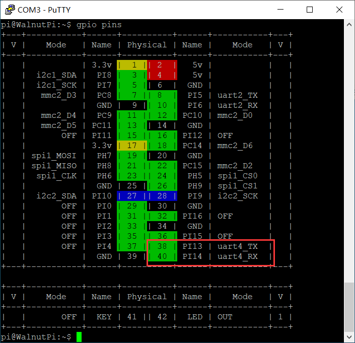

# 切换GPIO功能

有些引脚上带有**PWM, I2C, UART, SPI**等功能，需要使用`set-device`指令来将设置启用，然后才能使用Python或C对其进行嵌入式编程应用。

`set-device`的工作原理是基于linux提供的**device tree overlay**功能，我们已经把 “将xx引脚配置为spi并启用对应驱动” 之类的信息写成配置文件(.dtb)中。这条指令会控制系统在开机时加载哪些配置文件(.dtb)。

注意，一个引脚同时只能被设置为一种功能，linux系统不允许引脚被多个驱动占用。比如**PI13**引脚可以被设置为**pwm3**或是**uart4_txd**，但在开机时只能二选一，要么设置为**pwm3**，要么设置为**uart4_txd**。


## 查看GPIO设备状态

可通过下面指令查看当前所有GPIO设备状态：

```bash
set-device status
```
- 状态为**off**，则该项不生效
- 状态为**enable**，则会设置对应引脚，并使能对应驱动。


## GPIO设备使能

通过下面指令使能某项GPIO设备：

```bash
sudo set-device enable xx
```

例：使能 **uart4**

```bash
sudo set-device enable uart4
```

使能后需要重启开发板生效：

```bash
sudo reboot
```

执行上面命令后使用`set-device status`命令可以看到uart4设备已被使能。



运行命令`gpio pins`后，也可看到核桃派1b的对应引脚被切换为对应工作模式




## GPIO设备禁用

通过下面指令禁用某项GPIO设备：

```bash
sudo set-device disable xx
```

使能后需要重启开发板生效：

```bash
sudo reboot
```