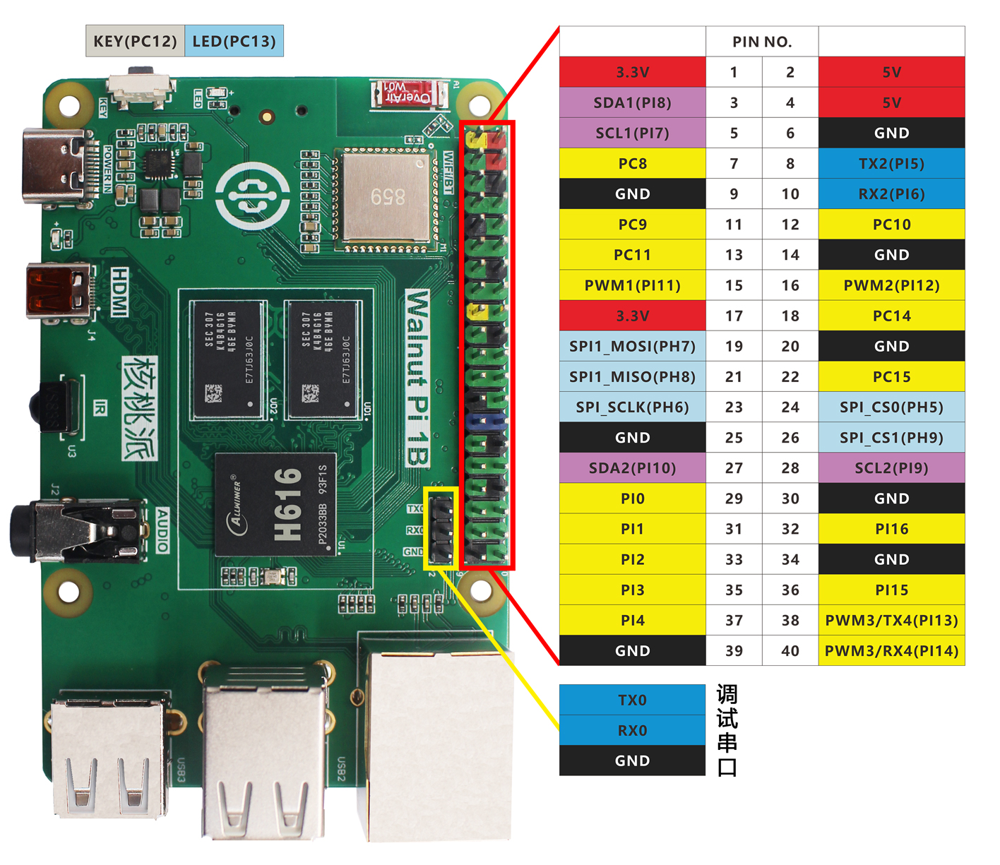

# GPIO介绍

我们详细介绍一下核桃派的GPIO，也就是核桃派的40Pin GPIO（和树莓派类似），核桃派已经是一个很棒的卡片电脑，但 GPIO 的设计让用户使用核桃派进行各类 DIY 电子设计变得更容易，让你拥使用一个强大的单片机开发板一样的体验。

下面是核桃派GPIO的引脚图：

- 核桃派1B

- 核桃派ZeroW

从上面表格和图例可以看到，GPIO和传统的单片机开发相似，除了普通IO口外，也有I2C、串口（UART）、SPI等总线接口，以及电源输出供电引脚（3.3V和5V）。可以外接各类传感器和模块，在后面的嵌入式编程章节都会涉及。

## 电源引脚

核桃派GPIO中有两路5V和两路3.3V输出引脚，以及8个GND引脚，可对外供电。

## 普通IO

除了电源引脚外，所有IO口都可以配置为输入/输出引脚使用。IO电平为3.3V。

## 其它功能

部分引脚有其它功能，具体如下：

- PWM (脉宽调制)
    - PI11, PI12, PI13, PI14 提供硬件PWM功能

- UART 
    - TX2(PI5), RX2(PI6)
    - TX4(PI13), RX4(PI14)

- I2C 
    - SDA1(PI8), SCL1(PI7)
    - SDA2(PI10), SCL2(PI9)

- SPI 
    - SPI1: MOSI (PH7); MISO (PH8); SCLK (PH6); CS0 (PH5), CS1 (PH9)