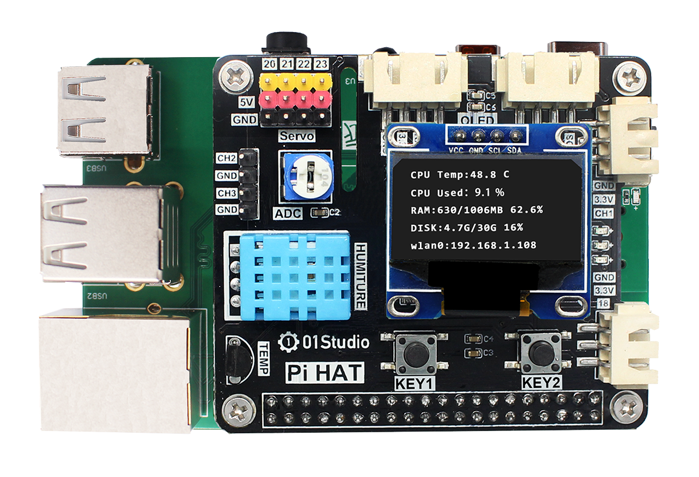
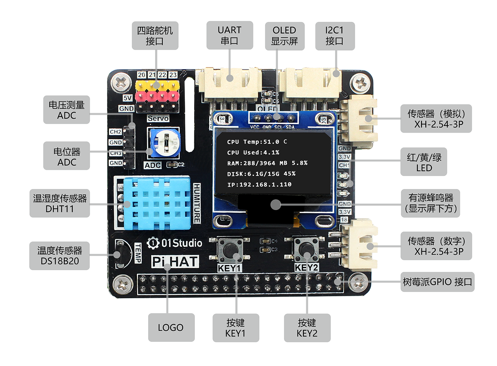

# 配件模块

这里主要介绍除了常用的外设外，核桃派官方推荐的一些常用配件和模块。

## 3.5寸显示屏

核桃派官方推出的3.5寸显示屏（电阻触摸），使用SPI总线，最高速率可达80MHz。背光可控制，使用官方驱动可以实现系统桌面显示以及其它UI功能。

|  产品参数 |
|  :---:  | ---  |
| 分辨率  | 480x320(Pixel) |
| 接口  | 4线SPI（速率最大：80MHz）|
| 显示屏IC  | st7796 |
| 触摸面板  | XPT2046(电阻触摸) |
| 工作温度  | -20℃ ~ 60℃ |
| 储存温度  | -30℃ ~ 70℃  |
| 外形尺寸  | 83x55mm  |
| 重量  | 75g  |

:::danger 注意

核桃派目前仅提供操作系统桌面显示（含触摸控制）功能。

:::

## PiHAT

PiHAT是由[01Studio公司](https://www.01studio.cc/)设计和研发，适用于树莓派、Jetson Nano和核桃派，通过40P GPIO与核桃派连接，大大提高了核桃派的编程学习可玩性和扩展性。

|  产品参数 |
|  :---:  | ---  |
| 接口  | 树莓派/核桃派/Jetson Nano标准40P接口 |
| LED  | 3个（红、黄、绿）|
| 按键  | 2个  (KEY1和KEY2)|
| 蜂鸣器  | 有源蜂鸣器，低电平导通 |
| 舵机  | 4路舵机接口 |
| 温度传感器  | DS18B20 |
| 温湿度传感器  | DHT11 |
| 电位器  | ADC输入，CH0通道 |
| 电压测量  | ADC输入x2，CH2和CH3通道, 排针连接 |
| 传感器  | XH-2.54-3P防呆接口，模拟输入（ADC），CH1通道 |
| 传感器  | XH-2.54-3P防呆接口，数字输入/输出 |
| UART(串口)  | XH-2.54-4P防呆接口，外接串口设备|
| I2C  | XH-2.54-4P防呆接口，外接I2C设备 |

:::danger 注意

核桃派暂无DS18B20和DHT11传感器驱动和例程。

:::