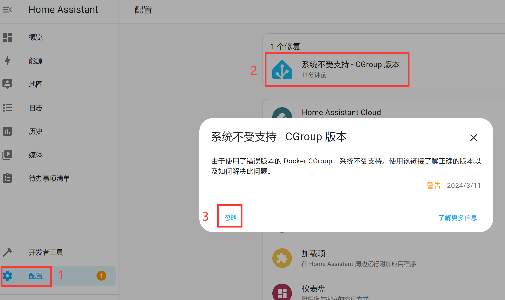
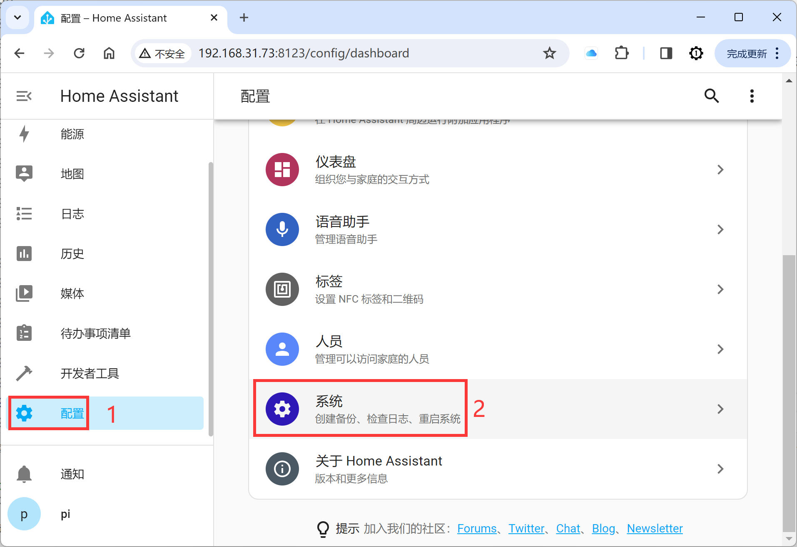

# 初始化配置

## 联网

安装完成后首次使用需要将核桃派接上5V电源，然后通过以太网或者WiFi方式连接到路由器。

### 通过以太网

将网线一端连接核桃派开发板，另一端连接路由器即可。

### 通过WiFi连接

核桃派WiFi连接参考教程：[**WiFi连接**](../os_software/wifi.md)

## 手机APP下载（可选）

Home Assistant 官方提供APP，和PC浏览器上使用一样。安装方式如下：

### 苹果手机

直接在APP Store搜索“Home Assistant”安装即可：

### Android手机
下载APK安装。APK位于核桃派Home Assistant资料包--APP应用文件夹内：

## 初始化设置

### 打开配置界面

Home Assistant主机从启动到运行大概需要2-3分钟时间，启动并联网成功后可以在手机或电脑浏览器对Home Assistant进行初始化配置：

:::tip 提示
核桃派启动后LED蓝灯闪烁，表示正在等待Home Assistant启动，Home Assistant启动完成后LED会常亮，表示启动成功，这时候即可进行下面配置操作。
:::

- 手机打开

使用APP的好处是当手机和Home Assistant连接在同一个路由器时能自动发现局域网内的Home Assistant主机，打开APP，即可搜索到：

- 浏览器打开

在电脑浏览器或者核桃派浏览器（桌面版）输入：http://walnutpi.local:8123 进入初始化界面。

（如果这个链接无法进入需要使用：http://XXXX:8123 ，XXXX为你的核桃派当前IP地址，如：http://192.168.1.100:8123） [**核桃派IP地址获取方法**](../os_software/ip_get.md)

:::tip 提示
配置成功后推荐使用ip地址登录，http://walnutpi.local:8123 实测偶尔会出现打不开情况。
:::

### 开始配置

进入后出现下面欢迎画面：

左下角选择简体中文，然后点击**创建我的智能家居按钮**。

输入自己定义的名称、用户名和密码（请牢记账号和密码），点击创建账户：

输入地理位置，这里未使用科学上网的用户可能显示不出地图，先直接点下一步跳过即可：

选择自己所在的地区：

选择是否共享使用数据给官方：

系统提示发现了一些设备，点完成即可。

然后进入了主界面，配置过的用户今后登录后都是出现这个主页面，刚刚提示发现的设备可能会在主界面仪表盘显示出来：

## 修复提示

提示修复 **系统不健康 - 没有提权** ，镜像方式首次启动原因，直接点忽略即可:

提示修复 **系统不受支持 - CGroup** 版本，直接点忽略即可:

## 系统更新

Home Assistant更新，收到这个提示可以直接点进去更新，没有科学上网的用户更新会花费比较长时间（10多分钟以上） ，请耐心等待安装完成。

## 网络管理

网络管理用于管理Home Assistant主机的有线和无线网络（WiFi）连接。

点击 `配置` -- `系统` ：

点击`网络`:

这里可以看到有线以太网（ETH0）和无线WiFi（WLAN0）的网络情况，包括IP地址以及搜索WiFi热点并连接等功能设置。

连接WiFi热点需要将WLAN0的IPV4和IPV6开启，再扫描，选择热点输入密码连接即可。连接成功后可以看到IP信息。

:::tip 提示
更换网络方式后IP地址会变化，注意同步修改Home Assistant主机的登录地址。
:::

## 安全关机

长按核桃派按键6秒以上，LED闪烁几下就可以松开，进入关机过程，稍作等待到蓝灯熄灭，表示关机完成。

:::danger 警告
不建议直接断电来关闭核桃派，有可能出现Home Assistant数据保存错误或丢失。
:::

