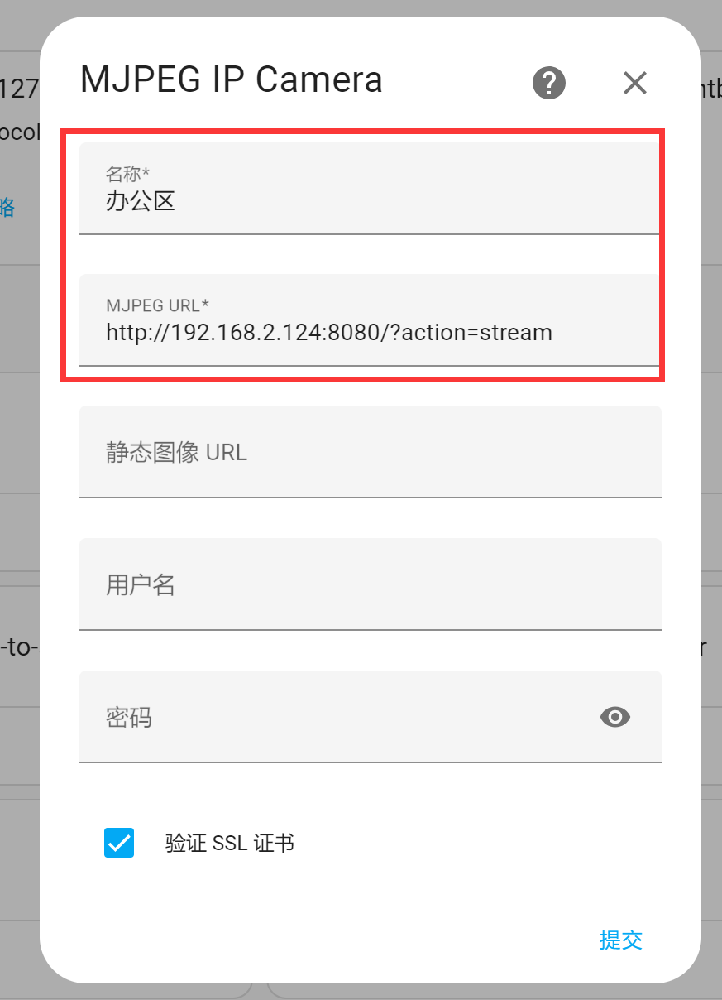

# 摄像头监控

Home Assistant集成了**MJPEG IP Camera**集成，可以跟前面核桃派USB摄像头使用方法对接起来，实现在Home Assistant界面监控。

核桃派USB摄像头使用教程请看前面[USB摄像头章节内容](../os_software/usb_cam.md) , 这里不再重复。

按上面教程启动摄像头并测试通过后接下来在Home Assistat添加该设备：

打开**配置**  -- **添加集成** :

在弹出对话框搜索 **MJPEG** 关键词，然后选择下方**MJPEG IP Camera** :

接下来填写摄像头信息：

- `名称`: 自定义；
- `MJPEG URL`: 填写连接USB摄像头的IP地址加字符，[核桃派IP地址获取](../os_software/ip_get.md)， 例： http://192.168.1.11:8080/?action=stream。如果USB摄像头连接到Home Assistant主机上的话，可以直接用127.0.0.1 （本机IP） 。

完成后可以看到集成栏多了MMJPEG IP Camera:

打开设备点击下方这个小圆圈可以看到摄像头监控画面：

可添加至首页仪表盘：

添加后发现仪表盘的监控画面没有即时刷新，按下面方法配置一下即可：

点击右上角小铅笔按钮进入卡片编辑：

点击监控画面左下角**编辑**：

相机视图模式选择：live（直播）：

完成返回后刷新一下网页，即可看到相机画面实时刷新：

