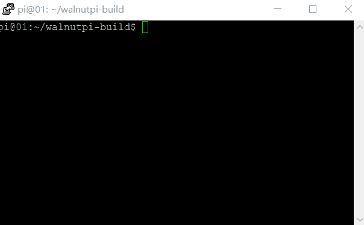
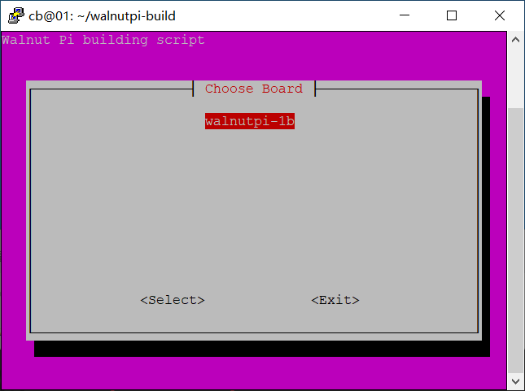

# 使用walnutpi-build构建系统镜像
我们提供的sd卡镜像就是用这个构建出来的
:::info
修改日期：2024.1.3

作者：sc-bin(酥饼)

有疑问可以进群聊聊（核桃派QQ群: 677173708）
:::


## walnutpi-build
我们把构建系统镜像的过程写成了shell脚本，并在[<github链接>](https://github.com/walnutpi/walnutpi-build)处开源，可以从此处下载最新版。

```
git clone https://github.com/walnutpi/walnutpi-build.git
```

- 系统需求：ubuntu22.04
- 运行时需要全程科学上网，一些东西需要当场从github处下载


## 运行脚本，构建镜像
首先运行以下命令，安装两个所需的前置软件
```
sudo apt install whiptail bc 
```

运行脚本只需要进入walnutpi-build的文件夹内，运行以下命令。注意，如果命令行宽度或高度不够，会运行失败。
```
sudo ./build.sh
```


操作方式如下
- 按`Esc键`退出
- 按`上下方向键`选择选项
- 按`回车键`确认

出来的第一个界面是选择开发板，目前有两个，带legacy的是编译walnutpi-1b最初适配的linux5.16版本，不带的是编译最新的linux6.1版本



接下来第二个界面是选择编译哪个组件，构建一个系统镜像文件，或是想选择单独编译uboot linux rootfs。

这里直接选择第一项，构建整个系统镜像


接下来要选择编译`server`或是`desktop`版本，按下回车则会开始构建，想更改具体配置可以去修改`本项目/fs-build`路径下的脚本
- server: 无桌面，体积小，启动快。
- desktop: 在server版本基础上安装了桌面，预装了一些桌面应用，玩法更多。


最后会在`本项目/output`路径下输出一个可用于烧录的镜像，命名格式是`版本号_编译日期_有无桌面_板子名_内核版本_debian版本`，例如
- server版本的镜像名为`V2.0.0_12-27_server_WalnutPi-1b_6.1.31_bookworm.img`
- desktop版本的镜像名为`V2.0.0_12-27_desktop_WalnutPi-1b_6.1.31_bookworm.img`


