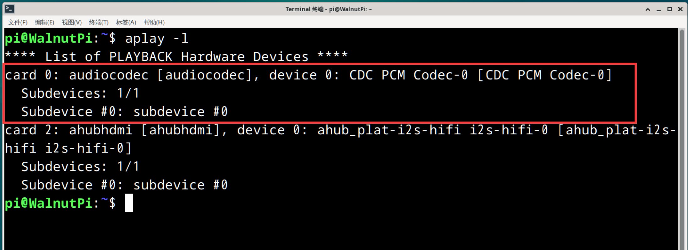
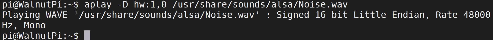

# 音频

## 耳机口

核桃派板载的3.5mm音频输出口，该接口有一定的输出功率，可以使用耳机或者带功放的扬声器都可以播放声音。

### 查看音频设备

可以使用下面指令来查看音频信息：

```bash
aplay -l
```



### 音频播放测试

播放系统自带wav音频文件测试, 下面指令的**audiocodec**为上面指令查看到的耳机口设备名称：

```bash
aplay -D hw:audiocodec /usr/share/sounds/alsa/Noise.wav
```



音频口接上耳机或者扬声器，可以听到播放出声音。

### 桌面系统音乐播放

可以直接使用带桌面系统预装的VLC媒体播放器播放音频。

先将音频文件通过U盘或者ssh其它方式拷贝到核桃派，然后点击鼠标右键，**使用VLC媒体播放**即可：


## HDMI音频

如果你的HDMI显示器带扬声器功能，不清楚显示器是否带扬声器功能的可以使用一台windows电脑连接，能通过音频选择输出实现播放音频说明该HDMI显示器带音频功能。

:::tip 提示
此功能需要系统版本在v2.0.0以上。
:::


### 查看音频设备

可以使用下面指令来查看HDMI音频信息：

```bash
aplay -l
```


### 音频播放测试

播放系统自带wav音频文件测试, 下面指令的**ahubhdmi**为上面指令查看到的HDMI音频设备名称：(**注意该指令使用【plughw】而非前面耳机口的【hw】**)

```bash
aplay -D plughw:ahubhdmi /usr/share/sounds/alsa/Noise.wav
```


### 桌面系统音乐播放

可以直接使用带桌面系统预装的VLC媒体播放器播放音频。核桃派系统默认使用耳机口作为音频输出，只需要在导航栏右下角切换至HDMI即可实现播放器、网页等全局音频切换。


先将音频文件通过U盘或者ssh其它方式拷贝到核桃派，然后点击鼠标右键，**使用VLC媒体播放**即可：


