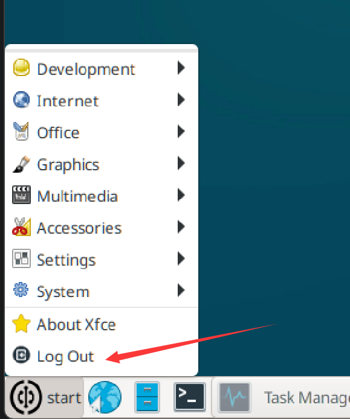

# 关机和重启

核桃派是带有操作系统的，跟普通单片机开发板直接断电就关闭不一样，为了保护电路板，建议用菜单栏的**Log Out(注销)**功能, 在弹出对话框中选择关机或重启。以避免突然断电从而损坏操作系统或者导致文件丢失。



**Shut DownW**是关机，**Restart**是重启。


可以通过指令来关机或重启。
- 关机
```bash
sudo shutdown
```

- 重启
```bash
sudo reboot
```