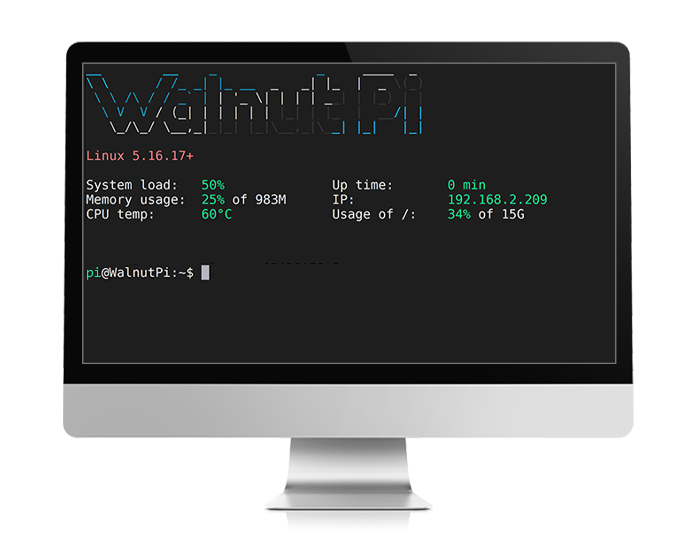
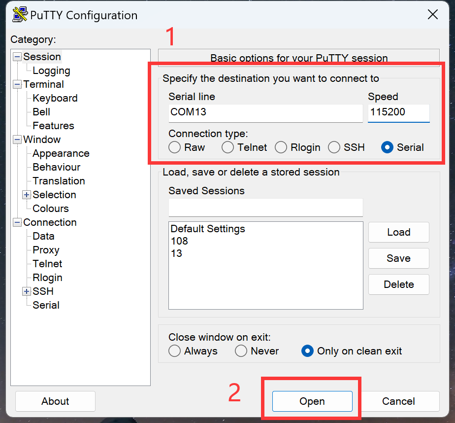
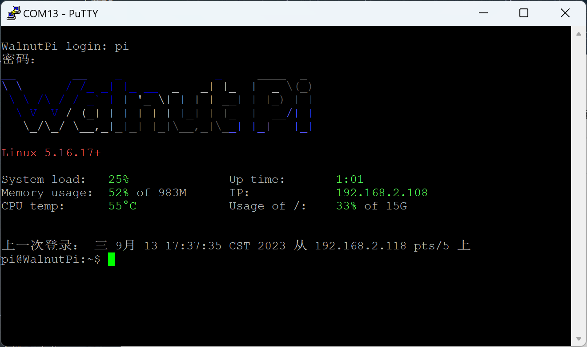

# 无桌面系统

无桌面系统跟桌面系统相比就是少了Debian桌面和软件应用，使用终端方式交互，好处是更快的启动速度，少占内容，功耗低。特别适合熟悉Linux指令的用户。

## 登录终端

- `普通用户（默认）` 账号：pi ; 密码：pi
- `管理员账户` 账号：root ; 密码：root

你可以使用以下方式登录终端。

### HDMI显示器

你依然可以使用HDMI加USB键盘鼠标方式通过显示器使用：



### 串口终端

:::tip 提示

此方法同样适用于带桌面系统

:::

通过核桃派预留的串口终端排针通过USB转TTL工具连接到电脑，然后使用putty这类终端软件登录：


在设备管理器可以看到设备的COM号：


打开putty软件:


输入刚刚查看到自己电脑的COM号，然后波特率是：115200，点击open:



然后出现账号密码输入提示，普通用户账户密码都输入"pi"即可。**如果没出现可以按一下键盘回车键试试**。登录成功就就出现核桃派终端相关信息。



:::tip 提示

无桌面系统登录后的默认路径 `/home/pi` 目录下只有一些隐藏文件，因此使用 **ls** 查看会没有东西，属于正常现象。可以通过 **ls -a** 查看所有文件，包括隐藏文件。

:::

### ssh远程

:::tip 提示

此方法同样适用于带桌面系统

:::

在这之前你需要将核桃派通过**网线**或者参考下一节**WiFi连接**章节内容将核桃派连接到路由器。保证核桃派和你的电脑在同一个 网段下（通常指连接到同一个路由器下）。

可以ssh无线远程打开终端，先使通过HDMI显示器或者串口方式用下方指令获取核桃派当前IP地址：
```bash
sudo ifconfig
```
eth0表示以太网接口，wlan0表示WiFi连接，连接成功下方会有IP地址。


这里同样使用putty软件演示（你可以使用其它带ssh功能的软件工具）:


选择的是ssh，然后输入核桃派IP地址，端口默认22。


弹出信任直接选择是即可。


然后出现账号密码输入提示，普通用户账户密码都输入"pi"即可。登录成功就就出现核桃派终端相关信息。


## 使用技巧

### WiFi连接

系统运行后我们最想做的应该是连接WiFi了，由于无桌面系统没有操作界面，因此我们可以通过终端指令方式来操作。

通过下面命令来获取当前可连接WiFi SSID：
```bash
nmcli dev wifi
```


:::danger 警告

务必先执行上方 **nmcli dev wifi** 指令获取WiFi信息后才能进行下一步开始连接。

:::
<br></br>

接下来通过下面指令连接指定的WiFi(需要加sudo管理员权限)。下方 "walnutpi" 为wifi账号，"88888888" 为密码。你需要替换成你自己的WiFi账号密码。
```bash
sudo nmcli dev wifi connect walnutpi password 12345678
```
<br></br>

连接成功后可以使用下面指令查看wifi连接情况，有IP地址说明连接成功。
```bash
sudo ifconfig
```
wlan0表示WiFi连接，下方有IP地址，eth0则表示以太网口连接。


