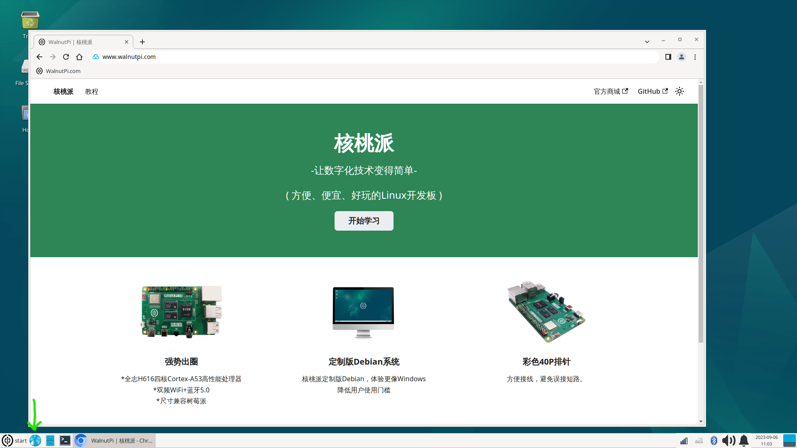
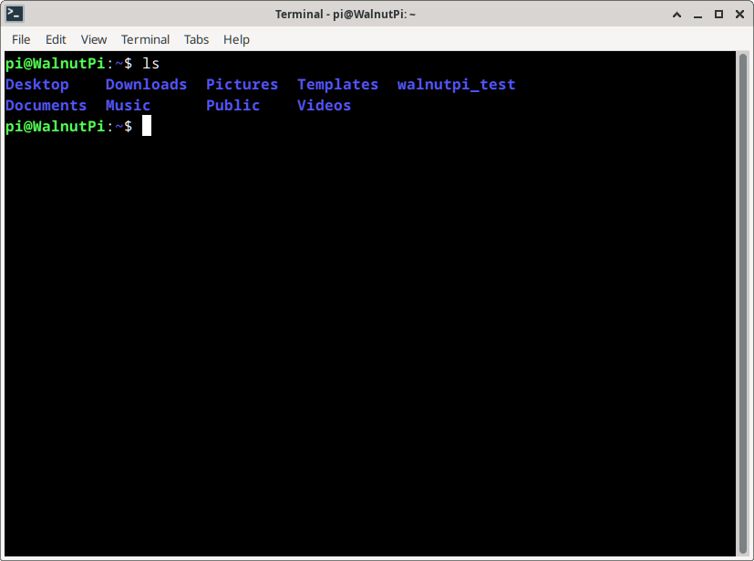
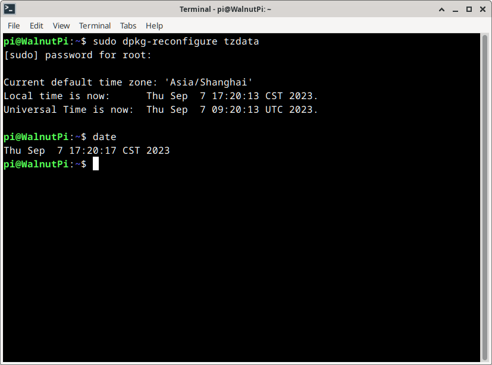

# 系统介绍和设置

将烧录好镜像的SD卡插入核桃派，查看桌面系统你需要一个HDMI显示器和键盘鼠标操作。

:::tip 提示

核桃派桌面系统首次启动由于需要初始化软件等，耗时比较长，大约几分钟，需要耐心等待系统桌面显示出来。以后再次启动速度会快很多，大约几十秒。

::: 

<br></br>

- `普通用户（默认）` 账号：pi ; 密码：pi
- `管理员账户` 账号：root ; 密码：root

## 桌面功能
核桃派Debian系统经过定制修改，目的是做成跟Windows接近，降低用户的使用门槛。以下是桌面功能说明。


**<font color='#06fe00' size='4'>A&nbsp;</font>** **<font size='4'>回收站</font>** &nbsp;&nbsp;&nbsp;&nbsp;&nbsp;&nbsp;
**<font color='#06fe00' size='4'>B&nbsp;</font>** **<font size='4'>文件系统</font>** &nbsp;&nbsp;&nbsp;&nbsp;&nbsp;&nbsp; 
**<font color='#06fe00' size='4'>C&nbsp;</font>** **<font size='4'>当前用户文件</font>** &nbsp;&nbsp;&nbsp;&nbsp;&nbsp;&nbsp; 
**<font color='#06fe00' size='4'>D&nbsp;</font>** **<font size='4'>菜单栏</font>** &nbsp;&nbsp;&nbsp;&nbsp;&nbsp;&nbsp; 

**<font color='#06fe00' size='4'>E&nbsp;</font>** **<font size='4'>启动栏：</font>** <font size='4'>从左往右依次是**浏览器、文件管理器、终端**</font>

**<font color='#06fe00' size='4'>F&nbsp;</font>** **<font size='4'>系统托盘：</font>** <font size='4'>从左往右依次是**网络、输入法、蓝牙、声音、通知、日期时间、快速桌面**</font>

## 浏览器
核桃派系统预装了谷歌浏览器迷你版Chromium, 位于启动栏第1项，使用方法跟我们平时电脑浏览器没什么区别。



## 文件管理
文件管理位于启动栏第2项，打开后可以看到核桃派相关文件，这些文件都是存放在SD卡里。


## 终端
终端（Termianal）要追溯到早期的计算机时代，那时候还没有可视化桌面，很多计算机操作都是通过终端命令完成。 到现在我们依然很多场合和调试会用到，掌握 linux 常用终端命令，能让你的开发工作事半功倍。

在启动栏中点击第3项 **“终端”** 按钮即可打开终端。**浏览器、文件管理器、终端**


在终端中首先看到的是提示符，它正在等待您的指示。 提示运行如下：

<font color='#06fe00'>pi@WalnutPi</font>:~$

pi 表示用户名; 

@后面的 WalnutPi 表示主机名; 

~后面表示当前目录; 

**$**表示非特权用户。

我们来简单测试一下终端，在终端输入 ls ,按回车，可以看到列出了当前目录下的文件和文件夹名称：
```bash
ls
```


输入 cd Desktop ,按回车，可以看到提示当前目录变成了 Desktop（桌面下）。
```bash
cd Desktop
```


## 用户切换
核桃派系统预设2个用户。分别是：
- **普通账户(桌面系统默认启动)** 用户名：pi 密码：pi
- **管理员** 用户名：root 密码：root

有些终端命令需要通过管理员才可以执行，我们可以在终端通过 su 指令来切换用户。

**切换为管理员：**在终端输入su，按回车，然后在弹出的Password:后面输入密码 **root**,（密码不会显示，注意大小写），再按回车当前终端即可进入管理员用户。
```bash
su
```


**切换为普通用户：**在终端输入su加用户名按回车即可，如切换为pi用户可输入下面命令：
```bash
su pi
```


## 语言切换
核桃派系统支持通过终端命令切换操作系统语言，目前支持中文和英文两种语言。**首次切换需要时间长一点，大约几十秒，请耐心等待。**设置完成后重启核桃派生效：
- 切换为中文：
```bash
sudo set-language cn
```

- 切换为英文：
```bash
sudo set-language en
```


## 时间设置
Linux系统启动会自动同步网络时间，但是使用的为世界标准时间UTC（伦敦时间），在中国使用需要将时区改成**Asia/Shanghai**，date命令才能获取正确时间。
执行命令：
```bash
sudo dpkg-reconfigure tzdata
```
选择Asia，即亚洲地区，按回车。


选择Shanghai，上海，按回车。


配置完成后可以输入date命令来查看时间：
```bash
date
```


## 系统设置
系统设置位于开始菜单栏，用户可以根据自己需要配置核桃派系统各项功能。


## 关机和重启
核桃派是带有操作系统的，跟普通开发板直接断电就关闭不一样，为了保护电路板，建议用菜单栏的Log Out, 在弹出对话框中选择关机或重启。以避免突然断电从而损坏操作系统。


**Shut DownW**是关机，**Restart**是重启。


可以通过指令来关机或重启。
- 关机
```bash
sudo shutdown
```

- 重启
```bash
sudo reboot
```