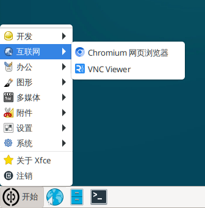
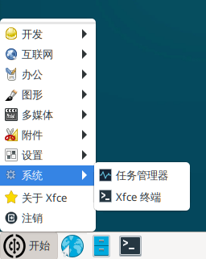

# 预装软件

核桃派系统预装了一些应用，方便用户使用。本节来简单介绍一下相关软件。软件位于开始菜单栏。

## 编程开发

### Geany
Geany是一个小巧的集成开发环境，是免费的自由软件。核桃派的C编程将会用到Geany。

### Thonny
Thonny是一个轻量级的Python IDE。主要做Python编程开发。核桃派的Python嵌入式编程内容主要用到Thonny。Thonny还可以用来给连接到核桃派的MicroPython硬件（pyboard、ESP32等）进行开发。

## 互联网

### chromium浏览器
谷歌迷你浏览器，用于上网浏览网页，也是核桃派系统默认浏览器。

### VNC Viewer
VNC客户端，可以远程到装有VNC服务器的电脑桌面。

## 办公

### LibreOffice
这是一款开源的offcie软件，可以在Linux系统下打开和编辑word、excel、PPT等相关文件。

## 图形

### Ristretto图片查看器
Ristretto图片查看器可以用于打开常见的jpg、png文件。

## 多媒体

### PulseAudio音量控制
调节3.5mm音频输出口音量。

### VLC媒体播放器
用于播放MP3、MP4等多媒体文件。

## 附件

### 截图
截图软件。

### Mousepad文本
一款轻量级的文本编辑器。

### Galculator计算器
计算器

## 系统

### 任务管理器
查看系统CPU、内存使用情况以及打开的进程。

### Xfce终端
核桃派系统默认终端。