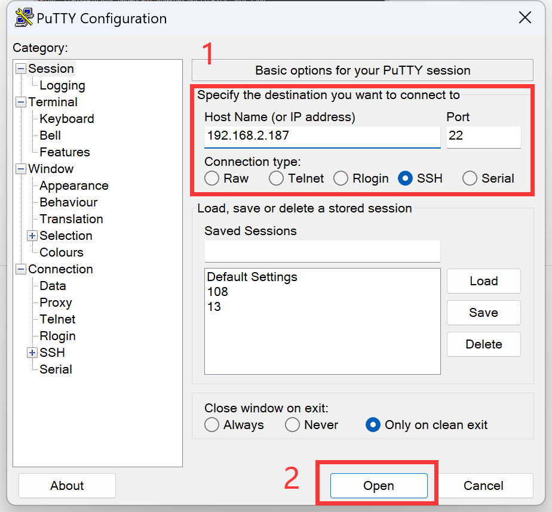

# SSH远程终端

熟悉指令用户可以对已经联网的核桃派进行局域网SSH远程终端控制，方便使用自己的PC对核桃派远程进行各种指令操作。

- `普通用户（默认）` 账号：pi ; 密码：pi
- `管理员账户` 账号：root ; 密码：root

在这之前你需要将核桃派通过**网线**或者参考下一节[WiFi连接](../os_software/wifi)章节内容将核桃派连接到路由器。保证核桃派和你的电脑在同一个 网段下（通常指连接到同一个路由器下）。

先使通过HDMI显示器或者串口方式用下方指令获取核桃派当前IP地址：
```bash
sudo ifconfig
```
eth0表示以太网接口，wlan0表示WiFi连接，连接成功下方会有IP地址。


这里使用putty软件演示（你可以使用其它带ssh功能的软件工具）:


选择的是ssh，然后输入核桃派IP地址，端口默认22。



弹出信任直接选择是即可。


然后出现账号密码输入提示，普通用户账户密码都输入"pi"即可。登录成功就就出现核桃派终端相关信息。


