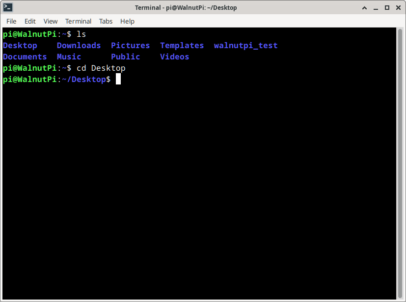

# 终端和常用命令

## 桌面系统打开终端
终端（Termianal）要追溯到早期的计算机时代，那时候还没有可视化桌面，很多计算机操作都是通过终端命令完成。 到现在我们依然很多场合和调试会用到，掌握 linux 常用终端命令，能让你的开发工作事半功倍。**（无桌面系统启动后就只显示这个终端）**

在启动栏中点击第3项 **“终端”** 按钮即可打开终端。**浏览器、文件管理器、终端**


在终端中首先看到的是提示符，它正在等待您的指示。 提示运行如下：

<font color='#06fe00'>pi@WalnutPi</font>:~$

pi 表示用户名; 

@后面的 WalnutPi 表示主机名; 

~后面表示当前目录; 

**$**表示非特权用户。

我们来简单测试一下终端，在终端输入 ls ,按回车，可以看到列出了当前目录下的文件和文件夹名称（**无桌面系统pi目录下默认没有文件**）：
```bash
ls
```


输入 cd Desktop ,按回车，可以看到提示当前目录变成了 Desktop（桌面下）。
```bash
cd Desktop
```


## 调试串口打开终端

通过核桃派预留的串口终端排针通过USB转TTL工具连接到电脑，然后使用putty这类终端软件登录 ：

:::tip 提示

当系统无法正常启动时可以使用此功能观察启动信息。注意TX,RX是交叉接线，有电平切换功能的USB TTL工具需要将电平切换到3.3V。

:::


:::tip 提示

如果你使用的ZeroW，可以通过接扩展板的调试串口，或者通过修改config.txt文件调试串口号实现使用40P排针上的uart2来实现终端信息输出。
[config.txt设置调试串口教程](../os_software/config.txt#设置串口终端位置)

:::

在设备管理器可以看到设备的COM号：


打开putty软件:


输入刚刚查看到自己电脑的COM号，然后波特率是：115200，点击open:


然后出现账号密码输入提示，普通用户账户密码都输入"pi"即可。**如果没出现可以按一下键盘回车键试试**。登录成功就就出现核桃派终端相关信息。


## 用户切换
核桃派系统预设2个用户。分别是：
- **普通账户(桌面系统默认启动)** 用户名：pi 密码：pi
- **管理员** 用户名：root 密码：root

有些终端命令需要通过管理员才可以执行，我们可以在终端通过 **sudo + 指令** 来执行。如果想直接在终端切换成管理员账户可以使用 su 指令来实现。

**切换为管理员：**在终端输入su，按回车，然后在弹出的Password:后面输入密码 **root**,（密码不会显示，注意大小写），再按回车当前终端即可进入管理员用户。
```bash
su
```


**切换为普通用户：**在终端输入su加用户名按回车即可，如切换为pi用户可输入下面命令：
```bash
su pi
```


## 常用Linux命令

|  编号 | 命令 | 命令长称 | 功能 |  
|  :---:  | :---:  | ---  | ---  |
| 1  | ls | list | 列出当前目录下的文件 |
| 2  | pwd | print working directory | 输出当前目录 |
| 3  | cd | change directory | 改变目录 |
| 4  | mkdir | make directory | 新建目录 |
| 5  | cat | concatenate | 显示或连接文件内容 |
| 6  | rm | remove | 删除文件 |
| 7  | rmdir | remove directory | 删除目录 |
| 8  | mv | move | 移动/重命名文件或目录 |
| 9  | cp | copy | 复制文件或目录 |
| 10  | echo |   | 显示在终端输入内容 |
| 11  | date |  | 读取系统日期和时间 |
| 12  | grep | global search regular <br></br> expression and print | 全面搜索正则表达式并打印 |
| 13  | man | manual  | 显示命令使用手册 |
| 14  | sudo | super user do | 以root权限执行 |
| 15  | chomod | change mode | 改变文件读写权限 |
| 16  | ./program |   | 运行program程序 |
| 17  | apt | advance package tool | 安装/删除软件包 |
| 18  | exit |  | 退出 |
| 19  | reboot |   | 重启 |
| 20 | shutdown |  | 关机 |