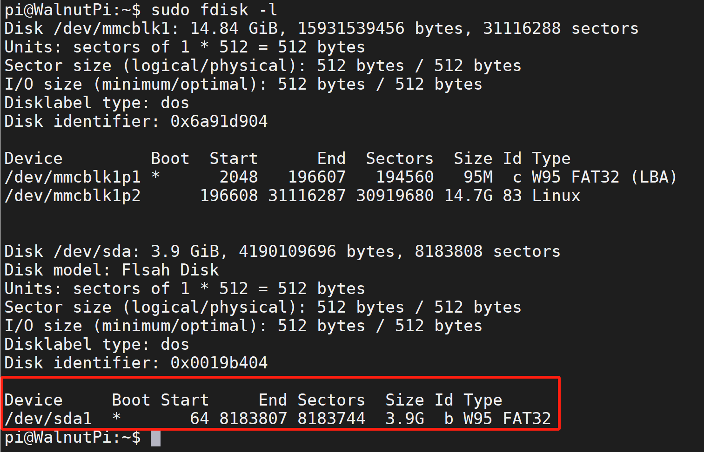

# U盘挂载

将U盘插入核桃派其中一个USB口。


## 带桌面系统

桌面系统跟我们Windows电脑操作类似，插入U盘后可以看到桌面中出现一个透明的U盘图标。


直接鼠标双击即可挂载并打开U盘。可以看到U盘位于 `/media/pi/` 目录下：


## 无桌面系统

无桌面系统下可以使用命令来挂载U盘。**（此方法同样适合带桌面系统）**

插入U盘后，先查看U盘信息：
```bash
sudo fdisk -l
```


这里使用的是一个4G容量的U盘，从上图可以看到设备为：`/dev/sda1` 。

知道U盘设备名称后我们可以通过**mount**指令来挂载U盘，通常挂载到`/media`或者`/mnt`目录下：

先在`/media`创建一个孔文件夹，名称自己定义，这里用“udisk”。
```bash
sudo mkdir udisk
```

挂载U盘：
```bash
sudo mount /dev/sda1 /media/udisk
```

挂载成功后通过"**ls**"命令可以看到U盘里面的文件内容。说明已经挂载成功。
```bash
ls /media/udisk
```


可以通过下面指令卸载U盘：
```bash
sudo umount /media/udisk
```