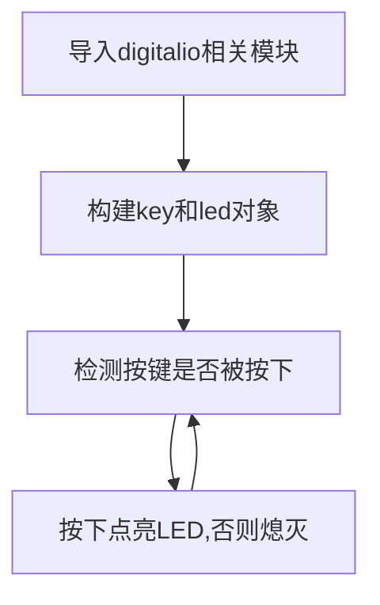
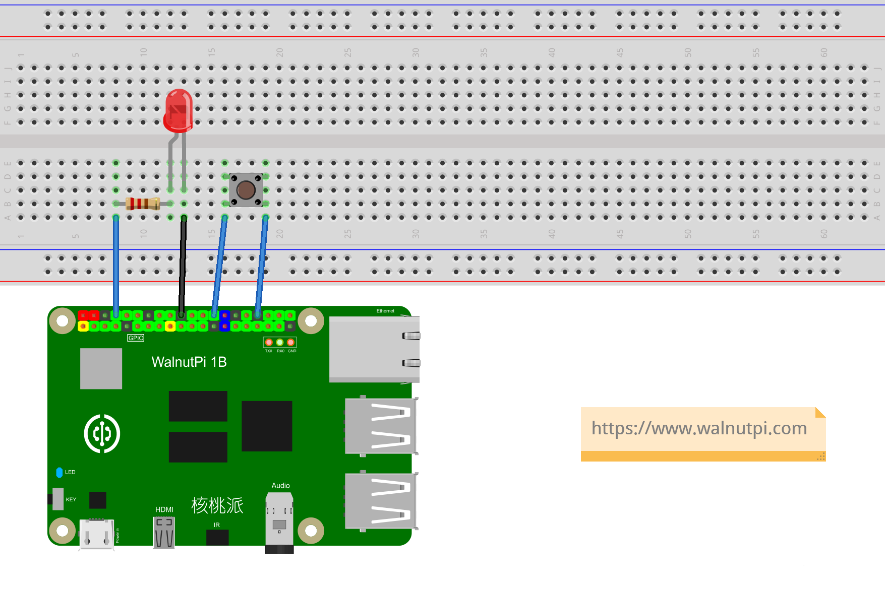

# 按键

## 前言
按键是最简单也最常见的输入设备，很多产品都离不开按键，包括早期的iPhone，今天我们就来学习一下如何使用Python来编写按键程序。有了按键输入功能，我们就可以做很多好玩的东西了。

## 实验目的
编程实现按键输入检测。

## 实验讲解

核桃派板载一个按键，位于TYPE-C供电口旁边：

  <br></br><br></br>

从核桃派原理图可以看到按键连接到主控引脚PC12, 没按下时输入高电平（1），按下接地输出低电平（0）：

 <br></br><br></br>


由于我们使用的是Python库，只需要知道库引脚名称即可。按键在Python库中的名称为**board.KEY** :

 <br></br><br></br>

## digitalio对象

在CircuitPython中可以直接使用 digitalio（数字 IO）模块编程实现IO输入从而实现按键的输入电平检测。具体介绍如下表：

### 构造函数
```python
key=digitalio.DigitalInOut(pin)
```
参数说明：
- `pin` 开发板引脚编号。例：borad.PC8

### 使用方法
```python
key.direction = value
```
引脚定义输入/输出。value匹配值如下：
- `digitalio.Direction.INPUT` ：输入。
- `digitalio.Direction.OUTPUT` ：输出。

<br></br>

```python
key.pull = value
```
设置上下拉电阻。value匹配值如下：
- `digitalio.Pull.UP` :上拉。  
- `digitalio.Pull.DOWN` :下拉。  

<br></br>

```python
value = key.value
```
按键输入返回值。value返回值如下：
- `True` 或 `1` ：高电平。
- `False` 或 `0` ：低电平。

<br></br>

更多用法请阅读官方文档：<br></br>
https://docs.circuitpython.org/en/latest/shared-bindings/digitalio/index.html

KEY跟上一节LED一样也是用到digitalio对象，只是从输出方式给改成了输入方式，我们可以通过代码实现当检测到按键被按下时（输入低电平）点亮LED蓝灯，松开时（输入高电平）熄灭LED蓝灯。



## 参考代码

```python
'''
实验名称：按键
实验平台：核桃派
'''

#导入相关模块
import board
from digitalio import DigitalInOut, Direction, Pull

#构建LED对象和初始化
led = DigitalInOut(board.LED) #定义引脚编号
led.direction = Direction.OUTPUT  #IO为输出

#构建按键对象和初始化
key = DigitalInOut(board.KEY) #定义引脚编号
key.direction = Direction.INPUT #IO为输入

while True:

    if key.value == 0: #按键被按下
        led.value = 1 #点亮LED

    else: #松开
        led.value = 0 #关闭LED
```

## 实验结果

这里使用Thonny远程核桃派运行以上Python代码，关于核桃派运行python代码方法请参考： [运行Python代码](../python_run.md)


按下按键，LED点亮。


松开，LED熄灭


除了使用板载按键和LED外，你也可以自己搭建电路，注意修改代码中的GPIO引脚编号即可。



按键的本质也是GPIO操作，除了板载的LED和按键，你也可以通过杜邦线连接到核桃派其它GPIO（40P排针上）使用相关功能。
