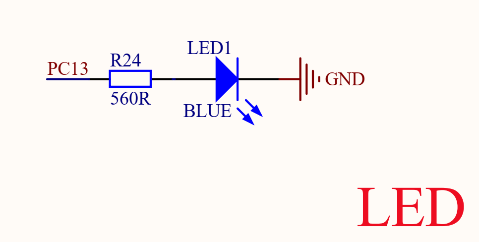
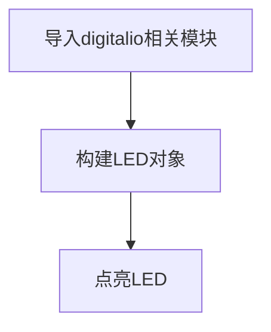

# 点亮第1个LED

## 前言
相信大部分人开始学习嵌入式单片机编程都会从点亮LED开始，我们核桃派的学习也不例外，通过点亮第一个LED能让你对核桃派GPIO应用和编程方法有一定的认识，为以后的学习和更大型的程序打下基础，增加信心。

## 实验目的
点亮板载LED蓝灯。

## 实验讲解

核桃派板载一个可编程LED，位于按键旁边：


从核桃派原理图可以看到LED连接到主控引脚PC13,通过输出高电平点亮：


由于我们使用的是Python库，只需要知道库引脚名称即可。LED在Python库中的名称为**board.LED** :


## digitalio对象

在CircuitPython中可以直接使用 digitalio（数字 IO）模块编程实现IO输出从而点亮LED功能。具体介绍如下表：

### 构造函数
```python
led=digitalio.DigitalInOut(pin)
```
参数说明：
- `pin` 开发板引脚编号。例：board.PC8

### 使用方法
```python
led.direction = value
```
引脚定义输入/输出。value匹配值如下：
- `digitalio.Direction.INPUT` ：输入。
- `digitalio.Direction.OUTPUT` ：输出。

<br></br>

```python
led.pull = value
```
设置上下拉电阻。value匹配值如下：
- `digitalio.Pull.UP` :上拉。  
- `digitalio.Pull.DOWN` :下拉。  

<br></br>

```python
led.value = value
```
GPIO输出值。value匹配值如下：
- `True` 或 `1` ：高电平。
- `False` 或 `0` ：低电平。

<br></br>

更多用法请阅读官方文档：<br></br>
https://docs.circuitpython.org/en/latest/shared-bindings/digitalio/index.html

上面对CircuitPython的DigitalInOut对象做了详细的说明，digitalio是大模块，DigitalInOut、Direction、Pull、DriveMode是digitalio下面的其中一个小模块，在python编程里有两种方式引用相关模块:

- 方式1是：import digitalio，然后通过digitalio. DigitalInOut来操作；
- 方式2是：from digitalio import DigitalInOut,意思是直接从digitalio中引入DigitalInOut模块，然后直接通过DigitalInOut来操作。显然方式2会显得更直观和方便，本实验也是使用方式2来编程。代码编写流程如下：



## 参考代码

```python
'''
实验名称：点亮第1个LED
实验平台：核桃派
'''

#导入相关模块
import board
from digitalio import DigitalInOut, Direction

#构建LED对象和初始化
led = DigitalInOut(board.LED) #定义引脚编号
led.direction = Direction.OUTPUT  #IO为输出

led.value = 1 #输出高电平，点亮板载LED蓝灯

#led.value = 0 #输出低电平，熄灭板载LED蓝灯
```

## 实验结果

这里使用Thonny远程核桃派运行以上Python代码，关于核桃派运行python代码方法请参考： [运行Python代码](../python_run.md)


LED被点亮，不过核桃派的蓝灯默认做了系统启动指示灯（成功启动蓝灯亮），所以看不出效果。


可以修改代码将led熄灭：
```python
led.value = 0 #输出低电平，熄灭板载LED蓝灯
```


除了使用板载LED外，你也可以自己搭建电路，注意修改代码中的GPIO引脚编号即可。


从第一个实验我们可以看到，使用Python来开发核桃派硬件是要学会python库的构造函数和其使用方法，便可通过编程对相关对象的操作，在强大的Python库支持下，实验只用了简单的几行代码便实现了点亮LED灯。
