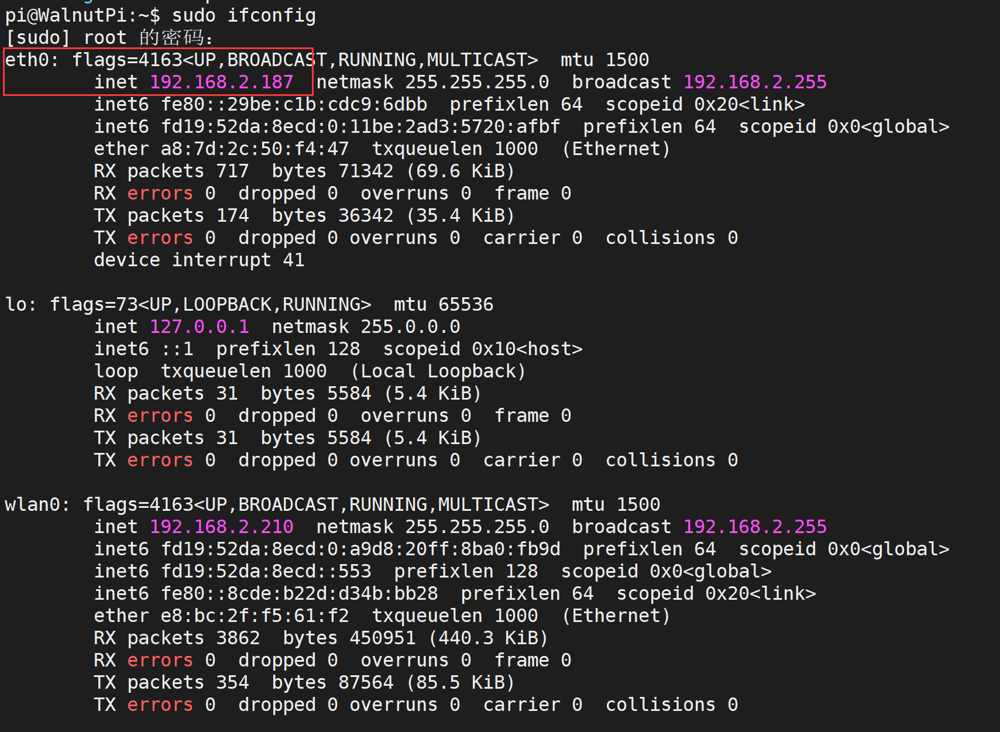

# IP地址获取

本章所有内容都用到网络，因此需要先获取核桃派的IP地址。

## WiFi IP地址

WiFi模块硬件位置, 通过WiFi无线连接到路由器（支持2.4G、5G信号）：


通过以下命令可以获取核桃派所有网络IP地址，**wlan0**为WiFi无线卡名称，连接成功可以看到其IP地址。
```bash
sudo ifconfig
```


## 以太网IP地址

以太网模块硬件位置，通过网线连接到路由器：


通过以下命令可以获取核桃派所有网络IP地址，**eth0**为以太网卡名称，连接成功可以看到其IP地址。
```bash
sudo ifconfig
```


