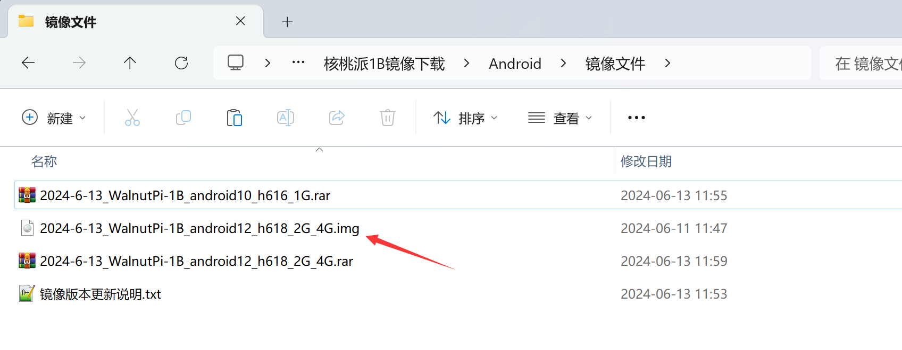
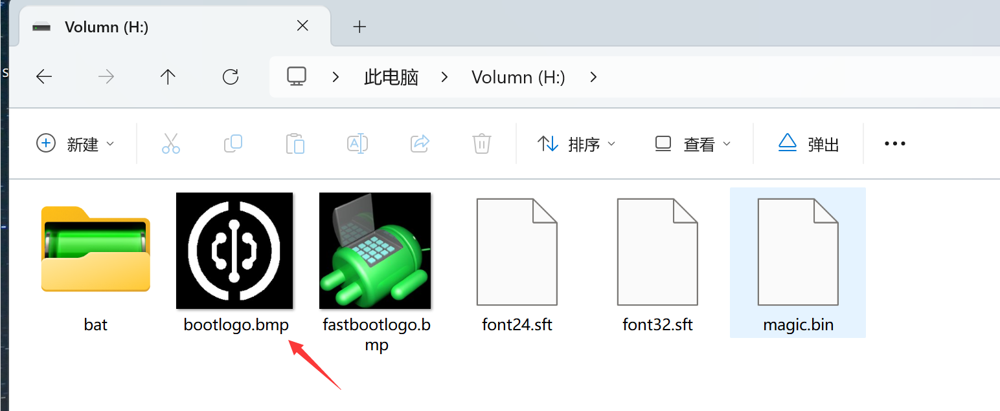
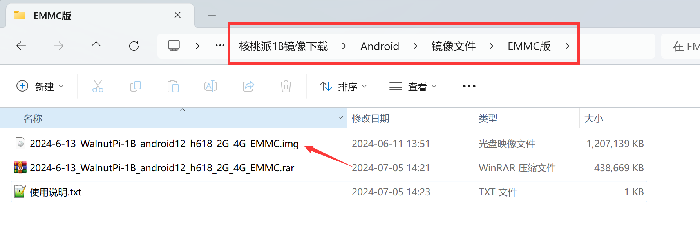
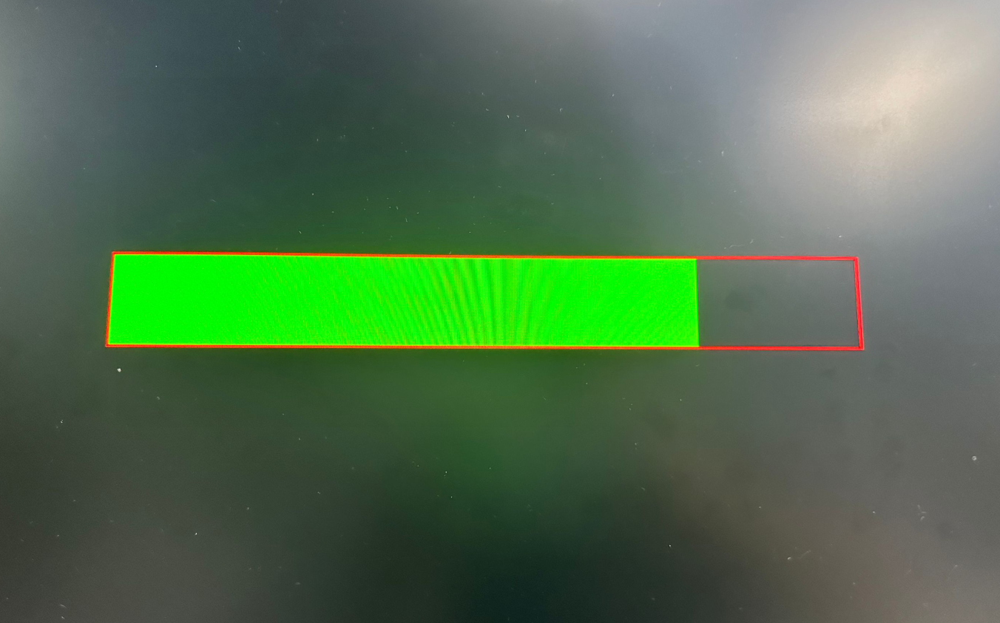

# 镜像烧录

核桃派1B Android使用的是Android TV系统。已经对核桃派1B硬件进行了适配。用户烧录该系统可以安装各类安卓APP或者打造TV机顶盒子。

核桃派1B 1G版本（H616）基于Android 10 , 2G/4G（H618）版本基于Android 12。系统和相关软件区别不大。

:::danger 警告
核桃派H616和H618版本Android镜像烧错无法开机。请注意区分。
:::

## 镜像下载地址：

- 百度网盘链接：https://pan.baidu.com/s/1-ytTK-KI1RP2KsoZpjFSrA?pwd=WPKJ
- 提取码：**WPKJ**

打开Android文件夹，镜像更新说明可以看里面的**说明文档.txt**。觉得百度网盘下载慢的话可以到QQ群文件下载：677173708

**（下载后将压缩包解压,得到img镜像文件待使用）**

## SD启动卡烧录

### 使用 PhoenixCard 烧录

镜像下载完后我们还需要一个镜像烧录软件，使用PhoenixCard。软件位于核桃派Android镜像资料包下烧录工具文件夹里面：

**（下载后需要解压得到文件夹）**

进去文件夹，打开下图所示软件：

插入SD卡到电脑：

按下面步骤开始烧录：

1、选择要烧录的镜像；

2、启动卡；

3、选择插入的SD卡盘符；

4、点击烧卡开始烧录。

烧录过程中进度条可能不动，需要等待几分钟左右，请耐心等待，烧录完成后如下图所示：

在我的电脑回出现一个100多M的盘符。那是核桃派 Android系统的一些配置文件。

文件里面的bootlogao.bmp文件为开机LOGO，足以BMP格式图片，最大支持1280x720分辨率。用户可以自行替换。

## EMMC烧录

下载EMMC版本镜像，解压得到img文件。

使用上面 [烧录教程](#sd启动卡烧录) 烧录到SD卡。区别是要选`量产卡`，其它流程一样。

烧录完成后将SD卡插入核桃派EMMC版本硬件，插上HDMI显示器，上电，可以看到烧录进度。

进度条跑完后表示烧录完成，断电拔掉SD卡，重新上电，能进入安卓系统说明EMMC系统烧写正常。

