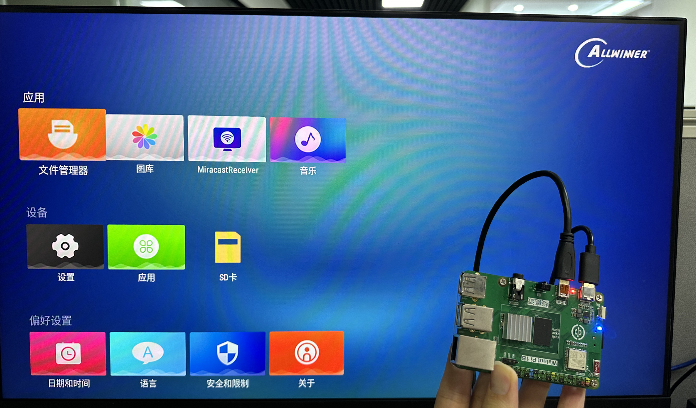

# 开机

在上一节系统镜像烧录完成后MicroSD卡里面就带有核桃派Android系统了，将它插入核桃派背面的SD卡槽，连接好HDMI显示器，上电后可以看到操作系统正常启动即可。

## HDMI显示器方式登录

系统正常启动蓝灯会常亮。启动成功后显示Android TV版桌面。

:::tip 提示

当蓝灯常亮而HDMI无显示时请更换一个HDMI显示器测试，依然无效可以使用下面串口终端方式查看系统启动信息。

::: 

## 串口终端方式登录

如果你没有显示器，可以使用USB转TTL工具连接到核桃派的调试串口使用串口终端方式登录。具体参考：[调试串口打开终端](../os_software/terminal#调试串口打开终端) 章节内容。
