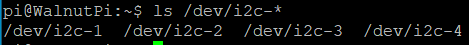
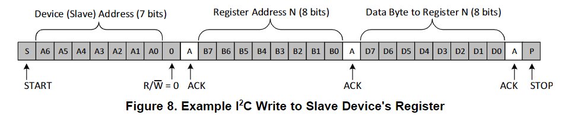

# I2C

## 配置引脚

### 找到板子上的i2c引脚
为了方便查找，我们加入了一个显示功能引脚位置的功能，运行以下命令，查看板子的40pin引脚上有几个可用i2c
```bash
gpio pin i2c
```


### 启用i2c
我们使用`set-device`指令来使能/关闭指定设备的底层驱动，使能后，引脚就会由gpio模式切换为对应的引脚复用功能。（配置后要重启才能生效）


首先查看各设备的状态
```bash
set-device status
```


运行指令启用i2c1，注意要重启后才能生效
```bash
sudo set-device enable i2c1
```

重启后查看引脚状态,可以看到3和5都处于i2c复用模式了了


并且存在`/dev/i2c-1`这个文件，因为后续我们需要通过操作这个文件来控制i2c通讯


## i2c读写程序
linux下一切皆是文件。而i2c1也被抽象为`/dev/i2c-1`这个文件。通过`open`打开它，用`ioctl`触发读写，`close`关闭文件。

### 1. 打开文件
linux下一切皆是文件，先使用`open`函数打开我们要操作的设备对应文件，获取文件描述符。

需要这些头文件
```c
#include <sys/types.h>
#include <sys/stat.h>
#include <fcntl.h>
#include <unistd.h>
```

open设备节点
```c
    int fd = open("/dev/i2c-1", O_RDWR);
    if (fd < 0)
    {
        perror("Fail to Open\n");
        return -1;
    }
```

### 2. i2c_msg
linux下操作i2c不是使用write和read函数，而是使用一个i2c_msg结构体来配置从i2c从起始到停止之间要做的内容。
- `addr`: 目标地址
- `flags`: 读还是写
- `buf` : buf的地址，根据`flags`是读还是写，会在地址帧发送后，将其内容发送出去，或是读取总线内容存放进来。
- `len` : buf的大小


### 3. 向i2c总线写
从德州仪器那下载的i2c时序图↓


加入我现在想往地址是0x3c的设备上，把寄存器0x01赋值为0x55，那msg结构体的设置就该如下。`addr`和`flags`共同决定第一帧地址帧的内容。因为`flags`是写，所以在地址帧发送完后，会将buf的内容依次发送出去。

首先，需要这些头文件
```c
#include <sys/ioctl.h>
#include <linux/i2c.h>
#include <linux/i2c-dev.h>
```

```c

    uint8_t addr = 0x3c;
    uint8_t reg = 0x01;
    uint8_t value = 0x55;

    uint8_t buf[2];
    buf[0] = reg; //寄存器
    buf[1] = value; //数据

    struct i2c_msg msg;
    msg.addr = addr; //目标地址
    msg.flags = 0;  //读写标志
    msg.len = 2;  //buf长度
    msg.buf = buf; 
```

编写完msg后，还需要创建`i2c_rdwr_ioctl_data`结构体，写清楚本次i2c通信要处理几个msg，然后用`ioctl`函数触发一次i2c通信。
```c
    struct i2c_rdwr_ioctl_data data;
    data.msgs = &msg;
    data.nmsgs = 1;

    int ret = ioctl(fd, I2C_RDWR, &data);
    if (ret < 0)
        printf("i2c write failed");
    return ret;
```

### 4. 从i2c总线读
从德州仪器那下载的i2c时序图↓


我现在想往地址是0x3c的设备上，读取寄存器0x01的值.

根据时序图，需要两个msg，第一个msg是写，地址帧后只跟寄存器编号。第二个msg是读，地址帧发完就是从机将该寄存器的内容返回。

```c
    uint8_t addr = 0x3c;
    uint8_t reg = 0x01;
    uint8_t value;

    struct i2c_msg msgs[2];
    msgs[0].addr = addr;
    msgs[0].flags = 0;
    msgs[0].len = 1;
    msgs[0].buf = &reg;

    msgs[1].addr = addr;
    msgs[1].flags = I2C_M_RD;
    msgs[1].len = 1;
    msgs[1].buf = &value;

```

编写完msg后，还需要创建`i2c_rdwr_ioctl_data`结构体，写清楚本次i2c通信要处理几个msg，然后用`ioctl`函数触发一次i2c通信。
```c
    struct i2c_rdwr_ioctl_data data;
    data.msgs = msgs;
    data.nmsgs = 2;

    int res = ioctl(fd, I2C_RDWR, &data);
    if (res < 0)
        printf("Read failed\n");

    return res;
```

### 5. 关闭文件
每次`open`后记得调用`close`来手动关闭，不然文件描述符会保留直到程序关闭。而系统限制单个程序最大只能同时打开1024个文件，如果程序不停的open却不close，没一会就要报错退出了。
```
close(fd);
```

## 示例-从mlx90614中读取温度数据


首先阅读mlx90614的手册，查看他的读写时序↓


根据手册给的时序，这里要创建两个msg，第一个是写，buf内存放读取温度的命令0x07。第二个是读，连续3个字节，其中前两个是温度数据。再加上mlx90614的地址是0，最后代码如下

```c
#include <stdio.h>
#include <stdint.h>
#include <string.h>

#include <sys/types.h>
#include <sys/stat.h>
#include <fcntl.h>
#include <unistd.h>

#include <sys/ioctl.h>
#include <linux/i2c.h>
#include <linux/i2c-dev.h>


#define DEV_I2C "/dev/i2c-1"

//计算mlx9614实际温度值
uint16_t mlx_data_transform(uint8_t Data[3])
{
    uint16_t temp;
    temp = (Data[1] << 8) + Data[0]; // 高位与低位结合
    temp = temp * 2 - 27315;         // 将数据扩大100倍
    return temp;
}

int main()
{

    int fd = open(DEV_I2C, O_RDWR);
    if (fd < 0)
    {
        perror("Fail to Open\n");
        return -1;
    }

    uint8_t addr = 0;
    uint8_t reg = 0x07;
    uint8_t value[3];

    struct i2c_msg msgs[2];
    msgs[0].addr = addr;
    msgs[0].flags = 0;
    msgs[0].len = 1;
    msgs[0].buf = &reg;

    msgs[1].addr = addr;
    msgs[1].flags = I2C_M_RD;
    msgs[1].len = 3;
    msgs[1].buf = value;

    struct i2c_rdwr_ioctl_data data;
    data.msgs = msgs;
    data.nmsgs = 2;

    while (1)
    {

        int res = ioctl(fd, I2C_RDWR, &data);
        if (res < 0)
            printf("Read failed\n");
        printf("temp=[%d]\r\n", mlx_data_transform(value));
        sleep(1);
    }
}
```

我将代码写在文件`i2c.c`内，想将其编译成名为`exe`的可执行文件，只需要执行下面这一句
```bash
gcc i2c.c -o exe
```

执行结果如下，显示我周围环境的温度是30左右，手靠近后上升到34:


