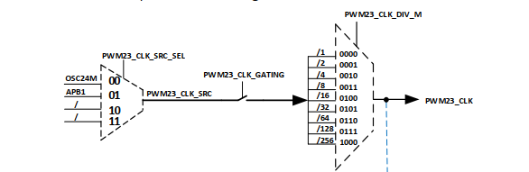
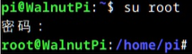
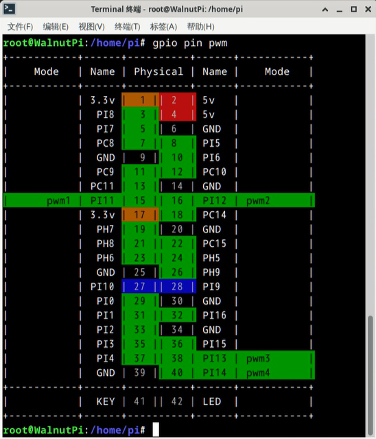
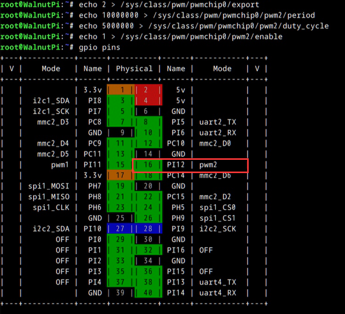

# PWM

本篇主要介绍如何使用板上的硬件PWM功能，基于linux下对pwm的通用操作方式

:::tip
linux系统规定，引脚同时只能被一个驱动使用。

例如核桃派1b的引脚38（PI13）可作为pwm3或uart4_tx。如果你启用了uart4功能，那这个引脚就不能再配置为pwm功能。

:::

## 硬件pwm参数注意

pwm的周期值和高电平时长最短可以设置到10ns

pwm2和pwm3外设共用一个分频器，所以这两路pwm的周期值必须在同一个区间内。




## 硬件pwm控制
**一切皆是文件** linux下操控一切硬件功能，都是通过修改指定文件的形式来实现。想控制硬件pwm，只需要把控制参数写入 **/sys/class/pwm/** 路径下的指定文件即可

那些文件需要使用管理员权限才能操作，为了方便，这里先从用户pi切换到root用户
```
su root
```



### 查看引脚
运行命令`gpio pin pwm`来查看有哪些引脚带硬件pwm功能。
```
gpio pin pwm
```



### 1. 导出控制文件
首先进入pwm控制器0的路径
```
cd /sys/class/pwm/pwmchip0
```


现在还没有单独某个pwm的控制文件，需要把你想控制的硬件pwm编号写入到文件 **export** 中，就会出现该pwm的对应控制文件了。

例如我想使用pwm1，可以使用`echo`命令，将`1`写入到 **export** 这个文件中。然后就会多出一个名为 **pwm1** 的文件夹 
```
echo 1 > export
```


进入这个 **pwm1** 文件夹，这些文件就可以用来设置pwm了


### 2. 设置周期

**period** 这个文件用于设置pwm的周期，单位是纳秒（ns）

例如我想输出一个周期为20ms的pwm，则敲入如下命令即可
```
echo 20000000 > period #周期设置为20ms
```


### 3. 设置占空比
**duty_cycle** 这个文件用来设置一个周期内高电平的时长，单位是纳秒（ns）

例如我想让这个pwm的高电平时长为1.5ms，则敲入如下命令即可
```
echo 1500000 > duty_cycle #高电平时长为1.5ms
```


###  4. 启动/关闭 输出
**enable** 这个文件用于使能pwm输出，
- 写入1，使能pwm输出
- 写入0，关闭pwm输出

```
echo 1 > enable #使能pwm输出
echo 0 > enable #关闭pwm输出
```


### 完整示例：控制pwm2输出
例如想让pwm2输出一个频率100HZ（周期10ms），占空比百分之50（高电平长5ms）的波形。完整流程如下
```
echo 2 > /sys/class/pwm/pwmchip0/export
echo 10000000 > /sys/class/pwm/pwmchip0/pwm2/period #周期设置为10ms
echo 5000000 > /sys/class/pwm/pwmchip0/pwm2/duty_cycle #高电平时长为5ms
echo 1 > /sys/class/pwm/pwmchip0/pwm2/enable #使能pwm输出
echo 0 >/sys/class/pwm/pwmchip0/pwm2/enable #关闭pwm输出
```



