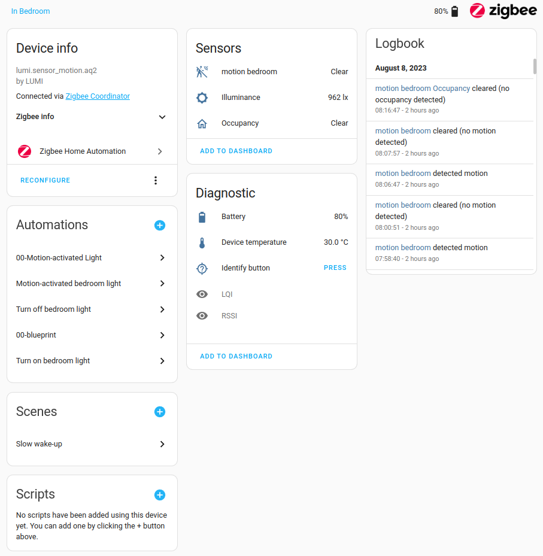
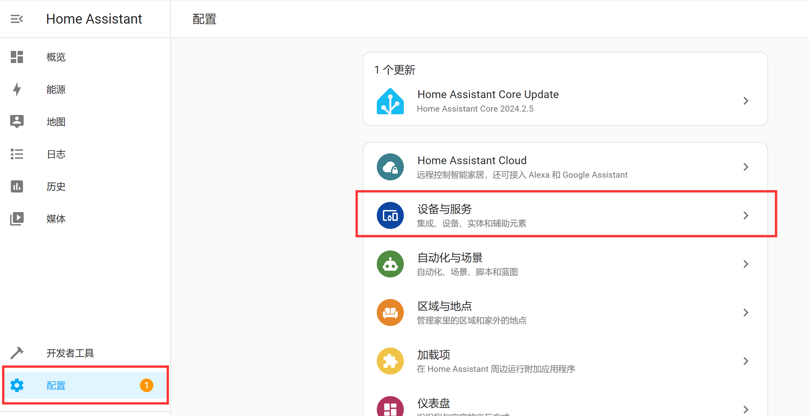
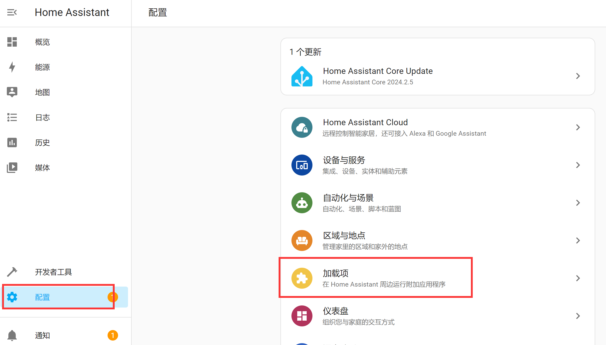

# 概念和术语

通过前面的安装和配置，我们已经成功进入Home Assistant, 接下来看一下Home Assistant最重要的一些概念。搞清楚这些概念对后面使用会有很大的帮助。这章节先大概了解即可，后面教程在实际使用过程中会有详细讲解。

## 集成

集成是允许 Home Assistant 连接到其他软件和平台的软件。例如，飞利浦名为Hue的产品将使用飞利浦Hue集成并允许 Home Assistant 与硬件控制器 Hue Bridge 对话。任何家庭助理兼容设备连接到 Hue Bridge 将在 Home Assistant 中显示为设备。

所有集成介绍链接：https://www.home-assistant.io/integrations

## 实体

实体是 Home Assistant 中保存数据的基本构建块。一个实体代表一个传感器或 Home Assistant 中的功能。实体用于监视物理属性或控制其他实体
。一个实体通常是设备的一部分或服务。

## 设备

设备是一个或多个实体的逻辑分组。一个装置可能代表一个物理设备，可以有一个或多个传感器。传感器显示为与设备关联的实体。例如，运动传感器被表示为设备。它可以提供运动检测、温度和光照水平作为实体。实体具有诸如在检测到运动时检测到以及在没有运动时清除等状态。

:::tip 提示
集成、设备、实体的关系可以用以下例子理解：小米集成下有小米温湿度传感计（1个设备） ，小米温湿度计下有2个实体，分别是温度和湿度值。
:::

**集成、设备、实体位于配置选项下：**

## 自动化

自动化是实现设备或事件联动，由3个关键组件组成：

1. 触发器 - 启动自动化的事件。例如，当太阳落山或运动传感器被激活时。
2. 条件 - 操作必须满足的可选测试可以运行。例如，如果有人在家。
3. 操作 - - 与设备交互。例如开灯。

## 场景

场景会捕获实体的状态，因此您可以稍后重新体验相同的场景。例如，“看电视”场景会调暗客厅灯光，设置为暖白色并打开电视。

**自动化、场景位于配置选项下：**

## 附加组件

附加组件（加载项）通常是可以与 Home Assistant 一起运行的应用程序，但提供了一种在 Home Assistant 中安装、配置和运行的快速简便的方法。附加组件提供额外的功能，而集成
将 Home Assistant 连接到其他应用程序。

