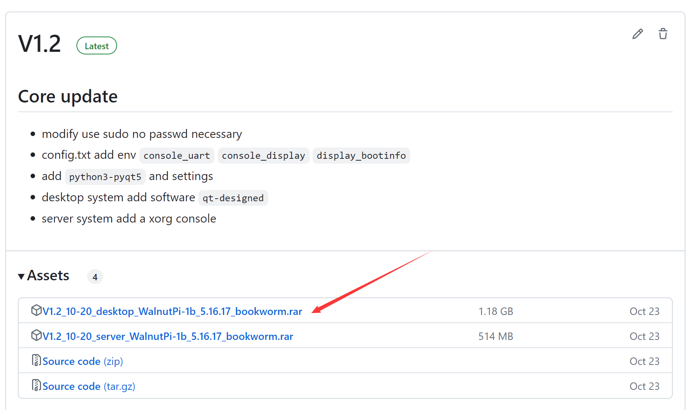

# 资料下载

## 系统镜像

当前核桃派提供核桃派OS（Debian12）、Ubuntn22.04、 Home Assistant、Android TV镜像，本教程主要基于核桃派OS（Debian12），也是我们推荐使用的镜像，分桌面版（Desktop版）和非桌面版（Server版）， 提供以下多种下载方式。

### 百度网盘

- 百度网盘链接：https://pan.baidu.com/s/1-ytTK-KI1RP2KsoZpjFSrA?pwd=WPKJ
- 提取码：**WPKJ**

### QQ群文件

核桃派开源互助群:  **677173708**

:::tip 提示
在Q群将群文件转发给自己设备或其它QQ即可高速下载。
:::

### GitHub

海外地区用户可以使用此方式下载：

https://github.com/walnutpi/walnutpi-build/releases

## 在线教程配套资料包

核桃派教程配套软件、例程源代码、原理图、芯片手册等。

### 百度网盘下载

- 百度网盘链接：https://pan.baidu.com/s/1Wu5De2rlShyz3wBCtZshPA?pwd=WPKJ 
- 提取码：**WPKJ**

### 海外地区下载

- [点击下载](https://walnutpi-1258570164.cos.ap-guangzhou.myqcloud.com/%E6%A0%B8%E6%A1%83%E6%B4%BE%E9%85%8D%E5%A5%97%E8%B5%84%E6%96%99%E5%8C%85%E4%B8%8B%E8%BD%BD/WalnutPi_1_Resources_2024-7-23.rar)

### 资料包介绍

- **开发工具软件**

开发软件、上位机、相关驱动。

- **教程代码**

本在线教程的源代码。

- **原理图和功能图**

开发板原理图和接口说明。

- **芯片手册**

主要IC手册等。

