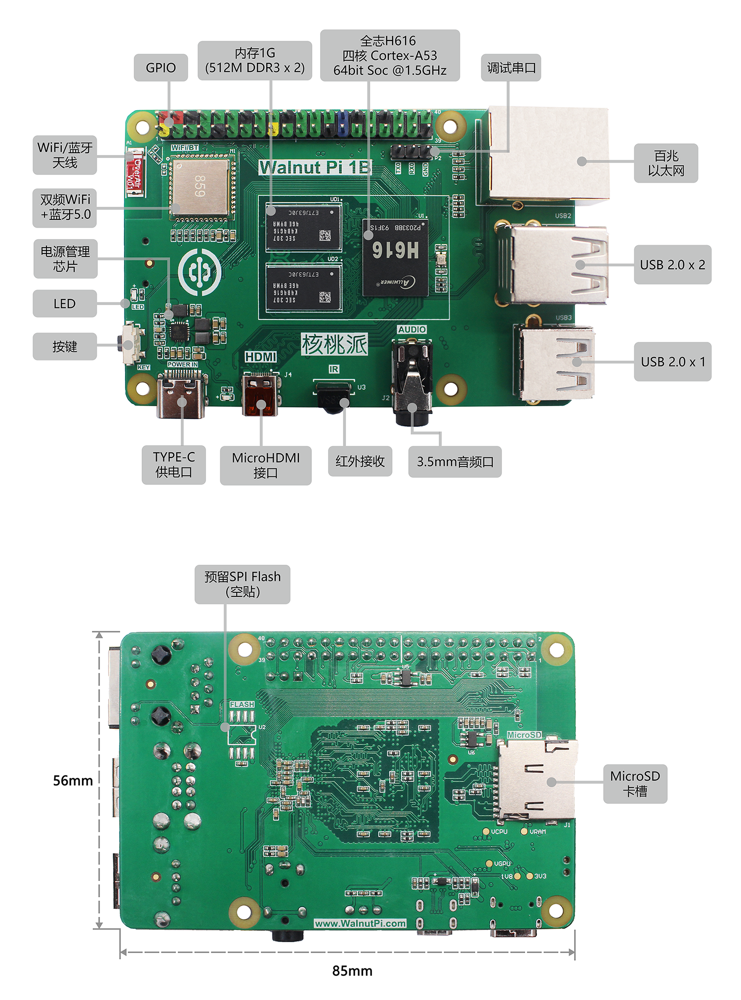
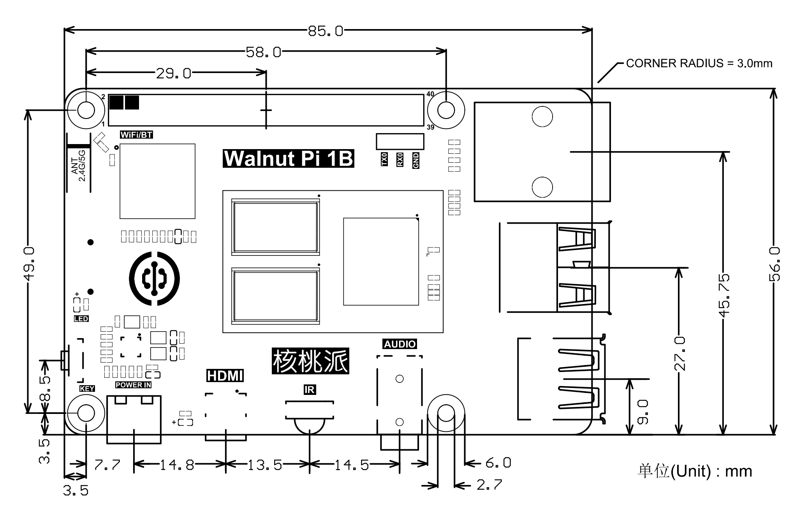
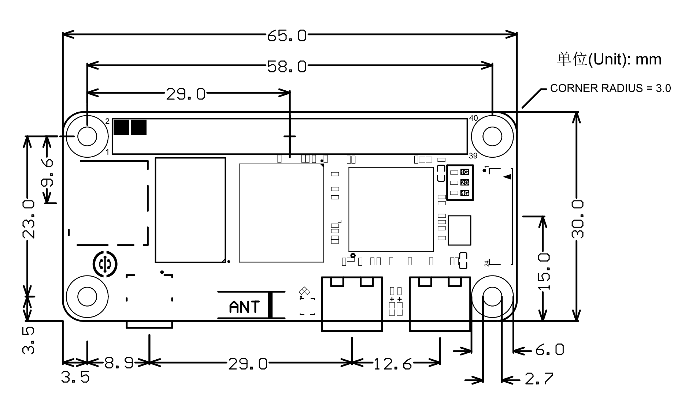
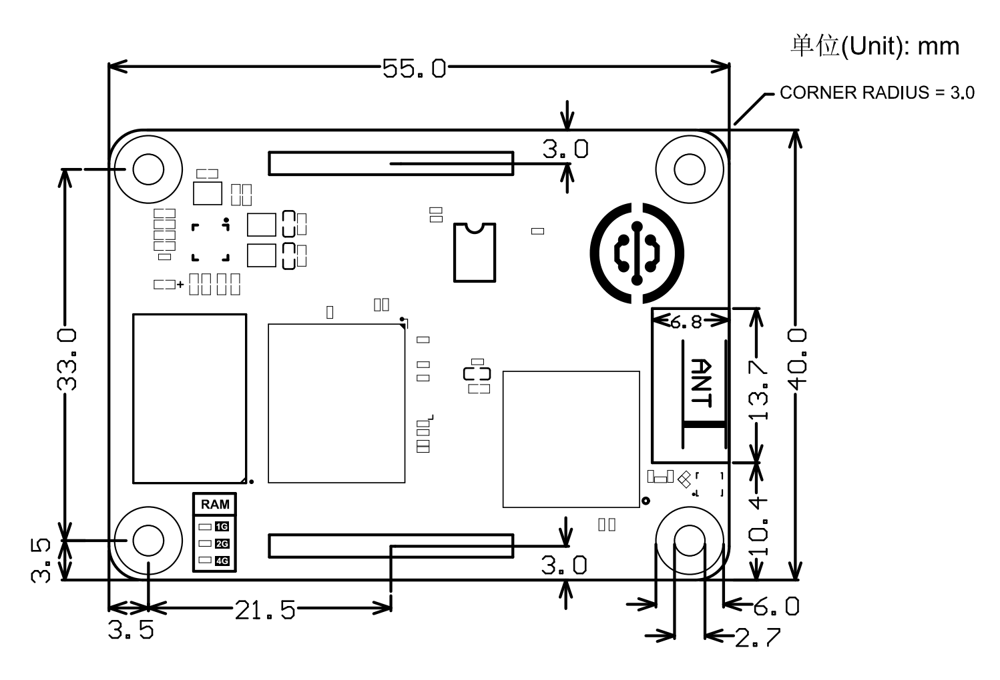

# 产品参数

核桃派1代基于全志H616/H618 四核64位Cortex-A53高性能处理器。

## 核桃派1B

### 功能描述

**1G内存版本:**

**2G/4G内存版本:**

:::tip 提示

全志H616和H618硬件和Linux驱动完全兼容，跑分性能基本无差异。

核桃派1B使用的DDR3内存峰值速度1800Mbps，LPDDR4内存峰值速度3733Mbps, 而H616/H618内存访问速度大约1000Mbps，并没达到两者的峰值速度。

**因此核桃派1B不同内存版本在速度和性能上并无差异，系统和教程代码完全通用，请放心使用。**

::: 

### 详细参数

|  产品参数 |
|  :---:  | ---  |
| CPU  | 全志H616/H618 64位/四核高性能Cortex-A53处理器，1.5GHz |
| GPU  | Mali G31 MP2  Supports OpenGL ES 1.0/2.0/3.2 、OpenCL 2.0|
| 内存  | ● 1GB  (512M DDR3 x 2)   ● 2GB  (LPDDR4)   ● 4GB  (LPDDR4)  | 
| 存储  | ● MicroSD卡最大支持512G  ● 预留SPI Flash（空贴）|
| 无线网络  | 双频WiFi（2.4G & 5G）+ 蓝牙5.0 |
| 有线网络  | 百兆以太网口 |
| 音频输出  | 3.5mm音频口 |
| 视频输出  | MicroHDMI 2.0a 支持4K@60fps |
| 外设  | ● USB 2.0 x 3  ● 红外接收头 x 1  ● 按键 x 1  ● LED x 1  ● 40Pin GPIO排针（兼容树莓派）  ● 3P排针UART（串口）调试 |
| 电源  | Type-C接口 5V/1A输入 |
| 操作系统  | 核桃派OS（Debian）、Ubuntu22.04、Home Assitant、Android |

|  外观规格 |
|  :---:  | ---  |
| 尺寸  | 85 x 56 x 21mm  (长宽为PCB尺寸) |
| 重量  | 38克 （裸板）|

### 尺寸图

## 核桃派ZeroW

### 功能描述

### 详细参数

|  产品参数 |
|  :---:  | ---  |
| CPU  | 全志H618 64位/四核高性能Cortex-A53处理器，1.5GHz |
| GPU  | Mali G31 MP2  Supports OpenGL ES 1.0/2.0/3.2 、OpenCL 2.0|
| 内存  | 1GB / 2GB / 4GB LPDDR4（可选）  | 
| 存储  | ● MicroSD卡最大支持512G  ● 预留SPI Flash（空贴）|
| 无线网络  | 双频WiFi（2.4G & 5G）+ 蓝牙5.0    (板载双频高增益陶瓷天线，ipex4外接可选)   |
| 视频输出  | MicroHDMI 2.0a 支持4K@60fps |
| 外设  | ● USB 2.0 x 1（TYPE-C）  ● 按键 x 1  ● LED x 1  ● 40Pin GPIO排针（兼容树莓派）  |
| FPC座  | ● USB 2.0 x 2   ● 红外接收 x 1  ● 音频  ● 百兆以太网  ● 调试串口（UART）   ● 电源输出（5V和3.3V）|
| 电源  | Type-C接口 5V/1A输入 |
| 操作系统  | 核桃派OS（Debian）、Ubuntu22.04、Home Assitant、Android |

|  外观规格 |
|  :---:  | ---  |
| 尺寸  | 65 x 30 x 5mm  (长宽为PCB尺寸) |
| 重量  | 8.5克 （裸板）|

### 尺寸图

## 核桃派CM1

### 功能描述

- **CM1标准版**

- **CM1 EMMC版**

:::tip 提示
**CM1 EMMC版模块会占用核桃派40P GPIO的PC8、PC9、PC10、PC11、PC14、PC15引脚。**
:::

### 详细参数

|  产品参数 |
|  :---:  | ---  |
| CPU  | 全志H618 64位/四核高性能Cortex-A53处理器，1.5GHz |
| GPU  | Mali G31 MP2  Supports OpenGL ES 1.0/2.0/3.2 、OpenCL 2.0|
| 内存  | 1GB / 2GB / 4GB LPDDR4（可选）  | 
| 存储  | ● MicroSD卡最大支持512G（BTB 连接器引出）   ● 闪存 EMMC 0GB/32GB 可选（其它容量可联系定制）  ● 预留 SPI Flash（空贴，无 EMMC 版本）|
| 无线网络  | 双频WiFi（2.4G & 5G）+ 蓝牙5.0    (板载双频高增益陶瓷天线，ipex4外接可选)   |
| 外设  （BTB连接器）  | ● 视频输出：MicroHDMI 2.0a 支持4K@60fps   ● 音频   ● 百兆以太网   ● USB 2.0 x 3   ● 红外接收 x1 ● 按键 x 1  ● LED x 1  ● 40Pin GPIO排针（兼容树莓派）  ● 调试串口（UART）   ● BOOT引脚   ● 电源输入（5V）|
| 电源  | Type-C接口 5V/1A输入 |
| 操作系统  | 核桃派OS（Debian）、Ubuntu22.04、Home Assitant、Android |

|  外观规格 |
|  :---:  | ---  |
| 尺寸  | 55 x 40 x 5mm |
| 重量  | 8.5克 （裸板）|

### 尺寸图

## 核桃派BOX

核桃派BOX由CM1计算模块+IO扩展板组合而成。可外接0.96寸OLED显示屏(I2C)、外壳和散热扇。

### 功能描述

#### 核桃派BOX

#### IO扩展板

### 详细参数

|  产品参数 |
|  :---:  | ---  |
| CPU  | 全志H618 64位/四核高性能Cortex-A53处理器，1.5GHz |
| GPU  | Mali G31 MP2  Supports OpenGL ES 1.0/2.0/3.2 、OpenCL 2.0|
| 内存  | 1GB / 2GB / 4GB LPDDR4（可选）  | 
| 存储  | ● MicroSD卡最大支持512G  ● 预留SPI Flash（空贴）|
| 无线网络  | 双频WiFi（2.4G & 5G）+ 蓝牙5.0   (板载双频高增益陶瓷天线，ipex4外接可选)|
| 有线网络  | 百兆以太网口 |
| 音频输出  | 3.5mm音频口 |
| 视频输出  | HDMI 2.0a 支持4K@60fps |
| 外设  | ● USB 2.0 x 2  ● 红外接收头 x 1  ● 按键 x 1  ● LED x 1  ● 40Pin GPIO排针（兼容树莓派）  ● 3P排针UART（串口）调试   ● 0.96寸OLED显示屏接口（I2C） |
| 电源  | Type-C接口 5V/1A输入 |
| 操作系统  | 核桃派OS（Debian）、Ubuntu22.04、Home Assitant、Android |

|  外观规格 |
|  :---:  | ---  |
| 尺寸  | 100 x 100 x 21 mm  (不含外壳)   105 x 105 x 33.6 mm (含外壳)|
| 重量  | 67.5克 （不含外壳）|

### 尺寸图

