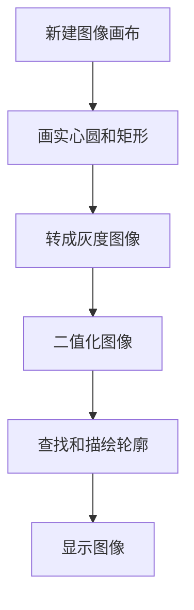

# 轮廓检测

## 前言

本节学习使用OpenCV对图像进行轮廓检测功能，轮廓指图像中图形或物体的边缘线条。

## 实验目的

图像轮廓检测并画图显示。

## 实验讲解

OpenCV Python库提供了findContours()函数实现查找轮廓以及drawContours()描绘轮廓功能。

### findContours() 使用方法

```python
contours, hierarchy = cv2.findContours(image, mode, methode)
```

图像查找边缘坐标。返回contours表示轮廓点坐标list；hierarchy表示层次关系。
- `iamge` ：8位单通道二值图像。
- `mode` ：检测模式。
    - `cv2.RETR_EXTERNAL` ：只检测外廓。
    - `cv2.RETR_LIST` ：检测所有轮廓，不建立层次关系。
    - `cv2.RETR_CCOMP` ：检测所有轮廓，建立2级层次关系。
    - `cv2.RETR_TREE` ：检测所有轮廓，立层树状层次关系。
- `methode` ：检测方法。
    - `cv2.CHAIN_APPROX_NONE` ：保存轮廓所有点。
    - `cv2.CHAIN_APPROX_SIMPLE` ：只保存水平、垂直、或对角线轮廓的端点。

### drawContours() 使用方法

```python
img = cv2.drawContours(image, contours, contourIdx, color, thickness, lineType, hierarchy, maxLevel, offset)
```

图像查找边缘坐标。返回contours表示轮廓点坐标list；hierarchy表示层次关系。
- `iamge` ：原始图像。
- `contours` ：findContours()得到的list。
- `contourIdx` ：索引方式，-1表示绘制所有轮廓。
- `color` ：颜色。
- `thickness` ：粗细，-1表示实心。
- `lineType` ：轮廓线型（可选）。
- `hierarchy` ：findContours()得到的层次关系（可选）。
- `maxLevel` ：层次深度（可选）。
- `offset` ：偏移量，改变绘制结果位置（可选）。


这里我们可以画一个实心圆和实心矩形，然后二值化图像，再查找轮廓和描绘轮廓，代码编写流程如下：



<br></br>

参考代码如下:

```python
'''
实验名称：轮廓检测
实验平台：核桃派1B
'''

import cv2
import numpy as np

#新建一个300x300像素的RGB888纯白色图像
img = np.ones((300,300,3),np.uint8)*255

#画蓝色实心圆形 img0
img0 = cv2.circle(img, (100, 100), 50, (255,0,0), -1)

#画红色实心矩形
img = cv2.rectangle(img0, (150, 150), (250, 250), (0,0,255), -1)

cv2.imshow('color', img) #显示图像

#将彩色图像转化为灰度图像（单通道）
img = cv2.cvtColor(img, cv2.COLOR_BGR2GRAY)
cv2.imshow('gray', img) #显示图像

#将灰度图像转化二值图像
t,img = cv2.threshold(img, 127, 255, cv2.THRESH_BINARY)
cv2.imshow('binary', img) #显示图像

#检测轮廓
contours, hierarchy = cv2.findContours(img, cv2.RETR_LIST, cv2.CHAIN_APPROX_NONE)

#在原图img0上描绘轮廓，绿色
img = cv2.drawContours(img0, contours, -1, (0,255,0), 5)
cv2.imshow('contours', img) #显示图像

cv2.waitKey() #等待键盘任意按键按下
cv2.destroyAllWindows() #关闭窗口

```

## 实验结果

在核桃派运行上面代码，可以看到实验图片的变化过程，最终轮廓被描绘出来实验结果如下图：


## 拓展

我们使用lenna.jpg描绘轮廓，观察结果。代码如下：

```python
'''
实验名称：轮廓检测2
实验平台：核桃派1B
'''
import cv2
import numpy as np

img0 = cv2.imread('lenna.jpg') #读取图像，原图观察用
cv2.imshow('lenna', img0) #显示图像

img = cv2.imread('lenna.jpg',0) #获取灰度图像
cv2.imshow('gray', img) #显示灰度图像

#将灰度图像转化二值图像
t,img = cv2.threshold(img, 127, 255, cv2.THRESH_BINARY)
cv2.imshow('binary', img) #显示二值图像

#检测轮廓
contours, hierarchy = cv2.findContours(img, cv2.RETR_LIST, cv2.CHAIN_APPROX_NONE)

#在原图img0上描绘轮廓
img = cv2.drawContours(img0, contours, -1, (0,255,0), 5)
cv2.imshow('contours', img) #显示轮廓图像

cv2.waitKey() #等待键盘任意按键按下
cv2.destroyAllWindows() #关闭窗口

```

实验结果如下：

