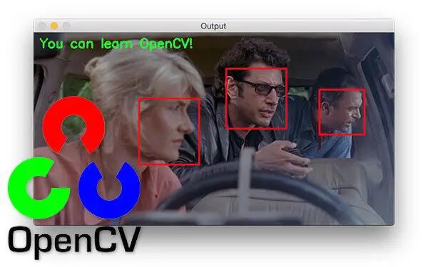
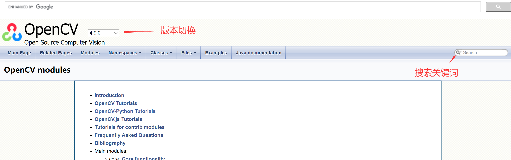

# OpenCV简介

OpenCV是一个基于Apache2.0许可（开源）发行的跨平台计算机视觉和机器学习软件库，可以运行在Linux、Windows、Android和Mac OS操作系统上。 它轻量级而且高效——由一系列 C 函数和少量 C++ 类构成，同时提供了Python、Ruby、MATLAB等语言的接口，实现了图像处理和计算机视觉方面的很多通用算法。

本教程基于核桃派开发板，使用OpenCV + Python开发，可以轻松实现图像处理以及视觉识别功能。从而应用到商用和工业项目中去。

## 官方网站

https://www.opencv.org/

## OpenCV Python库文档

https://docs.opencv.org/4.9.0/

可通过右边搜索功能搜索各类库说明。

## 本教程源代码下载

请到 [核桃派资料下载](../intro/download.md) 下载。代码位于以下路径：

