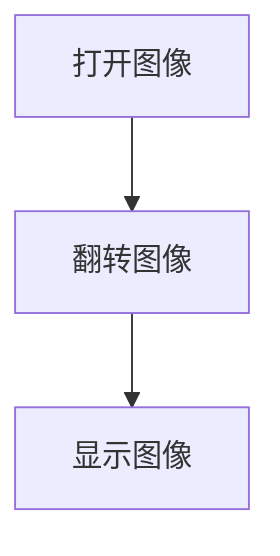

# 翻转

## 前言

本节学习使用OpenCV对图像进行翻转功能，支持沿X轴翻转或沿Y轴翻转，实现镜像功能。

## 实验目的

对图像进行翻转并显示。

## 实验讲解

OpenCV Python库提供了flip()函数实现图像翻转功能。

### flip() 使用方法

```python
img = cv2.flip(src, flipCode)
```

图像缩放。
- `src` ：原始图像。
- `flipCode` ：翻转类型。
    - `0` ：沿X轴翻转。
    - `1` ：沿Y轴翻转。
    - `-1` ：同时沿X和Y轴翻转。

本节我们将图片分别进行3种翻转方式并显示出来，代码编写流程如下：



<br></br>

参考代码如下:


```python
'''
实验名称：图像翻转
实验平台：核桃派1B
'''

import cv2

img = cv2.imread("lenna.jpg") # 读取当前目录下的图像lenna.jpg,
cv2.imshow('lenna', img) #显示图像

img1 = cv2.flip(img, 0) #沿X轴翻转
cv2.imshow('X', img1) #显示图像

img2 = cv2.flip(img, 1) #沿Y轴翻转
cv2.imshow('Y', img2) #显示图像

img3 = cv2.flip(img, -1) #同时沿X和Y轴翻转
cv2.imshow('X & Y', img3) #显示图像

cv2.waitKey() #等待键盘任意按键按下
cv2.destroyAllWindows() #关闭窗口

```

## 实验结果

在核桃派运行上面代码，可以看到实验结果如下图 (多个窗口可能会出现重叠，使用鼠标拖动一下)：


