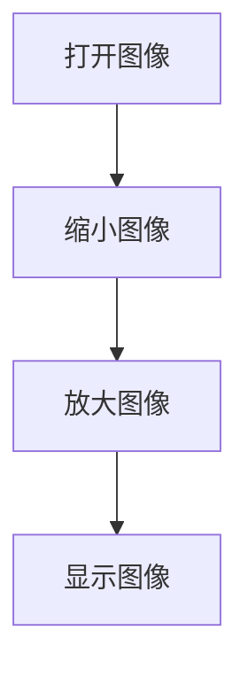

# 缩放

## 前言

本节学习使用OpenCV对图像进行缩放功能，即缩小和放大，也就是改变图像的大小。

## 实验目的

对图像进行缩放并显示。

## 实验讲解

OpenCV Python库提供了resize()函数实现图像缩放功能。

### resize() 使用方法

```python
img = cv2.resize(src, dsize, fx, fy, interpolation)
```

图像缩放。
- `src` ：原始图像。
- `dsize` ：生成图像大小，格式（宽，高），单位为像素。
- `fx` ：水平方向缩放比例（可选）。
- `fy` ：垂直方向缩放比例（可选）。
- `interpolation` ：补充或删减像素（可选），建议默认值。

本节我们将图片分别缩小和放大并显示出来，代码编写流程如下：



<br></br>

参考代码如下:

**使用dsize参数缩放：**
```python
'''
实验名称：图像缩放（dsize参数）
实验平台：核桃派1B
'''

import cv2

img = cv2.imread("lenna.jpg") # 读取当前目录下的图像lenna.jpg,
cv2.imshow('lenna', img) #显示图像

img1 = cv2.resize(img, (200,200)) #使用dsize参数按照宽高200x200大小缩放
cv2.imshow('200x200', img1) #显示图像

img2 = cv2.resize(img, (500,500)) #使用dsize参数按照宽高500x500大小缩放
cv2.imshow('500x500', img2) #显示图像

cv2.waitKey() #等待键盘任意按键按下
cv2.destroyAllWindows() #关闭窗口

```

**使用fx,fy参数缩放：**
```python
'''
实验名称：图像缩放（fx,fy参数）
实验平台：核桃派1B
'''

import cv2

img = cv2.imread("lenna.jpg") # 读取当前目录下的图像lenna.jpg,
cv2.imshow('lenna', img) #显示图像

img1 = cv2.resize(img, None, fx=1/2 , fy=1/2) #使用fx,fy参数将图像缩小到1/2
cv2.imshow('0.5x', img1) #显示图像

img2 = cv2.resize(img, None, fx=2 , fy=2) #使用fx,fy参数将图像放大2倍
cv2.imshow('2x', img2) #显示图像

cv2.waitKey() #等待键盘任意按键按下
cv2.destroyAllWindows() #关闭窗口

```

## 实验结果

分别在核桃派运行上面2个代码，可以看到实验结果如下图 (多个窗口可能会出现重叠，使用鼠标拖动一下)：

**使用dsize参数缩放结果：**


**使用fx,fy参数缩放结果：**

