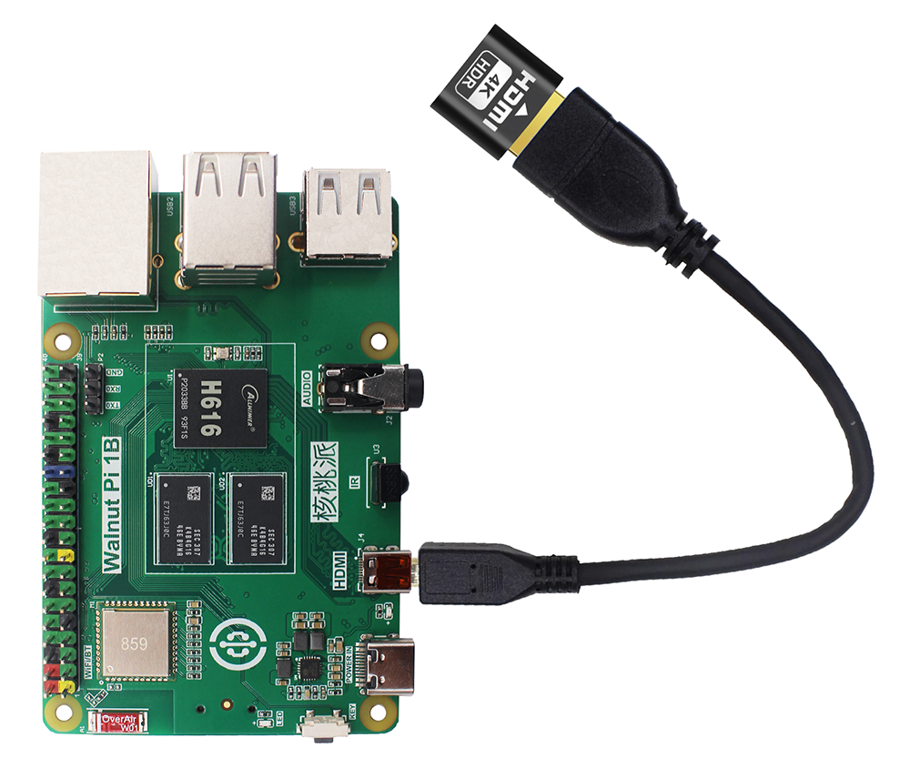
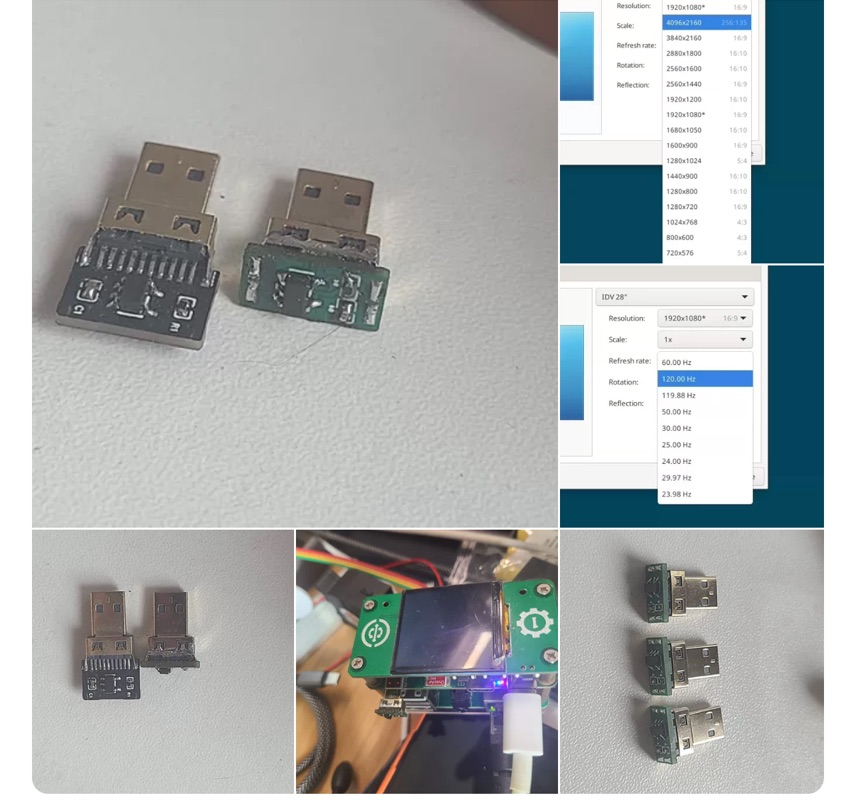
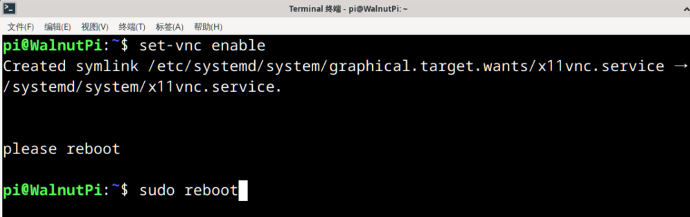
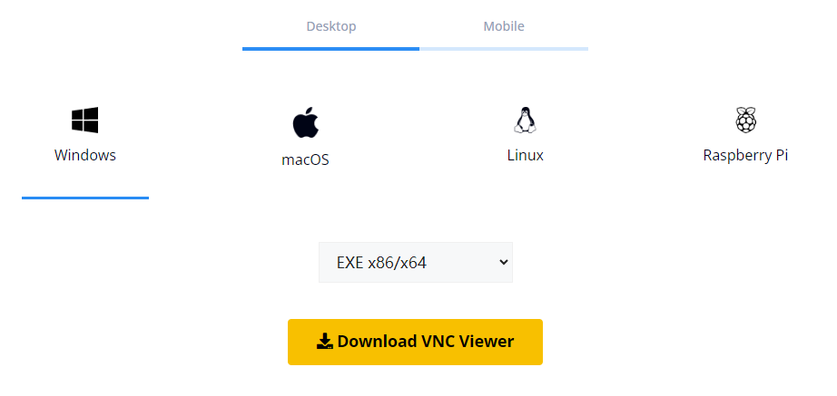
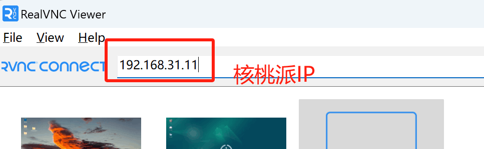
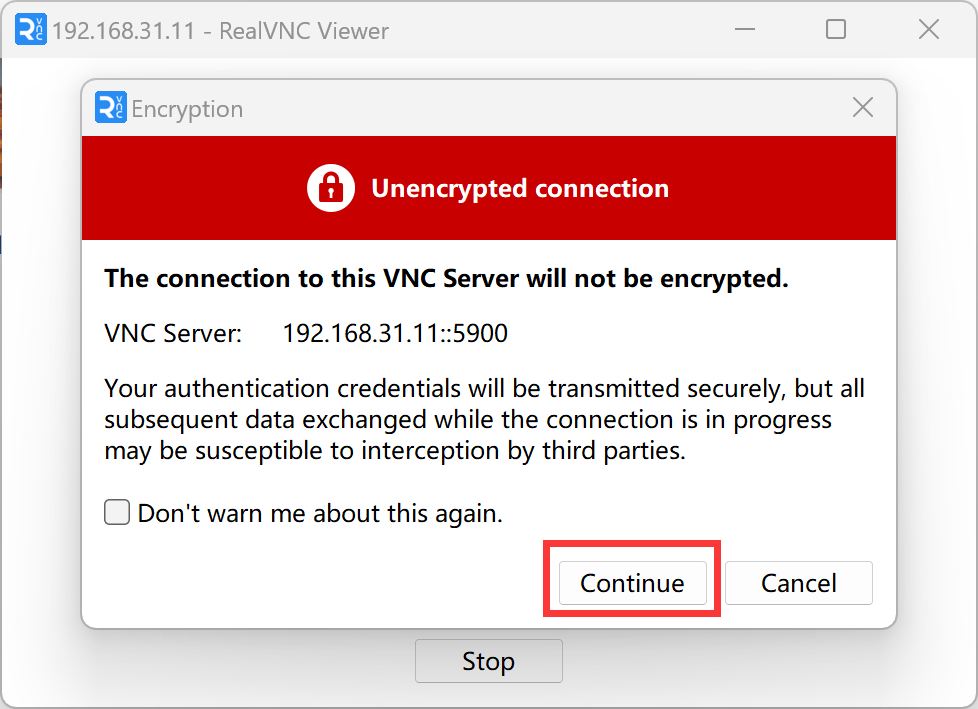
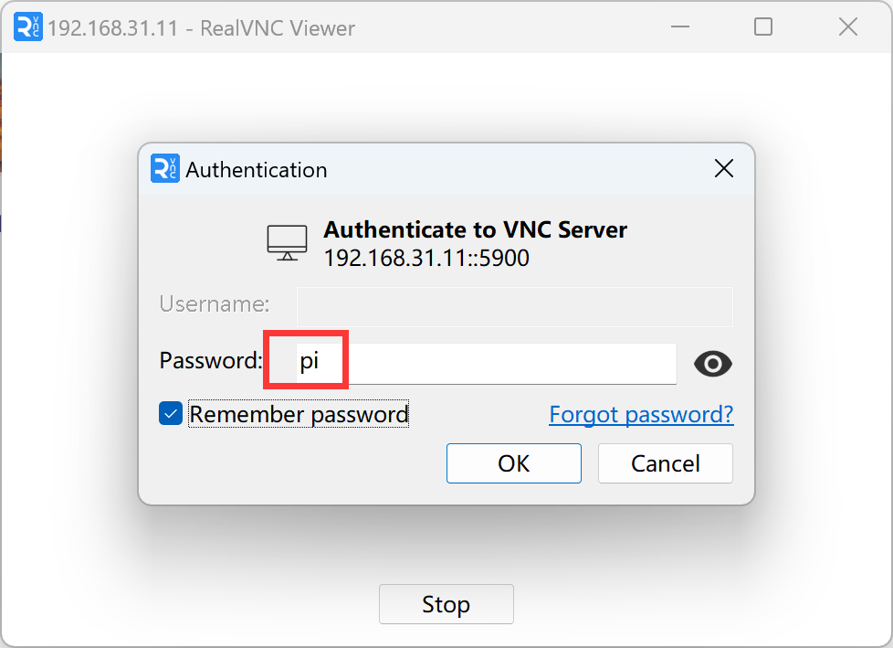
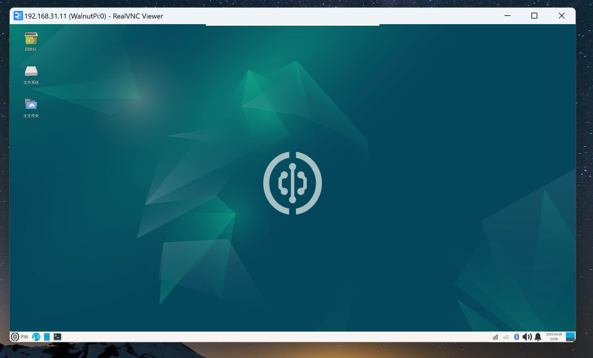
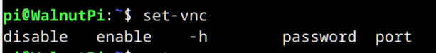

# VNC远程桌面

- **视频教程**

<iframe src="//player.bilibili.com/player.html?isOutside=true&aid=1953508549&bvid=BV14C411n7TY&cid=1518749812&p=1" scrolling="no" border="0" frameborder="no" framespacing="0" allowfullscreen="true" width="100%" height="500"></iframe>

<br></br>
<br></br>

核桃派预装了VNC服务器，VNC适应于局域网（通常指同一个路由器网络下）桌面登录。**使用该服务前先确保核桃派已经通过以太网或无线WiFi连接到路由器。**

使用核桃派桌面系统的时候由于要配置各类信息和联网，可以使用HDMI显示屏和键鼠操作，当我们配置好网络等参数后，就可以通过远程桌面来登录核桃派，实现电脑控制。

:::danger 注意
目前核桃派预装的是X11VNC服务器，好处是直接远程到当前桌面不额外占内存。不过远程时核桃派需要通过HDMI一直连接到显示器，否则会出现卡顿，原因未知，应该是没插入HDMI时系统没用到硬件渲染桌面导致。

但我们用VNC就是为了省一个显示器。这里给一个解决方案就是花10几元成本使用一个叫**HDMI显卡欺骗器**的东西，通过microHDMI转HDMI母头接到核桃派，解决未接显示器卡顿问题。[**点击购买->**](https://item.taobao.com/item.htm?spm=a213gs.success.result.1.6c854831c6UKif&id=741004778478) 
:::



除了官方推荐的外，也可以购买核桃派用户DIY的HDMI欺骗器，优点是体积小巧：[**点击购买->**](https://www.goofish.com/item?id=839752328610) 



## 开启VNC服务

输入下面指令即可开启：（默认密码：**pi** , 默认端口：**5900**）

```bash
set-vnc enable
```

开启成功后需要重启核桃派。

```bash
sudo reboot
```




## 电脑VNC连接到核桃派

现在电脑安装一个VNC Viewer（客户端,注意不是服务器），用于连接核桃派。下载地址：https://www.realvnc.com/en/connect/download/viewer/



安装完打开该软件，在上方输入核桃派的IP地址，[IP地址获取方法](../os_software/ip_get) 。**这里可以不用输入端口号，因为核桃派预装VNC服务器使用默认的5900端口**



然后按回车，在弹出的提示框按 “continue”：



密码是 **pi** ，可以勾选记住密码这样以后就不用再次输出。



点OK后成功登录。



## 关闭VNC服务

开启VNC以后就一直开机启动了，如想关闭VNC服务，可以通过下面指令，配置后重启核桃派生效。

```bash
set-vnc disable
```

## 设置密码

出厂密码默认是**pi**，比如要设置成 “12345678” ，可以通过下面指令：

```bash
set-vnc password 12345678
```

## 设置端口

出厂端口默认是**5900**，比如要设置成 “5901” ，可以通过下面指令：

```bash
set-vnc port 5901
```

:::tip 提示

在终端输入 “set-vnc ” ，按键盘 `Tab` 键即可查看所有命令。

:::



## 进阶操作：通过虚拟显示器和自动切换解决VNC卡顿问题

显卡欺骗器可行，但是不够优雅，那么有没有更优雅的方案呢？有的，兄弟，有的！我们可以通过脚本在开机时检测HDMI是否插入，从而决定是否启用虚拟显示器，解决VNC卡顿问题，实现流畅的VNC体验。

首先安装 xserver-xorg-video-dummy

```bash
sudo apt install xserver-xorg-video-dummy
```

创建自动切换脚本，此处以mousepad文本编辑器为例，你可以使用vim、nano等任意你喜欢的文本编辑器。

```bash
sudo mousepad /usr/local/bin/auto-display.sh
```

脚本内容为：

```bash
#!/bin/bash

# 检测核桃派的HDMI接口状态
HDMI_STATUS=$(cat sys/class/drm/card0-HDMI-A-1/status 2>/dev/null | head -1)

# 如果没检测到任何HDMI状态，默认视为未连接
if [ -z "$HDMI_STATUS" ]; then
    HDMI_STATUS="disconnected"
fi

# 配置文件路径
CONFIG_FILE="/usr/share/X11/xorg.conf.d/xorg.conf"
CONFIG_DIR="/usr/share/X11/xorg.conf.d"

# 确保目录存在
mkdir -p "$CONFIG_DIR"

if [ "$HDMI_STATUS" = "connected" ]; then
    echo "HDMI connected: 删除虚拟显示器配置，恢复物理屏..."
    # 如果有虚拟显示器配置，则删除它
    if [ -f "$CONFIG_FILE" ]; then
        rm -f "$CONFIG_FILE"
    fi
else
    echo "HDMI disconnected: 写入虚拟显示器配置..."
    # 写入 dummy 配置
    cat > "$CONFIG_FILE" << 'EOF'
Section "Device"
    Identifier  "DummyDevice"
    Driver      "dummy"
    VideoRam    256000
EndSection

Section "Monitor"
    Identifier  "DummyMonitor"
    HorizSync   28.0-80.0
    VertRefresh 48.0-75.0
    Modeline    "1920x1080_60.00" 173.00 1920 2048 2248 2576 1080 1083 1088 1120 -hsync +vsync
EndSection

Section "Screen"
    Identifier  "DummyScreen"
    Device      "DummyDevice"
    Monitor     "DummyMonitor"
    DefaultDepth 24
    SubSection "Display"
        Depth 24
        Modes "1920x1080_60.00"
    EndSubSection
EndSection
EOF
fi
```

保存文件、退出编辑，执行以下命令赋予执行权限：

```bash
sudo chmod +x /usr/local/bin/auto-display.sh
```

创建systemd服务

```bash
sudo mousepad /etc/systemd/system/auto-display.service
```

内容为：

```bash
[Unit]
Description=Auto switch HDMI or Dummy display for WalnutPi
Before=lightdm.service display-manager.service
DefaultDependencies=false

[Service]
Type=oneshot
ExecStart=/usr/local/bin/auto-display.sh

[Install]
WantedBy=multi-user.target
```

保存文件、退出编辑，执行以下命令启用服务：

```bash
sudo systemctl daemon-reload
sudo systemctl enable auto-display.service
```

到这里就完成啦！后续核桃派开机时，如果插入了显示器，就会自动从显示器输出，否则会自动启用虚拟显示器输出。

当不插显示器开机后，虚拟显示器运行中时，如果此时想使用物理显示器了，可以插上HDMI，然后通过VNC或SSH执行以下指令：

```bash
sudo /usr/local/bin/auto-display.sh
sudo systemctl restart lightdm
```

这样虚拟显示器会被关闭，物理显示器会被启用。同理，反向切换也是拔掉HDMI后执行上述命令。


