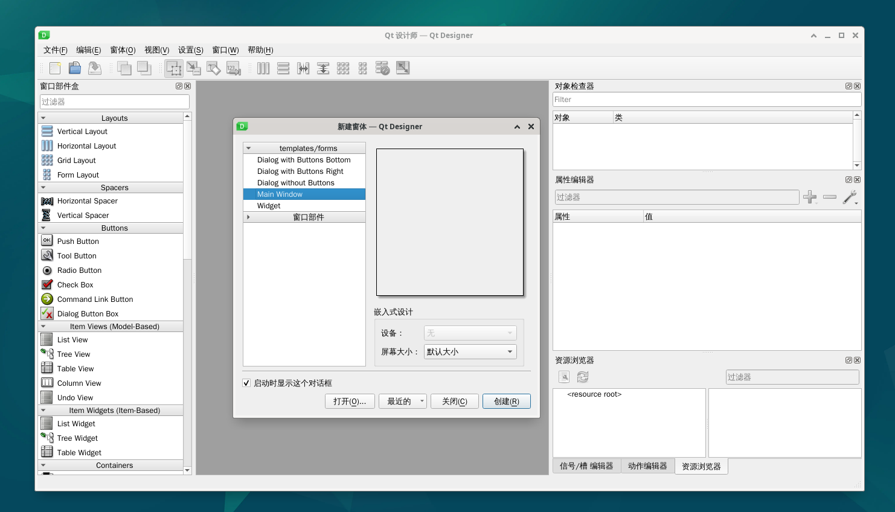

# 开发环境搭建

## 核桃派

核桃派出厂系统已经安装好了pyQT5，其中带桌面版系统预装QT Designer。QT Designer是一个强大的可视化GUI设计工具，通过QT Designer设计GUI可以极大提高开发效率。

:::tip 提示

推荐使用核桃派带桌面版系统开发，方便调试。

:::

### pyQT5

pyQT5可以通过以下命令查询：

由于pyQT5是一系列Python库，所以先进入python:

``` bash
python
``` 

然后 import 一下，注意字母大小写，没有报错则说明系统已经安装。如果提示没有找到库请重烧最新版镜像。

``` python
import PyQt5
``` 


### Qt Designer

核桃派系统已经预装QT Designer,位于**开始菜单--开发**目录下：


打开后软件界面如下图所示：



## Windows

pyQT5的一个好处是可移植性强，也就是说在Windows，Mac, Linux代码通用。如果你想在Windows上开发，然后在核桃派上使用相关代码也是可以的。

### 安装Python

1、确保电脑已经安装了Python3，在电脑终端运行python命令即可查看：

在Windows按键盘`Win`+ `R` ，输入cmd可以快速启动终端：


在终端输入**python**关键词能查看到Python版本说明已安装。


如果没有安装请到[<python官网下载链接>](https://www.python.org/downloads/)，推荐python3.10以上版本，注意安装时要勾选添加到环境变量的选项。

### 安装PyQT5

在Windows终端通过下面指令安装：

``` bash
pip3 install pyqt5
```

### 安装Qt Designer

在Windows终端通过下面指令安装：

``` bash
pip3 install pyqt5-tools
```

安装后可执行文件位于Python安装路径的lib目录下：

C:\Users\用户\AppData\Local\Programs\Python\Python310\Lib\site-packages\qt5_applications\Qt\bin

由于比较常用，可以拖动创建快捷方式到桌面。


软件打开后如下图所示：

