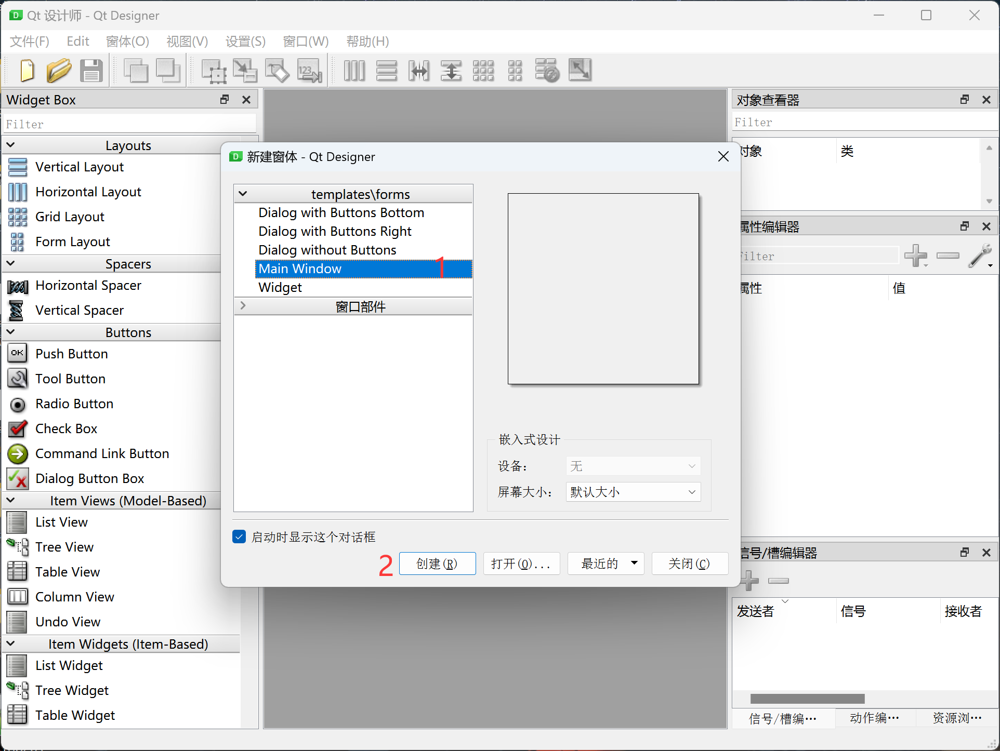
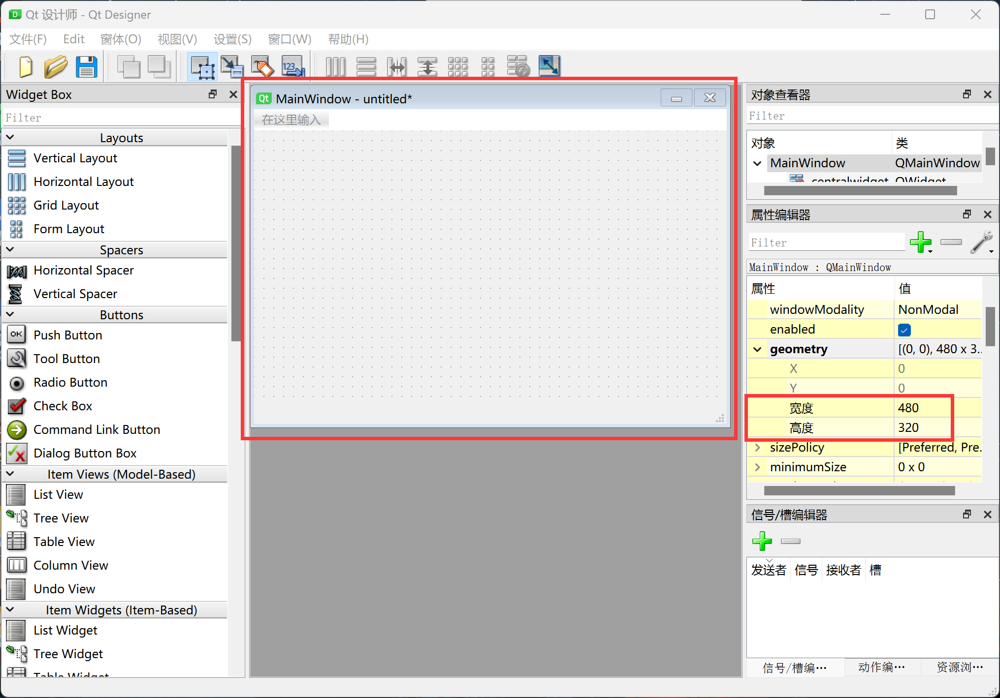
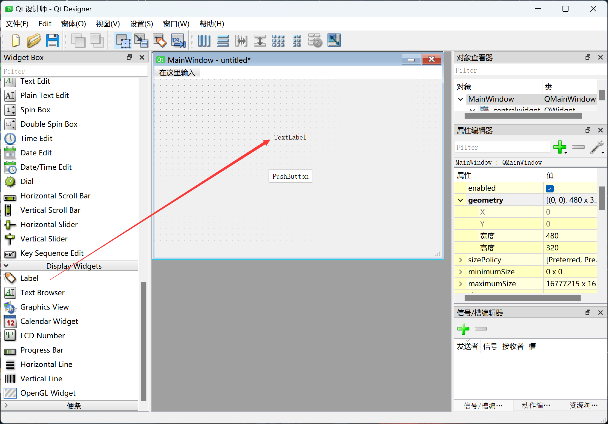
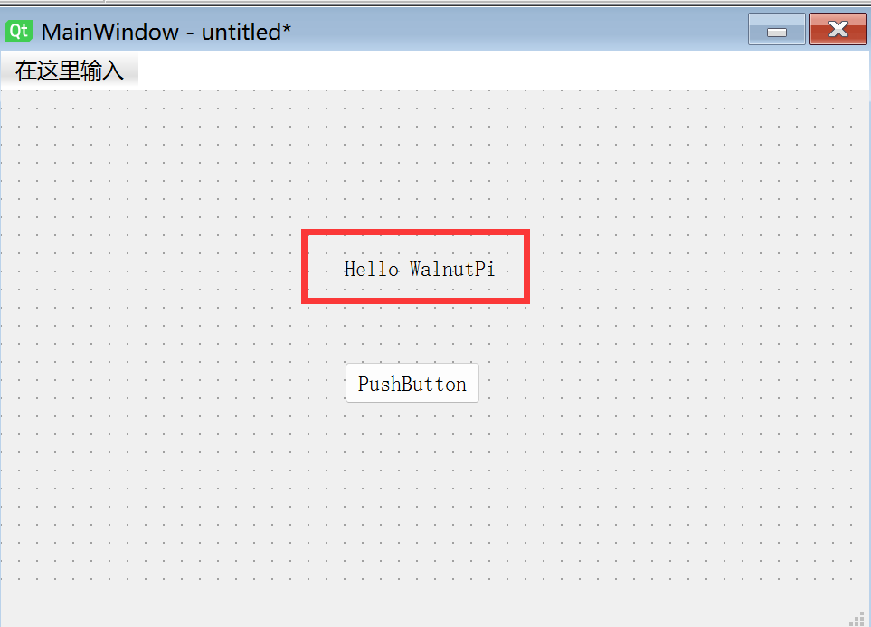
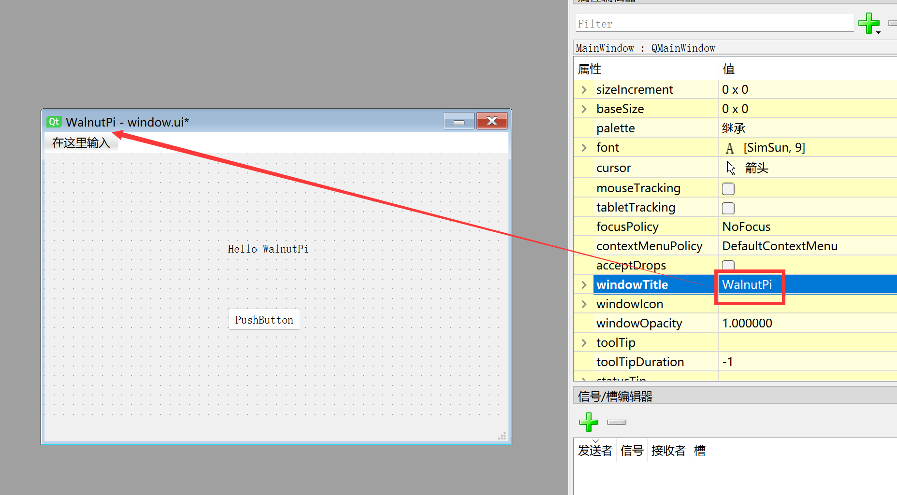
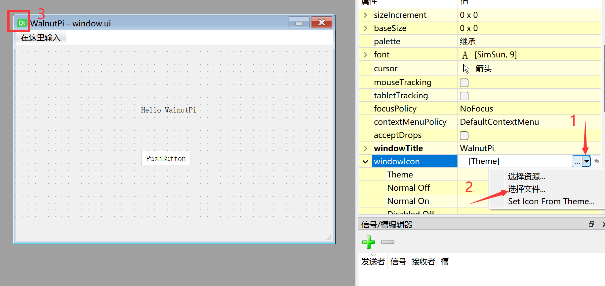
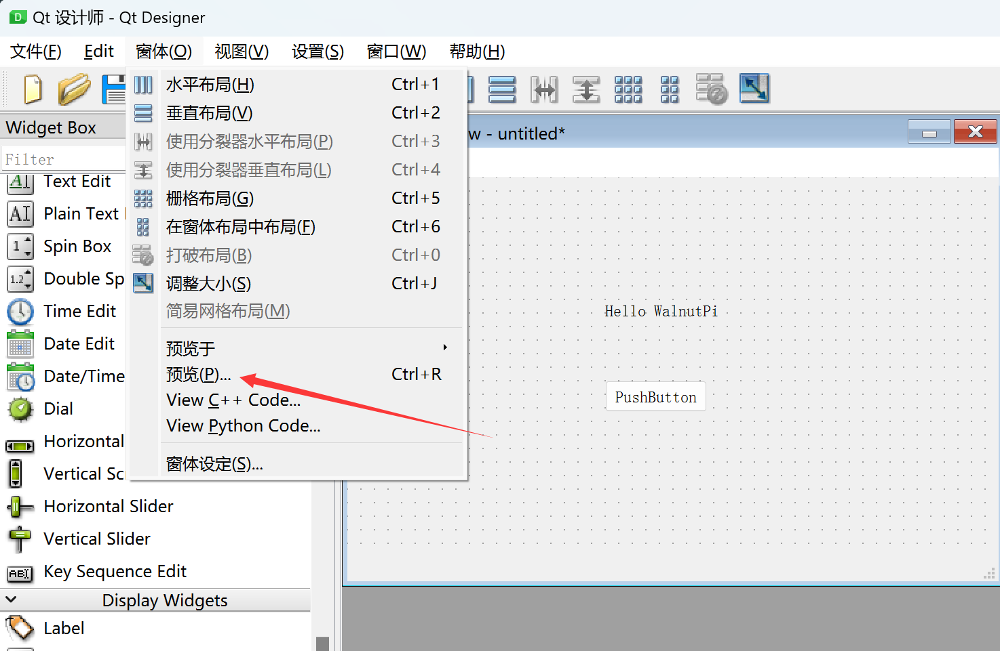
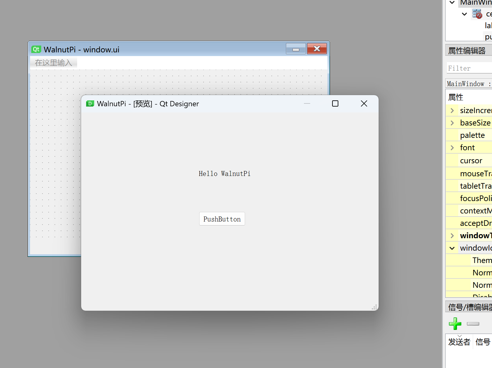
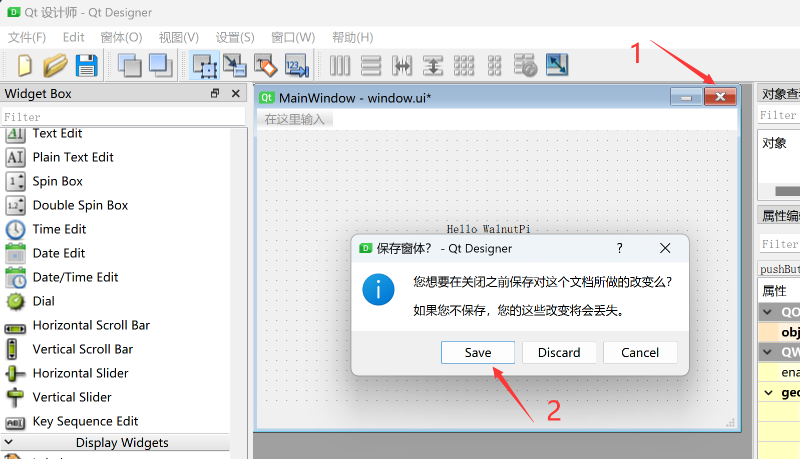
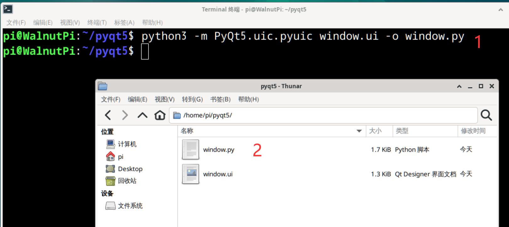

# 第一个窗口

本节我们来打造一个最简单的窗口来学习一下是怎么来构建自己的GUI并在核桃派上运行。

## 使用Qt Designer创建窗口

:::tip 提示

1、核桃派需要连接HDMI显示器和键盘鼠标设计，或者通过VNC远程桌面操作。参考：[VNC远程桌面](../os_software/vnc.md)。

2、由于pyQT5优秀的跨平台特点，本节操作在Windows下同样适用。

:::

设计pyQT5窗口用到Qt Designer。本节只做最简单的演示，更详细的窗口设置和控件功能在后面章节内容都会讲解。

打开Qt Designer，在左上角有不同窗口类型选择，一般默认选择**Main Window**，选择后点击**创建**：



创建后如下图，软件的各个区域功能如下：


考虑到部分用户想用3.5寸LCD显示，我们可以将窗口大小调成480x320（核桃派3.5寸LCD分辨率）。将右边**属性编辑器**的**geometry**属性展开，然后将宽度和高度调成480和320即可。



拖动一个PushButton控件到窗口。


拖动一个label标签控件到窗口。



双击label标签可以修改内容，将内容修改为：Hello WalnutPi 。



属性中的**windowTitle**可以修改窗口标题栏名称：



属性中的**windowIcon**可以修改窗口左上角图标，有兴趣用户可以自行修改：



我们将这个窗口作为第一个演示窗口了，点击菜单栏**窗体--预览**：



可以看到刚刚制作的窗口预览出来了。这个功能在开发过程中可以检查是不是我们想要制作的效果。



点击菜单栏**文件--保存**或直接点击新建窗口右上角关闭按钮，将新建的窗口保存，名字自己定义，这里保存为“window.ui”。



- 在核桃派下保存


到这里，第一个窗口ui文件设计完成。

## 将窗口ui文件转成Python代码文件

我们需要将设计好的窗口ui文件转成python代码才可以核桃派的Python程序执行。可以通过终端指令直接转换：

在window.ui文件目录下的终端执行下面指令，该指令表示将window.ui文件生成window.py文件

```bash
python -m PyQt5.uic.pyuic window.ui -o window.py
```

执行后可以看到生成了py文件



打开windows.py文件可以看到生成了Python代码如下，主要就是窗口名称、位置坐标等属性的设置，大家可以修改窗口或按钮属性值，然后再生成py代码对比，就可以直观了解到各个对象的使用方法。

```python

# -*- coding: utf-8 -*-

# Form implementation generated from reading ui file 'window.ui'
#
# Created by: PyQt5 UI code generator 5.15.9
#
# WARNING: Any manual changes made to this file will be lost when pyuic5 is
# run again.  Do not edit this file unless you know what you are doing.

from PyQt5 import QtCore, QtGui, QtWidgets

class Ui_MainWindow(object):
    def setupUi(self, MainWindow):
        MainWindow.setObjectName("MainWindow")
        MainWindow.resize(480, 250)
        self.centralwidget = QtWidgets.QWidget(MainWindow)
        self.centralwidget.setObjectName("centralwidget")
        self.pushButton = QtWidgets.QPushButton(self.centralwidget)
        self.pushButton.setGeometry(QtCore.QRect(190, 160, 75, 23))
        self.pushButton.setObjectName("pushButton")
        self.label = QtWidgets.QLabel(self.centralwidget)
        self.label.setGeometry(QtCore.QRect(190, 90, 91, 16))
        self.label.setObjectName("label")
        MainWindow.setCentralWidget(self.centralwidget)
        self.menubar = QtWidgets.QMenuBar(MainWindow)
        self.menubar.setGeometry(QtCore.QRect(0, 0, 480, 22))
        self.menubar.setObjectName("menubar")
        MainWindow.setMenuBar(self.menubar)
        self.statusbar = QtWidgets.QStatusBar(MainWindow)
        self.statusbar.setObjectName("statusbar")
        MainWindow.setStatusBar(self.statusbar)

        self.retranslateUi(MainWindow)
        QtCore.QMetaObject.connectSlotsByName(MainWindow)

    def retranslateUi(self, MainWindow):
        _translate = QtCore.QCoreApplication.translate
        MainWindow.setWindowTitle(_translate("MainWindow", "WalnutPi"))
        self.pushButton.setText(_translate("MainWindow", "PushButton"))
        self.label.setText(_translate("MainWindow", "Hello WalnutPi"))
```

可以看到生成的代码只是定义了类和函数，所以该代码是不能直接运行的，需要添加一些代码来实现窗口显示，这在下一节会讲述。
