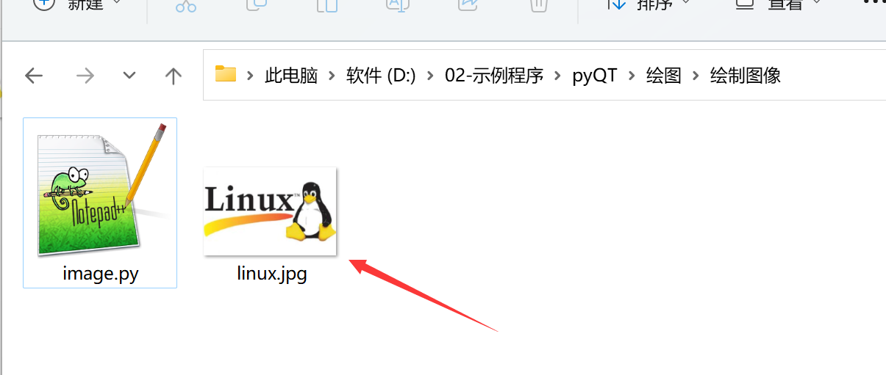

# 绘制图像

绘制图像的函数跟前面画形状类似，只需要一个函数即可实现：

## 函数

```python
drawPixmap(x, y, width, height, QPixmap("xx.jpg"))
```
绘制图像。
- `x, y` : 起始坐标，图像左上角；
- `width` : 宽度，不填默认为图片宽度；
- `height` : 高度，不填默认为图片高度；
- `QPixmap("xx.jpg")` : 图片路径，支持常见的BMP, JPG, JPEG, PNG等格式；

## 编程方法

我们通过代码来实现绘制图像：

我们先运行一下最终代码再来讲解：

```python
# -*- coding: utf-8 -*-

# pyQT5 For WalnutPi

from PyQt5 import QtCore, QtGui, QtWidgets

from PyQt5.QtCore import Qt
from PyQt5.QtGui import QPainter, QPixmap
from PyQt5.QtWidgets import QWidget

class Window(QWidget):
    
    def __init__(self):
        super().__init__() #同时执行父对象QWidget的初始化程序
        self.setWindowTitle("WalnutPi Paint") # 设置窗口标题
        self.resize(480,320) # 设置窗口大小
        
        #窗口背景颜色设置
        self.setObjectName("Paint_Window")
        self.setStyleSheet("#Paint_Window{background-color: black}") #黑色

    def paintEvent(self,event):
        
        painter=QPainter(self) # 创建绘图对象
        painter.setPen(Qt.green) # 设置画笔,绿色
        
        #绘制图像
        painter.drawPixmap(0,0,QPixmap("linux.jpg"))
        
#################
#   主程序代码   #
#################
import sys

#【可选代码】允许Thonny远程运行
import os
os.environ["DISPLAY"] = ":0.0"

#【可选代码】解决2K以上分辨率显示器显示缺失问题
QtCore.QCoreApplication.setAttribute(QtCore.Qt.AA_EnableHighDpiScaling)

#主程序入口，构建窗口并显示
app = QtWidgets.QApplication(sys.argv)
window = Window() #构建窗口对象
window.show() #显示窗口
#window.showFullScreen() #全屏显示窗口

#【建议代码】允许终端通过ctrl+c中断窗口，方便调试
import signal
signal.signal(signal.SIGINT, signal.SIG_DFL)
timer = QtCore.QTimer()
timer.start(100)  # You may change this if you wish.
timer.timeout.connect(lambda: None)  # Let the interpreter run each 100 ms

sys.exit(app.exec_()) #程序关闭时退出进程

```

先将要先显示的图片放到代码同一目录下：



运行代码，可以看到运行结果如下：


<br></br>

接下来我们来看看代码的实现原理：

主程序入口代码跟以往类似，新建了一个窗口：

```python
#主程序入口，构建窗口并显示
app = QtWidgets.QApplication(sys.argv)
window = Window() #构建窗口对象
window.show() #显示窗口
```

新建的窗口初始化了窗口标题和大小，同时设置了背景颜色为黑色，方便观察结果。
```python
class Window(QWidget):
    
    def __init__(self):
        super().__init__() #同时执行父对象QWidget的初始化程序
        self.setWindowTitle("WalnutPi Paint") # 设置窗口标题
        self.resize(480,320) # 设置窗口大小
        
        #窗口背景颜色设置
        self.setObjectName("Paint_Window")
        self.setStyleSheet("#Paint_Window{background-color: black}") #黑色
```

**def paintEvent(self,event):**是固定格式，窗口构建后会自动执行这个函数，所以QPainter对象初始化画图函数都放里面。

```python
    def paintEvent(self,event):
        
        painter=QPainter(self) # 创建绘图对象
        painter.setPen(Qt.green) # 设置画笔,绿色
        
        #绘制图像
        painter.drawPixmap(0, 0, QPixmap("linux.jpg"))
```

将绘制图像代码修改如下：
```python
    def paintEvent(self,event):
        
        ...

        #绘制图像
        painter.drawPixmap(0, 0, 150, 100, QPixmap("linux.jpg"))
```

再次运行，可以看到图像大小被设置成了150x100 :


