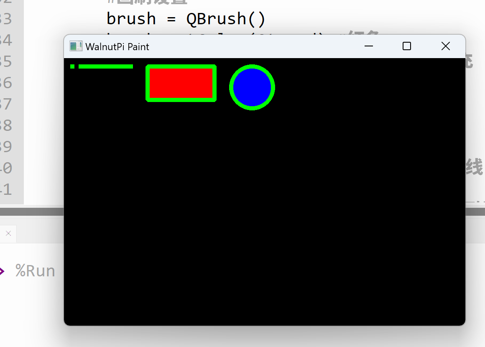

# 画笔和画刷设置

上一节我们学会了基本的图形画法，这一节我们来学习画笔和画刷设置。

## 画笔对象（QPen）

画笔主要用来设置形状线条的粗细，颜色，样式等。

|  常用画笔方法 |  说明 |
|  :---:  | --- | 
| setColor()  |  设置画笔颜色  | 
| setWidth()  |  设置画笔宽度  | 
| setStyle()  |  设置样式：<br></br>● Qt.SolidLine: 普通直线  | 

## 画刷对象（QBrush）

画刷主要用来给几何图形填充颜色。

|  常用画刷方法 |  说明 |
|  :---:  | --- | 
| setColor()  |  设置画刷颜色  |
| setStyle()  |  设置样式：<br></br>● Qt.SolidPattern: 纯色填充  |  

## 使用示例

**例：给上一节画形状中的所有形状线宽度改成5，矩形填充红色，圆形填充蓝色。**

实现代码如下：

```python
# -*- coding: utf-8 -*-

# pyQT5 For WalnutPi

from PyQt5 import QtCore, QtGui, QtWidgets

from PyQt5.QtCore import Qt
from PyQt5.QtGui import QPainter,QPen,QBrush
from PyQt5.QtWidgets import QWidget

class Window(QWidget):
    
    def __init__(self):
        super().__init__() #同时执行父对象QWidget的初始化程序
        self.setWindowTitle("WalnutPi Paint") # 设置窗口标题
        self.resize(480,320) # 设置窗口大小
        
        #窗口背景颜色设置
        self.setObjectName("Paint_Window")
        self.setStyleSheet("#Paint_Window{background-color: black}") #黑色

    def paintEvent(self,event):
        
        painter=QPainter(self) # 创建绘图对象
        
        #画笔设置：
        pen = QPen()
        pen.setColor(Qt.green) #绿色
        pen.setWidth(5) #宽度5
        painter.setPen(pen)
        
        #画刷设置
        brush = QBrush()
        brush.setColor(Qt.red) #红色
        brush.setStyle(Qt.SolidPattern) #填充
        painter.setBrush(brush) 
        
        painter.drawPoint(10,10) #画点
        
        painter.drawLine(20, 10, 80, 10) #画线
        
        painter.drawRect(100, 10, 80, 40) #画矩形
        
        #画刷重新设置，蓝色
        brush.setColor(Qt.blue)
        painter.setBrush(brush) 
        painter.drawEllipse(200, 10, 50, 50) #画圆
        

#################
#   主程序代码   #
#################
import sys

#【可选代码】允许Thonny远程运行
import os
os.environ["DISPLAY"] = ":0.0"

#【可选代码】解决2K以上分辨率显示器显示缺失问题
QtCore.QCoreApplication.setAttribute(QtCore.Qt.AA_EnableHighDpiScaling)

#主程序入口，构建窗口并显示
app = QtWidgets.QApplication(sys.argv)
window = Window() #构建窗口对象
window.show() #显示窗口
#window.showFullScreen() #全屏显示窗口

#【建议代码】允许终端通过ctrl+c中断窗口，方便调试
import signal
signal.signal(signal.SIGINT, signal.SIG_DFL)
timer = QtCore.QTimer()
timer.start(100)  # You may change this if you wish.
timer.timeout.connect(lambda: None)  # Let the interpreter run each 100 ms

sys.exit(app.exec_()) #程序关闭时退出进程

```

这里代码和之前区别主要是加入了画笔设置和画刷设置：
```python

    def paintEvent(self,event):

        ...

        #画笔设置：
        pen = QPen()
        pen.setColor(Qt.green) #绿色
        pen.setWidth(5) #宽度5
        painter.setPen(pen)
        
        #画刷设置
        brush = QBrush()
        brush.setColor(Qt.red) #红色
        brush.setStyle(Qt.SolidPattern) #填充
        painter.setBrush(brush) 
```

另外画刷初始化设置是红色，因此画完矩形后画圆前需要重新设置一下：
```python
    ...
        #画刷重新设置，蓝色
        brush.setColor(Qt.blue)
        painter.setBrush(brush) 
        painter.drawEllipse(200, 10, 50, 50) #画圆
```

运行结果如下：
