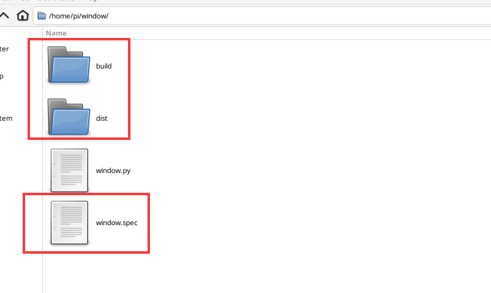
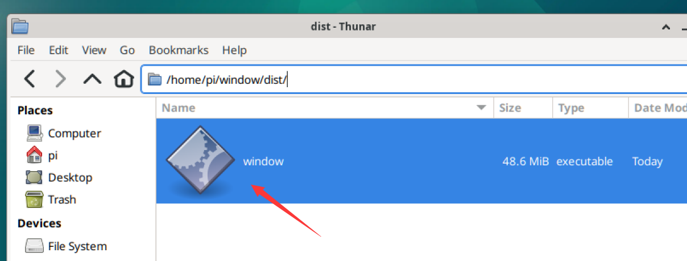

# 打包发布程序

在核桃派系统可以使用Pyinstaller将py代码打包成可执行文件。也就是相当于应用程序，可以直接双击打开执行。

:::tip 提示

在核桃派系统可以直接通过 python xx.py 指令打开python程序了，使用这个功能的目的是保护代码以及方便传播使用。

:::

核桃派新版系统出厂已经安装该应用，对于没有安装的系统版本可以通过pip指令安装：
```bash
sudo pip install pyinstaller
```
## 打包Python程序

在pi目录下新建一个文件夹window ，然后将自己运行通过的py代码文件拷贝进去，这里使用前面第一个窗口教程的window.py演示。

执行：
```bash
pyinstaller -F window.py
```


执行后可以看到目录下生成了3个新目录和文件。

- dist: 生成应用位置；
- build: 打包过程的日志文件和中间文件；
- window.spec: 打包所需配置



打开list文件夹，里面的就是可执行文件，双击即可打开。



如果无法打开，请执行下面命令给程序增加执行权限：

```bash
chmod +x window
```

打开后可以看到窗口程序：


