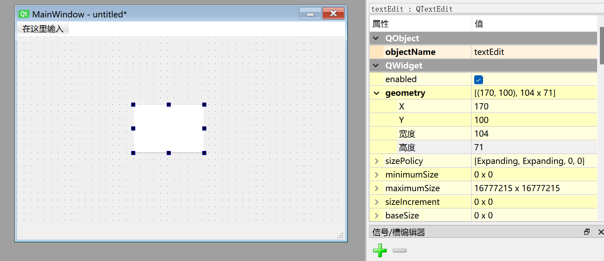
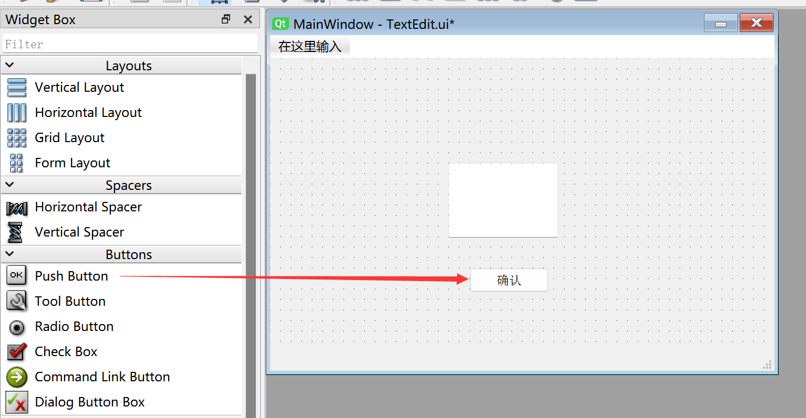

# TextEdit（多行文本框）

## 介绍

多行文本框允许用于输入多行文本。


双击可以添加文本框预显示内容，拖动边缘可以缩放。还有字体大小、其它属性右边属性栏都可以设置。



该窗口生成的py代码如下：
```python
# -*- coding: utf-8 -*-

from PyQt5 import QtCore, QtGui, QtWidgets


class Ui_MainWindow(object):
    def setupUi(self, MainWindow):
        MainWindow.setObjectName("MainWindow")
        MainWindow.resize(480, 320)
        self.centralwidget = QtWidgets.QWidget(MainWindow)
        self.centralwidget.setObjectName("centralwidget")
        self.textEdit = QtWidgets.QTextEdit(self.centralwidget)
        self.textEdit.setGeometry(QtCore.QRect(170, 100, 104, 71))
        self.textEdit.setObjectName("textEdit")
        MainWindow.setCentralWidget(self.centralwidget)
        self.menubar = QtWidgets.QMenuBar(MainWindow)
        self.menubar.setGeometry(QtCore.QRect(0, 0, 480, 22))
        self.menubar.setObjectName("menubar")
        MainWindow.setMenuBar(self.menubar)
        self.statusbar = QtWidgets.QStatusBar(MainWindow)
        self.statusbar.setObjectName("statusbar")
        MainWindow.setStatusBar(self.statusbar)

        self.retranslateUi(MainWindow)
        QtCore.QMetaObject.connectSlotsByName(MainWindow)

    def retranslateUi(self, MainWindow):
        _translate = QtCore.QCoreApplication.translate
        MainWindow.setWindowTitle(_translate("MainWindow", "MainWindow"))

```

其中跟单行文本相关的代码如下：

```python
# -*- coding: utf-8 -*-

from PyQt5 import QtCore, QtGui, QtWidgets


class Ui_MainWindow(object):
    def setupUi(self, MainWindow):
        ...
        self.textEdit = QtWidgets.QTextEdit(self.centralwidget)
        self.textEdit.setGeometry(QtCore.QRect(170, 100, 104, 71)) #文本框的x坐标、y坐标、宽度、高度；
        self.textEdit.setObjectName("textEdit") #设置多行文本框对象名称，非显示名称。

```
## QTextEdit对象

|  常用方法 |  说明 |
|  :---:  | --- | 
| setPlainText()  |  设置文本框内容  | 
| toPlainText()  |  获取文本框内容  | 
| clear()  |  清除文本框内容 | 
| setTextColor()  |  设置文本颜色。如参数：QtGui.QColor(255,0,0)表示红色 | 
| setTextBackgroundColor()  |  设置文本背景颜色。如参数：QtGui.QColor(255,0,0)表示红色 | 
| setWordWrapMode()  |  设置为自动换行 | 


## 示例

**例：在多行文本框输入指定内容然后点击按钮在终端打印出来。**

由于多行文本框没有确认输入信号，**Enter**键用于换行，所以这里可以结合[**按钮**](../buttons/push_button.md)来实现点击按钮将多行文本框内容打印出来。




完整代码如下：

```python

# -*- coding: utf-8 -*-

from PyQt5 import QtCore, QtGui, QtWidgets


class Ui_MainWindow(object):
    def setupUi(self, MainWindow):
        MainWindow.setObjectName("MainWindow")
        MainWindow.resize(480, 320)
        self.centralwidget = QtWidgets.QWidget(MainWindow)
        self.centralwidget.setObjectName("centralwidget")
        self.textEdit = QtWidgets.QTextEdit(self.centralwidget)
        self.textEdit.setGeometry(QtCore.QRect(140, 100, 191, 71))
        self.textEdit.setObjectName("textEdit")
        self.pushButton = QtWidgets.QPushButton(self.centralwidget)
        self.pushButton.setGeometry(QtCore.QRect(190, 200, 75, 23))
        self.pushButton.setObjectName("pushButton")
        MainWindow.setCentralWidget(self.centralwidget)
        self.menubar = QtWidgets.QMenuBar(MainWindow)
        self.menubar.setGeometry(QtCore.QRect(0, 0, 480, 22))
        self.menubar.setObjectName("menubar")
        MainWindow.setMenuBar(self.menubar)
        self.statusbar = QtWidgets.QStatusBar(MainWindow)
        self.statusbar.setObjectName("statusbar")
        MainWindow.setStatusBar(self.statusbar)

        self.retranslateUi(MainWindow)
        self.pushButton.clicked.connect(self.fun) # 按钮信号和槽定义
        QtCore.QMetaObject.connectSlotsByName(MainWindow)

    def retranslateUi(self, MainWindow):
        _translate = QtCore.QCoreApplication.translate
        MainWindow.setWindowTitle(_translate("MainWindow", "MainWindow"))
        self.pushButton.setText(_translate("MainWindow", "确认"))

    #执行函数
    def fun(self):
        print(self.textEdit.toPlainText()) #打印多行文本框信息

#################
#   主程序代码   #
#################
import sys

#【可选代码】允许Thonny远程运行
import os
os.environ["DISPLAY"] = ":0.0"

#【可选代码】解决2K以上分辨率显示器显示缺失问题
QtCore.QCoreApplication.setAttribute(QtCore.Qt.AA_EnableHighDpiScaling)

#主程序入口，构建窗口并显示
app = QtWidgets.QApplication(sys.argv)
MainWindow = QtWidgets.QMainWindow() #构建窗口对象
ui = Ui_MainWindow() #构建pyQT5设计的窗口对象
ui.setupUi(MainWindow) #初始化窗口
MainWindow.show() #显示窗口

#【建议代码】允许终端通过ctrl+c中断窗口，方便调试
import signal
signal.signal(signal.SIGINT, signal.SIG_DFL)
timer = QtCore.QTimer()
timer.start(100)  # You may change this if you wish.
timer.timeout.connect(lambda: None)  # Let the interpreter run each 100 ms

sys.exit(app.exec_()) #程序关闭时退出进程

```

运行代码，在多行文本框输入信息并按下**确认**按钮，可以看到终端打印出文本框的信息。

