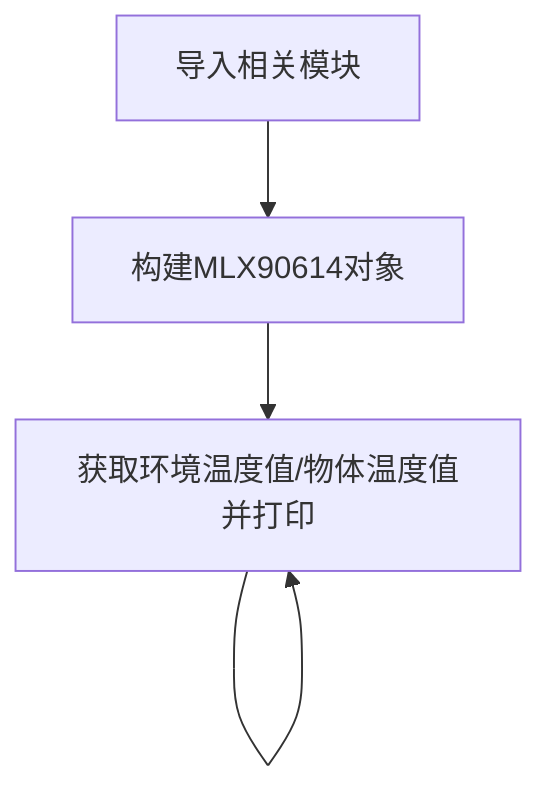
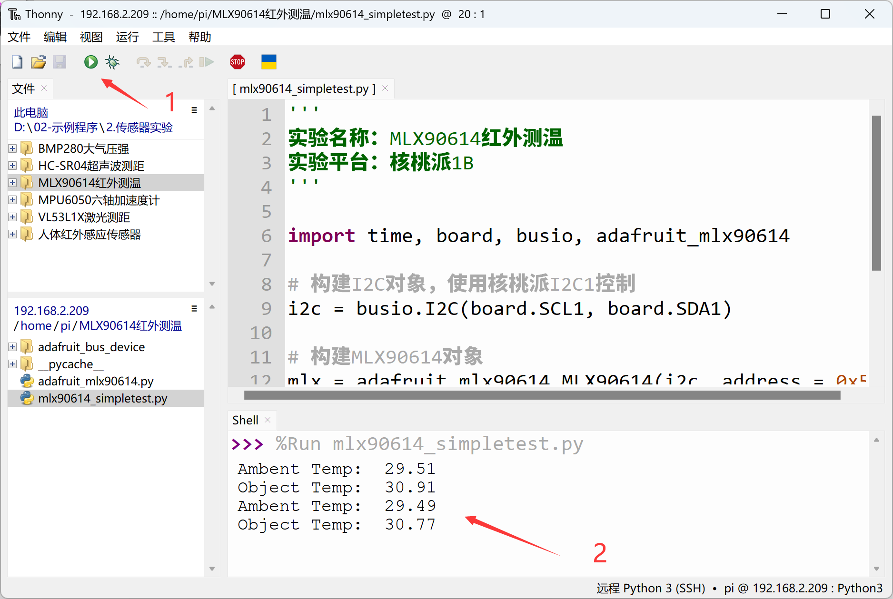

# MLX90614红外测温

## 前言
MLX90614是一款用于非接触式温度测量的红外温度计，能够测量-70至380°C之间的物体。该传感器采用红外敏感热电堆探测器芯片，可在温度范围内以0.02°C的分辨率测量温度。

## 实验目的
通过python编程实现MLX90614非接触式测温。

## 实验讲解

市面上大多MLX90614模块都通用，使用I2C总线通讯，下图是一款MLX90614传感器模块，有DCC（短距离10cm）和DCI（远距离100cm）两个型号，代码通用。

 

|  模块参数 |
|  :---:  | ---  |
| 供电电压  | 3.3V |
| 测量距离  | DCC(10cm) 和 DCI(100cm)|
| 测量范围  | -70℃ - 382℃ |
| 测量精度  | 0.5℃ |
| 通信方式  | I2C总线（默认地址：0x5a） |
| 引脚说明  | `VCC`: 接3.3V <br></br> `GND`: 接地 <br></br>  `SDA`: I2C数据引脚  <br></br> `SCL`: I2C时钟引脚 |

<br></br>

从上面介绍可以看到MLX90614是一款通过I2C接口驱动的传感器。我们通过核桃派I2C接口编程，即可以对该模块实现数据通讯。

本例程使用核桃派的I2C1来连接VL53L1X传感器：

 

 


## MLX90614对象

在CircuitPython中可以直接使用写好的Python库来获取MLX90614传感器数据。具体介绍如下：

### 构造函数
```python
mlx = adafruit_mlx90614.MLX90614(i2c, address=0x5a)
```
构建MLX90614对象。

参数说明：
- `i2c` 需要构建i2c对象，参考: [I2C对象说明](../gpio/i2c_oled#i2c对象)；这里不再重复。
- `address` 模块I2C地址。默认：0x5a；

### 使用方法

```python
mlx.ambient_temperature
```
读取环境温度，单位℃，数据类型：`float`。
<br></br>

```python
mlx.ambient_temperature
```
读取环境温度，单位℃，数据类型：`float`。

<br></br>

理解了MLX90614传感器原理和对象使用方法后，我们可以整理出编程思路，流程图如下 ：



## 参考代码
```python
'''
实验名称：MLX90614红外测温
实验平台：核桃派1B
'''

import time, board, busio, adafruit_mlx90614

# 构建I2C对象，使用核桃派I2C1控制
i2c = busio.I2C(board.SCL1, board.SDA1)

# 构建MLX90614对象
mlx = adafruit_mlx90614.MLX90614(i2c, address=0x5a)

while True:
    
    print("Ambent Temp: ", '%.2f'% mlx.ambient_temperature) #测量环境温度
    print("Object Temp: ", '%.2f'% mlx.object_temperature) #测量物体温度
    
    time.sleep(1)
```

## 实验结果

将MLX90614传感器按下图连接到核桃派， SDA1连接到模块SDA引脚, SCL1连接到模块SCL引脚：

 

由于本例程代码依赖其它py库，所以需要将整个例程文件夹上传到核桃派：

 

发送成功后需要打开远程目录（核桃派）的py文件来运行，因为运行会导入文件夹里面的其它库文件，因此这类型代码在电脑本地运行是无效的。

 

这里使用Thonny远程核桃派运行以上Python代码，关于核桃派运行python代码方法请参考： [运行Python代码](../python_run.md)。运行成功后可以看到终端打印出环境温度和物体温度信息：

 
