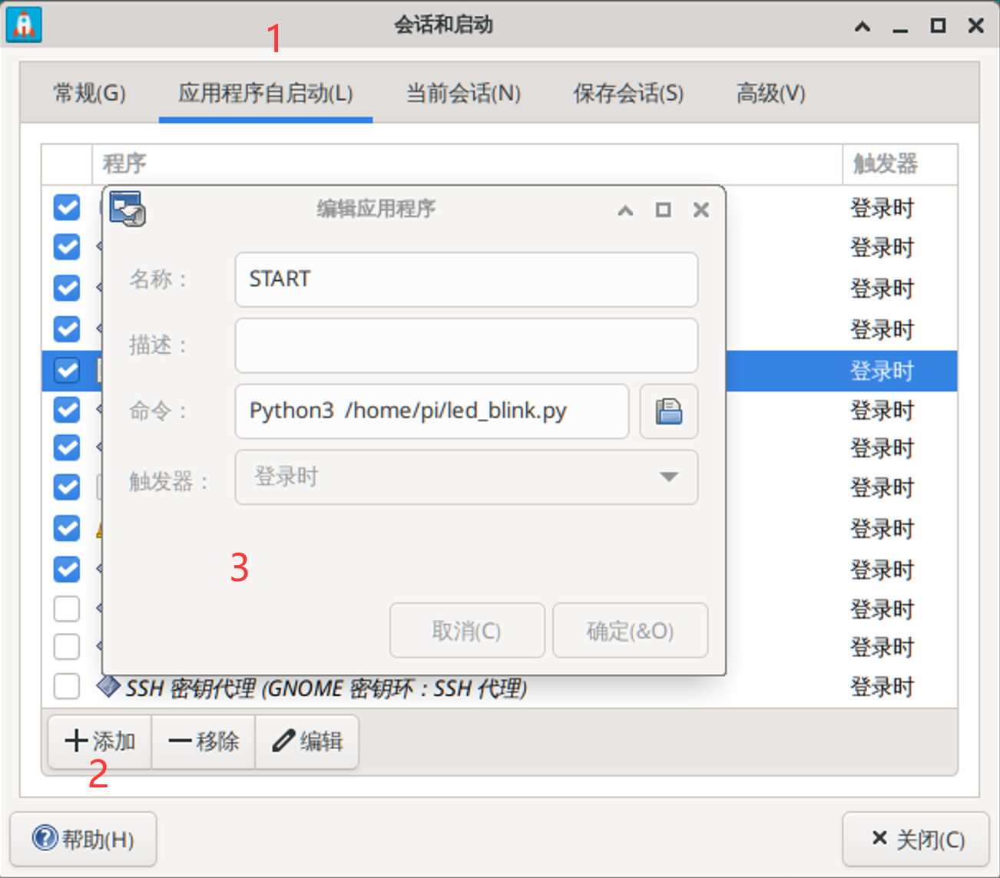
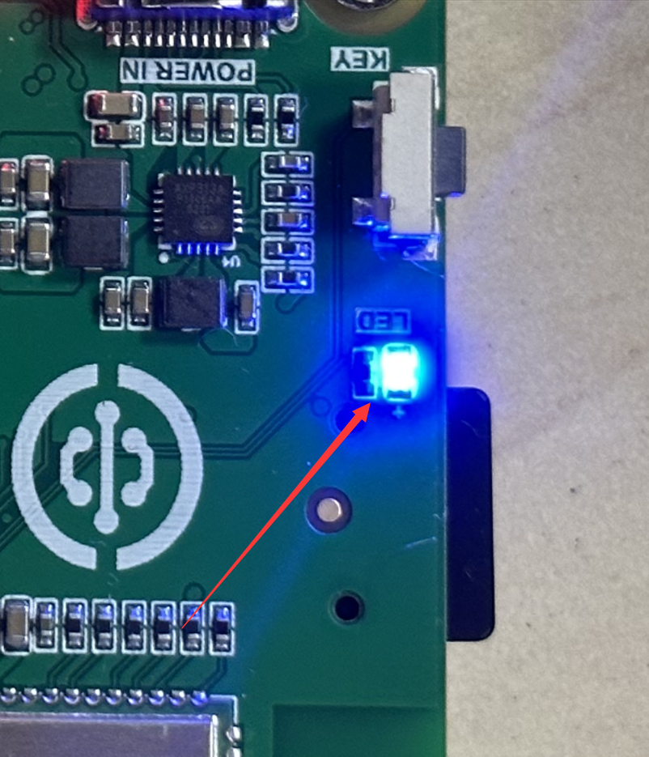

# 开机自动运行Python代码

在前面我们学习了非常多的Python嵌入式编程案例，其中肯定有小伙伴想到能不能把已经写好的Python代码放到核桃派，让它开机后自动执行呢？答案是可以的，而且是非常实用的功能，本节我们就来详细讲解一下。

## 桌面系统操作方法

首先我们先写一段测试用的Python代码，可以利用板载LED灯闪烁效果作为功能展示, 同时增加一个打印“Hello WalnutPi!”的提示信息，代码如下（核桃派开发板资料包--示例程序--其它使用技巧有该代码文件）：

```python
'''
实验名称：LED闪烁
实验平台：核桃派
'''

#导入相关模块
import board,time
from digitalio import DigitalInOut, Direction

#构建LED对象和初始化
led = DigitalInOut(board.LED) #定义引脚编号
led.direction = Direction.OUTPUT  #IO为输出

while True:

    led.value = 1 #输出高电平，点亮板载LED蓝灯
    
    time.sleep(0.5)
    
    led.value = 0 #输出低电平，熄灭板载LED蓝灯
    
    time.sleep(0.5)
    
    print("Hello WalnutPi!") #输出打印信息
```

将上面代码保存名称为 **led_blink.py** 文件，放在核桃派 /home/pi 目录下用于测试。可以使用Thonny传输或者使用U盘直接拷贝到该目录。


然后我们在核桃派桌面点击**开始菜单--设置--会话和启动**。


启动后点击 **应用程序自启动** ，然后左下角点 **+添加**，在弹出对话框配置以下信息：
- `名称`：定义程序名称，我们这里写START，自己可以修改自己想要的。
- `描述`：对这个应用程序的描述，可以不填。
- `名称`：命令，我们这里使用下面python终端命令启动py脚本。务必使用**Python3** ，注意大小写，因为这个程序是核桃派经过提权的，拥有管理员权限来运行python脚本，避免因权限问题出错。
```bash
Python3 /home/pi/led_blink.py
```
- `触发器`：选择登录时。




确认后可以看到列表出现了该START程序。


创建完成后可以发现 /home/pi/.config/autostart 目录下多了这个启动文件，点击右键，选择编辑启动器可以获取更多编辑内容。


如下图所示可以勾选**在终端运行**选项，这样打开该应用就会在桌面弹出一个新终端，方便查看调试信息。如果没勾选在在后台运行。


保存后可以双击该应用打开测试，可以看到桌面弹出新终端，打印**led_blink.py**输出的信息。


板载LED周期性闪烁！



执行复位指令，可以看到核桃派开发板弹出终端打印“Hello WalnutPi!” 以及LED灯闪烁，说明Python代码自启动正常。
```bash
sudo reboot
```

## 无桌面系统操作方法

前面讲了带核桃派桌面系统操作方法，这里讲一下无桌面版的操作方法，这里使用开机启动服务的方法。**这个方法同样也适合带桌面的系统！**

跟前面一样首先我们先写一段测试用的Python代码，可以利用板载LED灯闪烁效果作为功能展示, 同时增加一个打印“Hello WalnutPi!”的提示信息，代码如下（核桃派开发板资料包--示例程序--其它使用技巧有该代码文件）：

```python
'''
实验名称：LED闪烁
实验平台：核桃派
'''

#导入相关模块
import board,time
from digitalio import DigitalInOut, Direction

#构建LED对象和初始化
led = DigitalInOut(board.LED) #定义引脚编号
led.direction = Direction.OUTPUT  #IO为输出

while True:

    led.value = 1 #输出高电平，点亮板载LED蓝灯
    
    time.sleep(0.5)
    
    led.value = 0 #输出低电平，熄灭板载LED蓝灯
    
    time.sleep(0.5)
    
    print("Hello WalnutPi!") #输出打印信息
```

将上面代码保存名称为 **led_blink.py** 文件，放在核桃派 /home/pi 目录下用于测试。可以使用Thonny传输或者使用U盘直接拷贝到该目录。


在 /lib/systemd/system 目录下新建一个 start.service 文件。**(核桃派开发板资料包--示例程序--其它使用技巧--无桌面系统操作方法目录下有该文件。)**

```bash
sudo nano /lib/systemd/system/start.service
```

修改内容如下：

```bash
[Unit]
Description=Expand partition size

[Service]
Type=oneshot
ExecStart=Python3 /home/pi/led_blink.py
RemainAfterExit=yes
StandardOutput=null

[Install]
WantedBy=multi-user.target
```


保存后给该文件最高权限：
```bash
sudo chmod 777 /lib/systemd/system/start.service
```


开启该服务：
```bash
 sudo systemctl enable start.service
```


执行复位指令，可以看到核桃派开发板重启后LED灯闪烁，说明Python代码自启动正常。由于该方式在后台运行，所以看不到“Hello WalnutPi!” 打印信息！
```bash
sudo reboot
```


<br></br>

:::tip 提示
以上2种方法原理都是通过命令启动了Python脚本，用户可以自行修改命令，实现上电运行特定Linux指令或软件。
:::