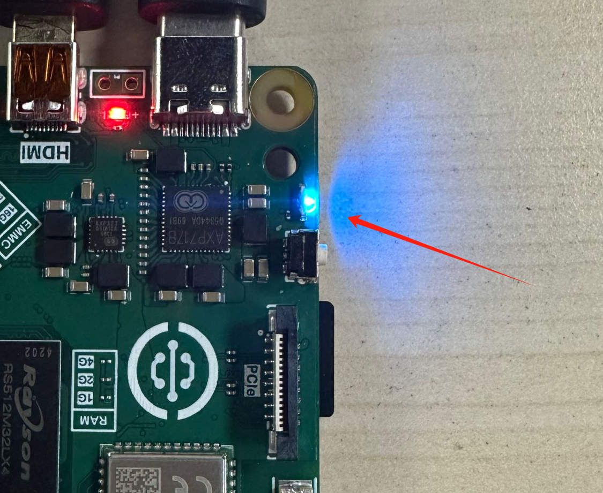

# 开机

在上一节系统镜像烧录完成后MicroSD卡里面就带有核桃派Android系统了，将它插入核桃派背面的SD卡槽，上电后蓝灯常亮表示启动正常。

## 使用5.5寸显示屏（电容触摸）

镜像名称为：【**2026-1-26_WalnutPi-2B_android13_5.5inch_hdmi.img**】 表示默认使用核桃派官方5.5寸屏（1080P）幕为主屏，[购买连接>>](https://item.taobao.com/item.htm?id=1013424344059)。可以外接HDMI作为同屏显示扩展。

系统正常启动蓝灯会常亮。

启动成功后显示Android系统界面。

核桃派2B Android系统出厂预装了豌豆荚、谷歌浏览器、B站，大部分应用游戏都可以通过豌豆荚进行下载安装。

## HDMI显示器同屏显示

直接插入HDMI显示器即可实现同屏显示。

如果你没有显示器，或者无法正常启动，可以使用USB转TTL工具连接到核桃派的调试串口使用串口终端方式登录，此方式适合调试人员。具体参考：[调试串口打开终端](../os_software/terminal#调试串口打开终端) 章节内容。
