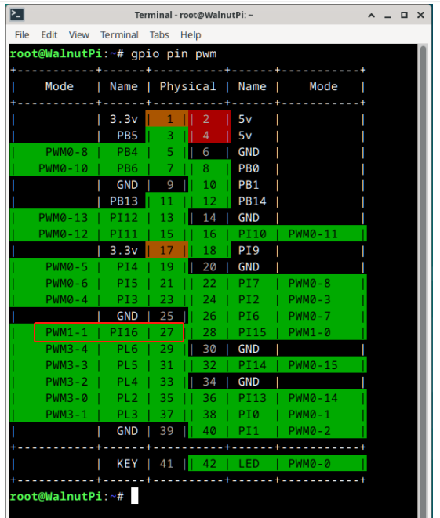
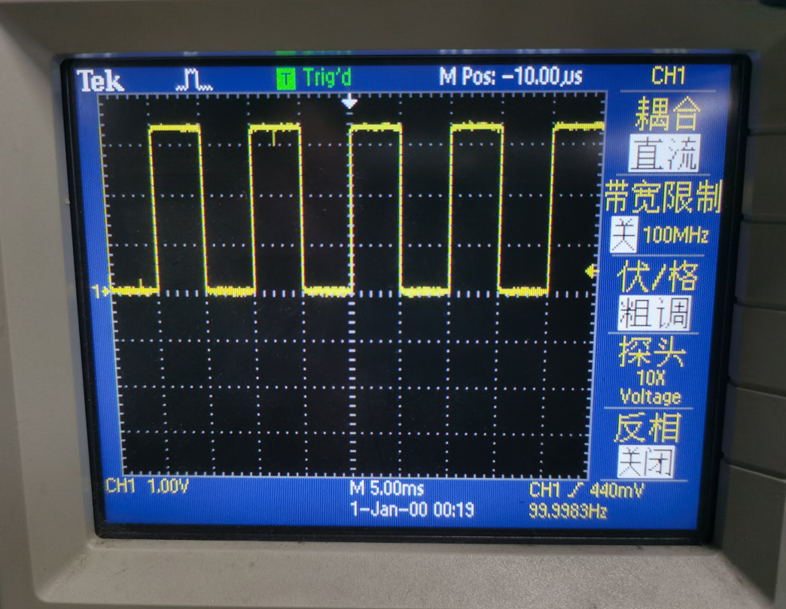

# PWM

[**GPIO应用 - PWM**](../gpio/pwm.md)章节中通过给指定的文件内写入数值来操作硬件pwm，如果想用C语言控制pwm，只要调用C语言提供的读写文件的函数去操作那些文件即可。

## 例程-操作PWM1-1输出

```c
#include <stdio.h>
#include <stdlib.h>
#include <fcntl.h>
#include <unistd.h>
#include <string.h>

char *control_path[4] = {
    "/sys/class/pwm/pwmchip0",
    "/sys/class/pwm/pwmchip16",
    "/sys/class/pwm/pwmchip20",
    "/sys/class/pwm/pwmchip22",
};

/**
 * 将字符串写入指定文件
 * @param path 文件路径
 * @param str 要写入的字符串
 */
void write_to_file(char *path, char *str)
{
    int fd;
    fd = open(path, O_WRONLY);
    if (fd < 0)
    {
        printf("open file error: %s\n", path);
        exit(-1);
    }
    write(fd, str, strlen(str));
    close(fd);
}

/**
 * 导出PWM通道
 * @param control 控制器编号0 1 2 3
 * @param channel PWM通道号
 */
void pwm_export(int control, int channel)
{
    char path[100];
    char str[10];

    sprintf(path, "%s/export", control_path[control]); // 生成export文件的路径
    sprintf(str, "%d", channel);
    write_to_file(path, str);
}

/**
 * 配置PWM通道的参数。
 * @param control 控制器编号0 1 2 3
 * @param channel PWM通道号
 * @param period PWM信号的周期，单位为纳秒。
 * @param duty_cycle PWM信号的高电平时长。
 */
void pwm_config(int control, int channel, int period, int duty_cycle)
{
    char str[10];
    char path[100];

    sprintf(path, "%s/pwm%d/period", control_path[control], channel);
    sprintf(str, "%d", period);
    write_to_file(path, str);

    sprintf(path, "%s/pwm%d/duty_cycle", control_path[control], channel);
    sprintf(str, "%d", duty_cycle);
    write_to_file(path, str);

    sprintf(path, "%s/pwm%d/polarity", control_path[control], channel);
    write_to_file(path, "normal");
}

/**
 * 启用PWM通道的输出。
 * @param control 控制器编号0 1 2 3
 * @param channel PWM通道号
 */
void pwm_enable(int control, int channel)
{
    char str[10];
    char path[100];

    sprintf(path, "%s/pwm%d/enable", control_path[control], channel);
    write_to_file(path, "1");
}

/**
 * 关闭PWM通道的输出。
 * @param control 控制器编号0 1 2 3
 * @param channel PWM通道号
 */
void pwm_disable(int control, int channel)
{
    char str[10];
    char path[100];

    sprintf(path, "%s/pwm%d/enable", control_path[control], channel);
    write_to_file(path, "0");
}

int main()
{
    pwm_export(1, 1); // 导出PWM通道
    pwm_config(1, 1, 10000000, 5000000); // 配置PWM周期和占空比
    pwm_enable(1, 1); // 启用PWM输出

    return 0;
}

```


上面代码中通过下面3个语句配置PWM输出。其中 **pwm_config(1, 1, 10000000, 5000000);** 

- (1,1) 表示定时器1，通道1
- 周期时间 10000000ns, 即10ms,  频率为：1s/10ms=100Hz; 
- 高电平时间 5000000ns, 即5ms, 占空比为：5ms/10ms = 50%

## 实验结果

下面为输出引脚和输出结果：



